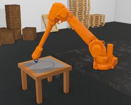

The [IRB 4600/40](https://new.abb.com/products/robotics/industrial-robots/irb-4600) is a 6 DOF indoor arm developed by [ABB](https://abb.com).
It has a payload of 40kg.

### Movie Presentation


### Irb4600-40 PROTO

Derived from [Robot](https://cyberbotics.com/doc/reference/robot).

```
PROTO Irb4600-40 [
  SFVec3f    translation     0 0 0
  SFRotation rotation        0 0 1 0
  SFString   name            "IRB 4600/40"
  SFString   controller      "pioneer3dx_collision_avoidance"
  MFString   controllerArgs  []
  SFString   customData      ""
  SFBool     supervisor      FALSE
  SFBool     synchronization TRUE
  SFColor    color           1 0.45 0
  MFNode     handSlot        []
  SFBool     staticBase      FALSE
]
```

#### Irb4600-40 Field Summary

- `handSlot`: Extends the arm hand with new nodes.

- `staticBase`: Defines if the robot base should be pinned to the static environment.

### "ikpy"

`ikpy` is an inverse kinematics library written in Python.
It can be installed easily using `pip`.
For further details, please refer to [their documentation](https://github.com/Phylliade/ikpy).

### Samples

You will find the following sample in this folder: "[WEBOTS\_HOME/projects/robots/abb/irb/worlds]({{ url.github_tree }}/projects/robots/abb/irb/worlds)".

#### [inverse\_kinematics.wbt]({{ url.github_tree }}/projects/robots/abb/irb/worlds/inverse\_kinematics.wbt)

 This example demonstrates the use of the `ikpy` Python module.
The `ikpy` chain is hard-coded in the controller.
The arm hand is equipped with a Pen device.
During the first seconds, the robot draws a circle on a paper sheet.
Then the robot hand moves to the target yellow and black object.
If this object is moved, the robot position is updated.
