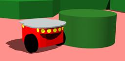

[adept's Pioneer 2](https://www.adept.com/) is a three-wheeled robot (2 motorized wheels and one passive caster wheel) mounted with several sensors including 16 ultrasonic sensors.

### Pioneer2 PROTO

Derived from [Robot](https://cyberbotics.com/doc/reference/robot).

```
Pioneer2 {
  SFVec3f    translation     0 0 0
  SFRotation rotation        0 0 1 0
  SFString   name            "Pioneer 2"
  SFString   controller      "braitenberg"
  MFString   controllerArgs  []
  SFString   customData      ""
  SFBool     supervisor      FALSE
  SFBool     synchronization TRUE
  MFNode     extensionSlot   []
}
```

#### Pioneer2 Field Summary

- `extensionSlot`: Extends the robot with new nodes in the extension slot.

### Samples

You will find the following sample in this folder: "[WEBOTS\_HOME/projects/robots/adept/pioneer2/worlds]({{ url.github_tree }}/projects/robots/adept/pioneer2/worlds)".

#### [pioneer2.wbt]({{ url.github_tree }}/projects/robots/adept/pioneer2/worlds/pioneer2.wbt)

 In this example, you can see a Pioneer 2 robot moving inside an arena while avoiding the walls.
Like many other examples, this one uses the `braitenberg` controller.
