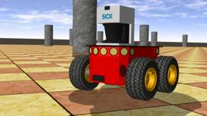

The Pioneer 3-AT robot is an all-purpose outdoor base, used for research and prototyping applications involving mapping, navigation, monitoring, reconnaissance and other behaviors.
It is caracterized by a set of features listed in the `Pioneer 3-AT characteristics`.
This model includes support for 4 motors and 16 sonar sensors (8 forward-facing, 8 rear-facing) for proximity measurements.

More information on specifications and optional devices are available on the following links as the official Adept Mobile Robots website no longer exists: [Operations manual (2007, v.5)](http://vigir.missouri.edu/~gdesouza/Research/MobileRobotics/Software/P3OpMan5.pdf) and [technical data](https://www.generationrobots.com/media/Pioneer3AT-P3AT-RevA-datasheet.pdf).

### Movie Presentation


### Pioneer 3-AT Model

%figure "Pioneer 3-AT characteristics"

| Characteristics             | Values       |
| --------------------------- | ------------ |
| Length                      | 508 mm       |
| Width                       | 497 mm       |
| Height                      | 277 mm       |
| Weight                      | 12 kg        |
| Max. forward/backward speed | 0.7 m/s      |

%end

The standard model of the Pioneer 3-AT is provided in the "pioneer3AT.wbt" file which is located in the "WEBOTS\_HOME/projects/robots/adept/pioneer3/worlds" directory of the Webots distribution.

The Pioneer 3-AT motors are [RotationalMotor](https://cyberbotics.com/doc/reference/rotationalmotor) nodes named according to the next figure.
The `wb_set_motor_position` and `wb_set_motor_velocity` functions allow the user to control the rotation of the wheels.

%figure "Pioneer 3-AT motor names"


%end

The sonar sensors are numbered according to the following figure.

%figure "Sonar sensors positions"


%end

The angle between two consecutive sensor directions is 20 degrees except for the four side sensors (so0, so7, so8 and so15) for which the angle is 40 degrees.

### Pioneer3at PROTO

Derived from [Robot](https://cyberbotics.com/doc/reference/robot).

```
Pioneer3at {
  SFVec3f    translation     0 0.11 0
  SFRotation rotation        0 0 1 0
  SFString   name            "Pioneer 3-AT"
  SFString   controller      "<generic>"
  MFString   controllerArgs  []
  SFString   customData      ""
  SFBool     supervisor      FALSE
  SFBool     synchronization TRUE
  MFNode     extensionSlot   []
}
```

#### Pioneer3at Field Summary

- `extensionSlot`: Extends the robot with new nodes in the extension slot.

### Samples

#### [pioneer3at.wbt]({{ url.github_tree }}/projects/robots/adept/pioneer3/worlds/pioneer3at.wbt)

 The "pioneer3at.wbt" world file is a simulation example of a simple obstacle avoidance behavior based on the use of a SICK LMS 291 [Lidar](https://cyberbotics.com/doc/reference/lidar) (see the "obstacle\_avoidance\_with\_lidar.c" controller file in the "WEBOTS\_HOME/projects/robots/adept/pioneer3/controller" directory).
The [Lidar](https://cyberbotics.com/doc/reference/lidar) depth output is used to compute two stimuli in front of the robot.
These two stimuli are computed by a [Gaussian function](https://en.wikipedia.org/wiki/Gaussian_function) applied slightly on the front left, and respectively on the front right of the robot.
