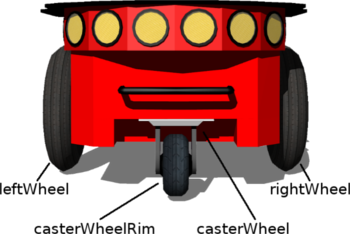
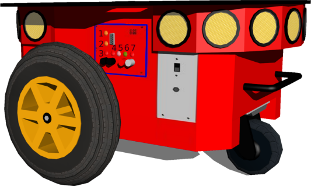
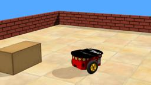
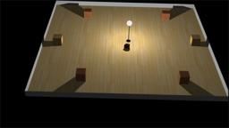
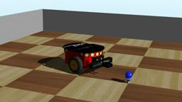
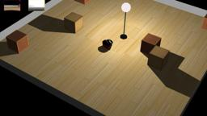

The Pioneer 3-DX robot is an all-purpose base, used for research and applications involving mapping, teleoperation, localization, monitoring, reconnaissance and other behaviors.
Pioneer 3-DX is characterized by a set of features listed in the `Pioneer 3-DX characteristics` table.

The base Pioneer 3-DX platform is assembled with motors featuring 500-tick encoders, 19 cm wheels, tough aluminum body, 8 forward-facing ultrasonic (sonar) sensors, 8 optional rear-facing sonars, 1, 2 or 3 hot-swappable batteries, and a complete software development kit.
The base Pioneer 3-DX platform can reach speeds of 1.6 meters per second and carry a payload of up to 23 kg.

More information on specifications and optional devices are available on the following links as the official Adept Mobile Robots website no longer exists: [Operations manual (2007, v.5)](http://vigir.missouri.edu/~gdesouza/Research/MobileRobotics/Software/P3OpMan5.pdf) and [technical data](https://www.generationrobots.com/media/Pioneer3DX-P3DX-RevA.pdf).

### Movie Presentation


### Pioneer 3-DX Model

%figure "Pioneer 3-DX characteristics"

| Characteristics             | Values       |
| --------------------------- | ------------ |
| Length                      | 485 mm       |
| Width                       | 381 mm       |
| Height                      | 217 mm       |
| Weight                      | 9 kg         |
| Max. forward/backward speed | 1.2 m/s      |

%end

This model includes support for two motors, the caster wheel, 7 [LEDs](https://cyberbotics.com/doc/reference/led) on the control panel and 16 sonar sensors (8 forward-facing, 8 rear-facing) for proximity measurements.
The standard model of the Pioneer 3-DX is provided in the "pioneer3dx.wbt" file which is located in the "WEBOTS\_HOME/projects/robots/adept/pioneer3/worlds" directory of the Webots distribution.

The Pioneer 3-DX motors are [RotationalMotor](https://cyberbotics.com/doc/reference/rotationalmotor) nodes named according to the next figure.
The `wb_set_motor_position` and `wb_set_motor_velocity` functions allow the user to control the rotation of the wheels.

%figure "Pioneer 3-DX motor names"



%end

The sonar sensors are numbered according to this figure:

%figure "Sonar sensors positions"


%end

The angle between two consecutive sensor directions is 20 degrees except for the four side sensors (so0, so7, so8 and so15) for which the angle is 40 degrees.

The 7 [LEDs](https://cyberbotics.com/doc/reference/led) are named according to the following table, where the numbers are shown on the `LEDs positions` figure.

%figure "Pioneer 3-DX LED names"

| Number | Name             |
| ------ | ---------------- |
| 1      | N/A              |
| 2      | lower yellow led |
| 3      | red led 3        |
| 4      | red led 2        |
| 5      | white led        |
| 6      | green led        |
| 7      | red led 1        |

%end

%figure "LEDs positions"



%end

### Pioneer3dx PROTO

Derived from [Robot](https://cyberbotics.com/doc/reference/robot).

```
Pioneer3dx {
  SFVec3f    translation     0 0 0.0975
  SFRotation rotation        0 0 1 0
  SFString   name            "Pioneer 3-DX"
  SFString   controller      "pioneer3dx_collision_avoidance"
  MFString   controllerArgs  []
  SFString   customData      ""
  SFBool     supervisor      FALSE
  SFBool     synchronization TRUE
  MFNode     extensionSlot   []
}
```

#### Pioneer3dx Field Summary

- `extensionSlot`: Extends the robot with new nodes in the extension slot.

### Samples

Here are listed the different example worlds based on the Pioneer 3-DX.
The worlds and controllers can be accessed in the "[WEBOTS\_HOME/projects/robots/adept/pioneer3]({{ url.github_tree }}/projects/robots/adept/pioneer3)" directory.

#### [pioneer3dx.wbt]({{ url.github_tree }}/projects/robots/adept/pioneer3/worlds/pioneer3dx.wbt)

 The "pioneer3dx.wbt" world file shows a simulation example of an avoidance algorithm based on the use of the 16 sonar sensors (see the "pioneer3dx\_collision\_avoidance.c" controller file).
The three [LEDs](https://cyberbotics.com/doc/reference/led) are switched on and off periodically.

#### [pioneer3dx\_collision\_avoidance.wbt]({{ url.github_tree }}/projects/robots/adept/pioneer3/worlds/pioneer3dx\_collision\_avoidance.wbt)

 The "pioneer3dx\_collision\_avoidance.wbt" world file is a simulation example of an avoidance algorithm based on the use of the 16 sonar sensors in a dark environment (see the "pioneer3dx\_obstacle\_avoidance.c" controller file).

#### [pioneer3dx\_gripper.wbt]({{ url.github_tree }}/projects/robots/adept/pioneer3/worlds/pioneer3dx\_gripper.wbt)

 The "pioneer3dx_gripper.wbt" world file is a simulation example where a gripper is used to move a ball (see the "pioneer3dx\_gripper.c" controller file).
The `Pioneer3Gripper` PROTO is mounted on the `extensionSlot` of the `Pioneer3dx` PROTO node.

#### [pioneer3dx\_matlab.wbt]({{ url.github_tree }}/projects/robots/adept/pioneer3/worlds/pioneer3dx\_matlab.wbt)

 The "pioneer3dx_matlab.wbt" world file is a simulation example an obstacle avoidance behavior using a MATLAB controller (see the "pioneer3dx\_matlab.m" controller file).

#### [pioneer3dx\_with\_kinect.wbt]({{ url.github_tree }}/projects/robots/adept/pioneer3/worlds/pioneer3dx\_with\_kinect.wbt)

 The "pioneer3dx\_with\_kinect.wbt" world file is a simple simulation example of an obstacle avoidance behavior based on a Microsoft Kinect sensor (see the "pioneer3dx\_obstacle\_avoidance\_kinect.c" controller file).
The `Kinect` PROTO is mounted in the `extensionSlot` field of the `Pioneer3dx` PROTO node.
