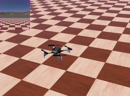

The Crazyflie is a smalll 30 gram quadcopter developed by [Bitcraze](https://www.bitcraze.io)

### Movie Presentation

Here are examples of the Crazyflie being used in real life research:


### Crazyflie Proto

Derived from [Robot](https://cyberbotics.com/doc/reference/robot).

```
PROTO Crazyflie [
  field SFVec3f    translation     0 0 0.015
  field SFRotation rotation        0 0 1 0
  field SFString   name            "Crazyflie"
  field SFString   controller      "crazyflie"
  field MFString   controllerArgs  []
  field SFString   customData      ""
  field SFBool     supervisor      FALSE
  field SFBool     synchronization TRUE
  field MFNode     extensionSlot   []
]
```

### Samples

You will find the following sample in the folder: "[$WEBOTS\_HOME/projects/robots/bitcraze/crazyflie/worlds]({{ url.github_tree }}/projects/robots/bitcraze/crazyflie/worlds)"

#### [crazyflie.wbt]({{ url.github_tree }}/projects/robots/bitcraze/crazyflie/worlds/crazyflie.wbt)

 This simulation shows a Crazyflie, that you can control with your keyboard.
