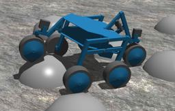

The "Shrimp" robot is a mobile platform for rough terrain from [Bluebotics](http://www.bluebotics.ch).
It has 6 wheels and a passive structure that adapts to the terrain profile and climbs obstacles.
It can also turn on the spot.

### Movie Presentation


### Shrimp PROTO

Derived from [Robot](https://cyberbotics.com/doc/reference/robot).

```
Shrimp {
  SFVec3f    translation     0 0 0
  SFRotation rotation        0 0 1 0
  SFString   name            "Shrimp"
  SFString   controller      "shrimp"
  MFString   controllerArgs  []
  SFString   customData      ""
  SFBool     supervisor      FALSE
  SFBool     synchronization TRUE
  MFNode     extensionSlot   []
}
```

#### Shrimp Field Summary

- `extensionSlot`: Extends the robot with new nodes in the extension slot.

### Samples

You will find the following sample in this folder: "[WEBOTS\_HOME/projects/robots/bluebotics/shrimp/worlds]({{ url.github_tree }}/projects/robots/bluebotics/shrimp/worlds)".

#### [shrimp.wbt]({{ url.github_tree }}/projects/robots/bluebotics/shrimp/worlds/shrimp.wbt)

 In this example the robot will first move on its own to the center of the world; then you may drive it yourself using the keyboard.
Several obstacles are present in this world.
To find out which keys will allow you to perform these operations, please read the explanation message printed at the beginning of the simulation in the Webots console.
