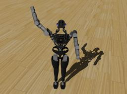

The "Atlas" is a humanoid robot developed by [Boston Dynamics](https://www.bostondynamics.com/atlas) with funding and oversight from DARPA.
The robot is 1.8 meters tall and is designed for a variety of search and rescue tasks.

### Atlas PROTO

Derived from [Robot](https://cyberbotics.com/doc/reference/robot).

```
Atlas {
  SFVec3f    translation     0 0 1
  SFRotation rotation        0 0 1 0
  SFString   name            "Atlas"
  SFString   controller      "hello_world_demo"
  MFString   controllerArgs  []
  SFString   customData      ""
  SFBool     supervisor      FALSE
  SFBool     synchronization TRUE
  MFNode     pelvisSlot      []
}
```

#### Atlas Field Summary

- `pelvisSlot`: Extends the robot with new nodes in the pelvis slot.

### Samples

You will find the following sample in the folder: "[WEBOTS\_HOME/projects/robots/boston_dynamics/atlas/worlds]({{ url.github_tree }}/projects/robots/boston_dynamics/atlas/worlds)".

#### [atlas.wbt]({{ url.github_tree }}/projects/robots/boston_dynamics/atlas/worlds/atlas.wbt)

 This simulation shows an Atlas robot in a simple environment. The robot is moving its right arm.
