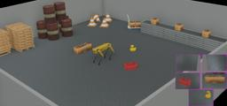

The "Spot" robot, previously called "SpotMini", is is a four-legged dog-like robot developed by [Boston Dynamics](https://www.bostondynamics.com/spot).

The nimble robot is 83 centimeters tall and is designed for a variety of search, inspection and delivery tasks.
It can climb stairs and traverse rough terrain with unprecedented ease, yet it is small enough to use indoors.
It is built to be a rugged (IP54 for dust and wet protection) and customizable platform.
Spot can go where wheeled robots cannot, while carrying payloads with endurance far beyond aerial drones.
The maximal speed is 1.6 m/s with a runtime of 90 minutes and the batteries are swappable.
Spot uses five stereo cameras (360 degrees vision) to avoid obstacles and people as it moves through dynamic work sites.

It is unfortunately not possible to use the [Spot SDK](https://github.com/boston-dynamics/spot-sdk) together with Webots.
This is because this SDK doesn't include all the low level motion control functionalities which are necessary to control the simulated model.
Re-writing these functionalities as open-source software or somehow reusing Boston Dynamics binary libraries could be a possibility enabling the creation of an interface between the Spot SDK and Webots.
If you would like to contribute to such a project, please refer to this [discussion](https://github.com/cyberbotics/webots/discussions/2677).

### Movie Presentation


### Spot PROTO

Derived from [Robot](https://cyberbotics.com/doc/reference/robot).

```
Spot {
  SFVec3f     translation      0 0 0.624
  SFRotation  rotation         0 0 1 0
  SFString    name             "Spot"
  SFString    model            "Boston Dynamics - Spot"
  SFString    controller       "spot_moving_demo"
  MFString    controllerArgs   []
  SFString    customData       ""
  SFBool      supervisor       FALSE
  SFBool      synchronization  TRUE
  SFBool      selfCollision    FALSE
  MFNode      extensionSlot    []
}
```

#### Spot Field Summary

- `extensionSlot`: Extends the robot with new nodes.

### Samples

You will find the following sample in the folder: "[$WEBOTS\_HOME/projects/robots/boston\_dynamics/spot/worlds]({{ url.github_tree }}/projects/robots/boston_dynamics/spot/worlds)"

### [spot.wbt]({{ url.github_tree }}/projects/robots/boston_dynamics/spot/worlds/spot.wbt)

 This simulation shows a Spot robot in a simple environment.
The robot is saying hello with its right leg.
