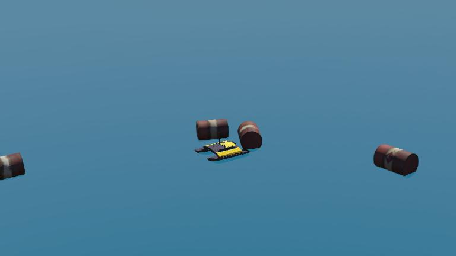
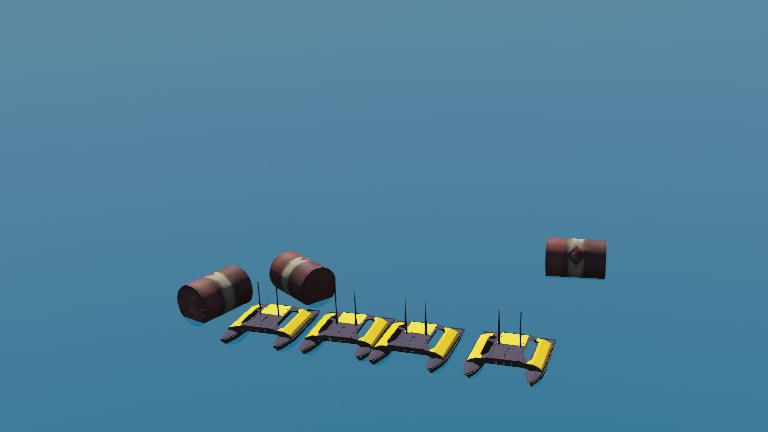

The [clearpath's Heron USV](https://robots.ros.org/clearpath-heron-usv/) is a USV platform.

### Motors

There are 2 motor, motor name `left_motor`and `right_motor`.
You can add new Camera, GPS or other sensors you want under `body_slot`.

### Movie Presentation


### Heron PROTO

Derived from [Robot](https://cyberbotics.com/doc/reference/robot).

```js
Heron {
  SFVec3f    translation     0 0 0
  SFRotation rotation        0 1 0 1.5708
  SFString   name            "heron"
  SFString   controller      "heron_usv_controller"
  MFString   controllerArgs  []
  SFBool     synchronization TRUE
  MFNode     bodySlot        []
}
```

#### Heron Field Summary

- `bodySlot`: Extends the robot with new nodes.

### Samples

You will find the following sample in this folder: "[WEBOTS\_HOME/projects/robots/clearpath/heron/worlds]({{ url.github_tree }}/projects/robots/clearpath/heron/worlds)".

Ocean

#### [heron\ocean.wbt]({{ url.github_tree }}/projects/robots/clearpath/heron/worlds/ocean.wbt)

 This simulation shows a basicly usv.

#### [heron\swarm.wbt]({{ url.github_tree }}/projects/robots/clearpath/heron/worlds/swarm.wbt)

 This simulation shows a basicly swarm robotics.
