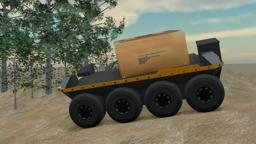

The Moose robot from [Clearpath Robotics](https://www.clearpathrobotics.com) is a large all-terrain unmanned ground vehicle yet.
It can handle tough environments with its rugged build, low ground pressure, and 8x8 traction tires, which allow effortless mobility through soft soils, vegetation, thick muds, and steep grades.
With a large payload mounting area and accessible power and communication ports, Moose can be easily customized with sensors, manipulators and other payloads to accommodate a wide variety of robotics applications in mining, agriculture, construction and environmental monitoring.

### Movie Presentation


### Moose PROTO

Derived from [Robot](https://cyberbotics.com/doc/reference/robot).

```
Moose {
  SFVec3f    translation     0 0 0.38
  SFRotation rotation        0 1 0 1.5708
  SFString   name            "moose"
  SFString   controller      "<none>"
  MFString   controllerArgs  []
  SFBool     synchronization TRUE
  SFColor    color           0.8 0.5 0.1
  MFNode     bodySlot        []
}
```

#### Moose Field Summary

- `color`: Defines the bumper color.
- `bodySlot`: Extends the robot with new nodes.

### Samples

You will find the following sample in this folder: "[WEBOTS\_HOME/projects/robots/clearpath/moose/worlds]({{ url.github_tree }}/projects/robots/clearpath/moose/worlds)".

#### [moose\_demo.wbt]({{ url.github_tree }}/projects/robots/clearpath/moose/worlds/moose\_demo.wbt)

 This simulation shows a Moose robot following a predefined path on an uneven terrain. It carries a cardboard box.
