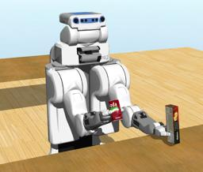

The [clearpath's PR2 robot](http://wiki.ros.org/Robots/PR2) is a mobile manipulation platform.
The robot is mounted on four directional wheels, had two articulated arms with grippers, an articulated body and head.
It is mounted by several sensors including cameras.

### Movie Presentation


### Pr2 PROTO

Derived from [Robot](https://cyberbotics.com/doc/reference/robot).

```
Pr2 {
  SFVec3f    translation     0 0 0
  SFRotation rotation        0 0 1 0
  SFString   name            "PR2"
  SFString   controller      "pr2_demo"
  MFString   controllerArgs  []
  SFString   customData      ""
  SFBool     supervisor      FALSE
  SFBool     synchronization TRUE
  SFBool     selfCollision   FALSE
  MFNode     baseSlot        []
}
```

#### Pr2 Field Summary

- `baseSlot`: Extends the robot with new nodes in the base slot.

### Samples

You will find the following sample in this folder: "[WEBOTS\_HOME/projects/robots/clearpath/pr2/worlds]({{ url.github_tree }}/projects/robots/clearpath/pr2/worlds)".

#### [pr2.wbt]({{ url.github_tree }}/projects/robots/clearpath/pr2/worlds/pr2.wbt)

 This simulation shows a PR2 robot grabbing biscuit boxes from one table, and putting them on another table.
