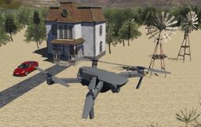

The [Mavic 2 PRO](https://www.dji.com/ch/mavic-2) from [DJI](https://www.dji.com) is quadcopter drone mounted with a motorized camera.

### Movie Presentation


### Mavic2Pro PROTO

Derived from [Robot](https://cyberbotics.com/doc/reference/robot).

```
PROTO Mavic2Pro {
  SFVec3f    translation         0 0 0.065
  SFRotation rotation            0 0 1 0
  SFString   name                "Mavic 2 PRO"
  SFString   controller          "mavic2pro"
  MFString   controllerArgs      []
  SFString   customData          ""
  SFBool     supervisor          FALSE
  SFBool     synchronization     TRUE
  MFFloat    battery             []
  MFNode     bodySlot            []
  MFNode     cameraSlot          [ Camera { width 400 height 240 } ]
}
```

#### Mavic2Pro Field Summary

- `bodySlot`: Extends the robot with new nodes.
- `cameraSlot`: Extends the camera with new nodes.

### Samples

You will find the following sample in this folder: [WEBOTS\_HOME/projects/robots/dji/mavic/worlds]({{ url.github_tree }}/projects/robots/dji/mavic/worlds).

#### [mavic\_2\_pro.wbt]({{ url.github_tree }}/projects/robots/dji/mavic/worlds/mavic\_2\_pro.wbt)

 This demonstration shows a DJI Mavic 2 PRO flying over a rural area.
The `mavic2pro.c` controller allows you to control the drone, after it has taken off, with the keyboard of your computer.
The `mavic2pro_patrol.py` controller shows how to move to specific world coordinates using its GPS, imu and gyroscope.
