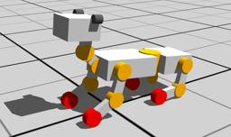

The "GhostDog" robot is a dog-like robot developed by the [EPFL BioRob laboratory](https://biorob.epfl.ch/).

It is a quadruped robot made of active hip joints and passive knee joints (using springs and dampers).
Each knee is made of two embedded HingeJoint nodes, one active and one passive, sharing the same rotation axis.
The passive HingeJoint simulates the spring and damping.
The active HingeJoint is not actuated in the following demo but it could be used for controlling the knee joints.

### GhostDog PROTO

Derived from [Robot](https://cyberbotics.com/doc/reference/robot).

```
GhostDog {
  SFVec3f    translation     0 0 0.29
  SFRotation rotation        0 0 1 0
  SFString   name            "GhostDog"
  SFString   controller      "ghostdog"
  MFString   controllerArgs  []
  SFString   customData      ""
  SFBool     supervisor      FALSE
  SFBool     synchronization TRUE
  MFNode     extensionSlot   []
}
```

#### GhostDog Field Summary

- `extensionSlot`: Extends the robot with new nodes in the extension slot.

### Samples

You will find the following sample in this folder: "[WEBOTS\_HOME/projects/robots/epfl/biorob/worlds]({{ url.github_tree }}/projects/robots/epfl/biorob/worlds)".

#### [ghostdog.wbt]({{ url.github_tree }}/projects/robots/epfl/biorob/worlds/ghostdog.wbt)

 This example shows the GhostDog robot which gallops.
The keyboard can be used to control the robot's direction and to change the amplitude of the galloping motion.
