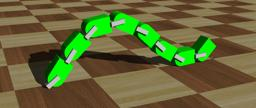

The "Yamor" robot is a modular robot developed by the [EPFL BioRob laboratory](https://biorob.epfl.ch/).

### Yamor PROTO

Derived from [Robot](https://cyberbotics.com/doc/reference/robot).

```
Yamor {
  SFVec3f    translation     0 0 0.03
  SFRotation rotation        0 0 1 0
  SFString   name            "Yamor"
  SFString   controller      "yamor"
  MFString   controllerArgs  []
  SFString   customData      ""
  SFBool     supervisor      FALSE
  SFBool     synchronization TRUE
  MFNode     extensionSlot   []
}
```

#### Yamor Field Summary

- `extensionSlot`: Extends the robot with new nodes in the extension slot.

### Samples

You will find the following sample in this folder: "[WEBOTS\_HOME/projects/robots/epfl/biorob/worlds]({{ url.github_tree }}/projects/robots/epfl/biorob/worlds)".

#### [yamor.wbt]({{ url.github_tree }}/projects/robots/epfl/biorob/worlds/yamor.wbt)

 In this example, eight Yamor robot "modules" attach to and detach from each other using [Connector](https://cyberbotics.com/doc/reference/connector) devices.
Connector devices are used to simulate the mechanical connections of docking systems.
Each module is controlled by an instance of the same robot controller, which can only connect or disconnect from another module and move its rotational motor.
From these simple behaviors, a global behavior emerges.
The resulting robot (composed of all the modules) moves forward as a worm.
From times to times, a module is dropped, showing the robustness of the locomotion behavior of such a system.
