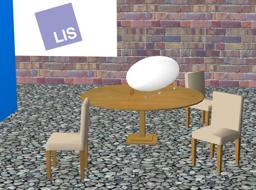

The "Blimp" robot is a Zeppelin-like aerial robot developed by the [EPFL LIS laboratory](https://lis.epfl.ch/).

### Blimp PROTO

Derived from [Robot](https://cyberbotics.com/doc/reference/robot).

```
Blimp {
  SFVec3f    translation     0 0 0.4
  SFRotation rotation        0 0 1 0
  SFString   name            "Blimp"
  SFString   controller      "blimp"
  MFString   controllerArgs  []
  SFString   customData      ""
  SFBool     supervisor      FALSE
  SFBool     synchronization TRUE
  MFNode     extensionSlot   []
}
```

#### Blimp Field Summary

- `extensionSlot`: Extends the robot with new nodes in the extension slot.

### Samples

You will find the following sample in this folder: "[WEBOTS\_HOME/projects/robots/epfl/lis/worlds]({{ url.github_tree }}/projects/robots/epfl/lis/worlds)".

### [blimp.wbt]({{ url.github_tree }}/projects/robots/epfl/lis/worlds/blimp.wbt)

 This is an example of the flying blimp robot developed at the Laboratory of Intelligent Systems (LIS) at EPFL.
You can use your keyboard, or a joystick to control the Blimp's motion across the room.
Use the up, down, right, left, page up, page down and space (reset) keys.
Various [Solid](https://cyberbotics.com/doc/reference/solid) and [IndexedFaceSet](https://cyberbotics.com/doc/reference/indexedfaceset) nodes are used to model the room using textures and transparency.
A *physics plugin* is used to add thrust and other forces to the simulation.

> **Note**:
[Fluid](https://cyberbotics.com/doc/reference/fluid) and [Propeller](https://cyberbotics.com/doc/reference/propeller) nodes are now recommended to create flying robots.
