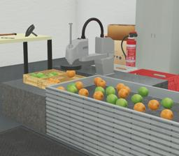

[SCARA Epson T6](https://www.epson.eu/products/robot/scara-t6-series) is a 4-axis robotic arm with three revolute and one prismatic DOF.
The chosen model is the T6-602s.
It has a 200mm vertical range with the shaft.
Each arm has a radius of 300mm and can thus reach 600mm horizontally.
It can handle a payload of maximum 6kg.
An end-effector can be chosen on its shaft, as a gripper or a suction cup.

The actuators available are three rotational motors (`base_arm_motor`, `arm_motor` and `shaft_rotation_motor`), a linear motor (`shaft_linear_motor`) and a [LED](https://cyberbotics.com/doc/reference/led) (`epson_led`).
The motors have four position sensors named `base_arm_position`, `arm_position` `shaft_rotation_position` and `shaft_linear_position`.

> **Maximum range of operation in radian**: base arm: +/- 0.73, arm: +/- 0.83, shaft (linear): 200 mm, shaft (rotation): +/- 3.1416

### ScaraT6 PROTO

Derived from [Robot](https://cyberbotics.com/doc/reference/robot).

```
ScaraT6 [
  SFVec3f           translation     0 0 0
  SFRotation        rotation        0 0 1 0
  SFString          name            "Scara T6"
  SFString          controller      "<none>"
  MFString          controllerArgs  []
  SFBool            supervisor      FALSE
  SFString          customData      ""
  SFString          window          "<generic>"
  SFBool            staticBase      FALSE
  MFNode            handSlot        []

]
```

#### ScaraT6 Field Summary

-  `staticBase`: Defines if the SCARA base should be pinned to the static environment.
-  `handSlot`: Extends the shaft with new nodes in the hand slot.

### Samples

You will find the following sample in this folder: "[WEBOTS\_HOME/projects/robots/epson/scara_t6/worlds]({{ url.github_tree }}/projects/robots/epson/scara_t6/worlds)".

#### [Industrial\_example.wbt]({{ url.github_tree }}/projects/robots/epson/scara_t6/worlds/industrial\_example.wbt)

 In this example, you can see the SCARA robot moving fruits from a track to baskets using a suction cup.
