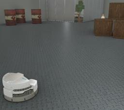

Designed by Festo, Robotino 3 is a three-wheeled (mecanum) robot.
The model is a modular mobile platform used for educational, training and research purposes.
It is controlled by an industry-standard PC system (ROS compatible) and it is also customizable with accessories to adapt to any specific need.

More information on the Robotino 3 robot can be found on the [constructor website](https://ip.festo-didactic.com/InfoPortal/Robotino3/Overview/EN/index.html).

### Robotino3 PROTO

Derived from [Robot](https://cyberbotics.com/doc/reference/robot).

```
Robotino3 {
  SFVec3f     translation          0 0 0
  SFRotation  rotation             0 0 1 0
  SFString    name                 "Robotino 3"
  SFString    model                "Festo - Robotino 3"
  SFString    controller           "robotino3"
  MFString    controllerArgs       []
  SFString    customData           ""
  SFBool      supervisor           FALSE
  SFBool      synchronization      TRUE
  SFBool      selfCollision        FALSE   # Enables/disables the detection of collisions within the robot.
  MFNode      bodySlot             []
  MFNode      cameraSlot           []
  MFNode      topSlot              []
  MFNode      middleSlot           []
  MFNode      bottomSlot           []
  SFString    infraredSensorModel  "SharpGP2D120"
}
```

#### Robotino 3 Field Summary

- `bodySlot` : Extends the robot with new nodes (such as the `Robotino3Platform` for example).
- `cameraSlot` : Extends the robot with a camera (such as the `Robotino3Webcam` for example).
- `topSlot`: Extends the robot with new parts such as lidar.
- `middleSlot`: Extends the robot with new parts such as lidar.
- `bottomSlot`: Extends the robot with new parts such as lidar.
- `infraredSensorModel`: Defines the infrared sensors used (it should be one of `SharpGP2D120`, `SharpGP2Y0A41SK0F` or `SharpGP2Y0A02YK0F`).


### Sample

You will find the following sample in this folder: "[WEBOTS\_HOME/projects/robots/festo/robotino3/worlds]({{ url.github_tree }}/projects/robots/festo/robotino3/worlds)".

> **Note:** For the mecanum wheels to behave correctly, the following [ContactProperties](https://cyberbotics.com/doc/reference/contactproperties) should be added in the `contactProperties` field of the [WorldInfo](https://cyberbotics.com/doc/reference/worldinfo) node:
```
  contactProperties [
    ContactProperties {
      material1 "WheelMat"
      coulombFriction [
        0, 2, 0
      ]
      bounce 0
    }
  ]
```

#### [robotino3.wbt]({{ url.github_tree }}/projects/robots/festo/robotino3/worlds/robotino3.wbt)

 This simulation shows a Robotino 3 moving in an industrial environment using a Braitenberg algorithm using the information received by its nine infrared sensors.
