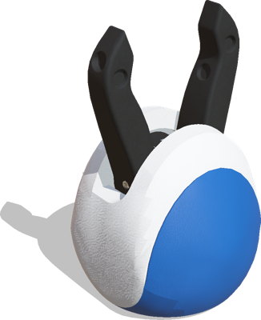
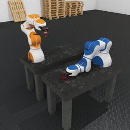

The [P-Rob 3](https://www.fp-robotics.com/en/p-rob) is a lightweight and soft covered collaborative robotic arm developed by [F&P Robotics](https://www.fp-robotics.com/en/).

### P-Rob3 PROTO

Derived from [Robot](https://cyberbotics.com/doc/reference/robot).

```
PROTO P-Rob3 [
  SFVec3f    translation     0 0 0
  SFRotation rotation        0 0 1 0
  SFString   name            "P-Rob3"
  SFString   controller      "<generic>"
  SFString   controllerArgs  ""
  SFBool     supervisor      FALSE
  SFBool     synchronization TRUE
  SFBool     selfCollision   TRUE
  SFColor    mainColor       0.98 0.98 0.98
  SFColor    secondaryColor  0.036 0.3 0.615
  MFNode     toolSlot        []
  SFBool     staticBase      TRUE
]
```

#### P-Rob3 Field Summary

- `mainColor`: Defines the main color fo the robot.

- `secondaryColor`: Defines the secondary color of the robot.

- `toolSlot`: Extends the arm hand with new nodes.

- `staticBase`: Defines if the robot base should be pinned to the static environment.

### Gripper

The P-Grip gripper from [F&P Robotics](https://www.fp-robotics.com/en/) can be added in the `toolSlot` of the `P-Rob3` node to give grasping capability to the robot.

%figure "P-Grip"



%end

### Samples

You will find the following sample in this folder: "[WEBOTS\_HOME/projects/robots/fp\_robotics/p-rob3/worlds]({{ url.github_tree }}/projects/robots/fp_robotics/p-rob3/worlds)".

#### [p-rob3.wbt]({{ url.github_tree }}/projects/robots/fp_robotics/p-rob3/worlds/p-rob3.wbt)

 This simulation shows two P-Rob3 arms working together to move cans in an industrial environment.
