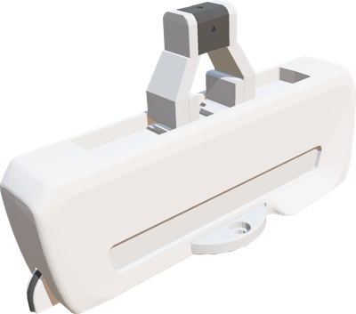
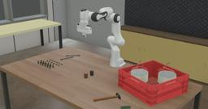

Franka Emika's Panda arm is an agile manipulator featuring 7 DOF with torque sensors at each joint, allowing adjustable stiffness/compliance and advanced torque control.

### Movie Presentation


### Panda PROTO

Derived from [Robot](https://cyberbotics.com/doc/reference/robot).

```
Panda {
  SFVec3f    translation      0 0 0
  SFRotation rotation         0 0 1 0
  SFString   name             "panda"
  SFString   controller       "<generic>"
  MFString   controllerArgs   []
  SFBool     supervisor       FALSE
  SFBool     synchronization  TRUE
  SFBool     selfCollision    FALSE
  MFNode     endEffectorSlot  []
}
```

#### Field Summary

- `endEffectorSlot`: Extend the robot with new nodes at the end of the arm.

### Panda Hand


The Panda Hand is a gripper from [Franka Emika](https://www.franka.de/) that can be added in the `endEffectorSlot` of the `Panda` node to give grasping capability to the robot.

%figure "Panda Hand Gripper"



%end

### Samples

You will find the following sample in this folder: "[WEBOTS\_HOME/projects/robots/franka\_emika/panda/worlds]({{ url.github_tree }}/projects/robots/franka_emika/panda/worlds)".

#### [panda.wbt]({{ url.github_tree }}/projects/robots/franka_emika/panda/worlds/panda.wbt)

 This simulation shows the Franka Emika's Panda robot in a factory environment.
The robot is equipped with a [Panda Hand](https://webots.cloud/run?url=https://github.com/cyberbotics/webots/blob/released/projects/robots/franka_emika/panda/protos/PandaHand.proto) gripper.
