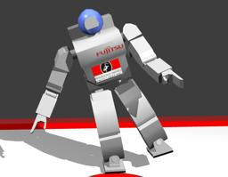
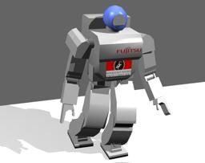

The [Fujitsu HOAP-2](https://en.wikipedia.org/wiki/HOAP) (HOAP for "Humanoid for Open Architecture Platform") is an humanoid robot of 48 cm with 25 degrees of freedom.

### Hoap2 PROTO

Derived from [Robot](https://cyberbotics.com/doc/reference/robot).

```
Hoap2 {
  SFVec3f    translation         0 0 0.29
  SFRotation rotation            0 0 1 0
  SFString   name                "HOAP-2"
  SFString   controller          "hoap2"
  MFString   controllerArgs      []
  SFString   customData          ""
  SFBool     supervisor          FALSE
  SFBool     synchronization     TRUE
  SFColor    diffuseColor        0.65 0.65 0.65
  SFFloat    shininess           0.8
  SFColor    specularColor       0.65 0.65 0.65
  SFString   contactMaterial     "default"
  SFString   footContactMaterial "default"
  MFNode     extensionSlot       []
}
```

#### Hoap2 Field Summary

- `diffuseColor`: Defines the `diffuseColor` field of the main [Material](https://cyberbotics.com/doc/reference/material).

- `shininess`: Defines the `shininess` field of the main [Material](https://cyberbotics.com/doc/reference/material).

- `specularColor`: Defines the `specularColor` field of the main [Material](https://cyberbotics.com/doc/reference/material).

- `contactMaterial`: Defines the `contactMaterial` field of all the [Solid](https://cyberbotics.com/doc/reference/solid) nodes except the feet.

- `footContactMaterial`: Defines the `contactMaterial` field of the foot [Solid](https://cyberbotics.com/doc/reference/solid) nodes.

- `extensionSlot`: Extends the robot with new nodes in the extension slot.

### Samples

You will find some samples in this folder: "[WEBOTS\_HOME/projects/robots/fujitsu/hoap2/worlds]({{ url.github_tree }}/projects/robots/fujitsu/hoap2/worlds)".

### [hoap2\_sumo.wbt]({{ url.github_tree }}/projects/robots/fujitsu/hoap2/worlds/hoap2\_sumo.wbt)

 In this example, a HOAP-2 robot performs the Shiko dance (the dance sumos perform before a combat).
This robot is equipped with `TouchSensors` on the soles of its feet; it measures and logs the pressure exerted by its body on the ground.

### [hoap2\_walk.wbt]({{ url.github_tree }}/projects/robots/fujitsu/hoap2/worlds/hoap2\_walk.wbt)

 In this example, a HOAP-2 robot walks straight forward on a tatami.
This robot is equipped with `TouchSensors` on the soles of its feet; it measures and logs the pressure exerted by its body on the ground.
