E-puck is a miniature mobile robot originally developed at EPFL for teaching purposes by the designers of the successful Khepera robot.
The hardware and software of e-puck is fully open source, providing low level access to every electronic device and offering unlimited extension possibilities.

The model includes support for the differential wheel motors (encoders are also simulated, as position sensors), the infra-red sensors for proximity and light measurements, the [Accelerometer](https://cyberbotics.com/doc/reference/accelerometer), the [Gyro](https://cyberbotics.com/doc/reference/gyro), the [Camera](https://cyberbotics.com/doc/reference/camera), the 8 surrounding [LEDs](https://cyberbotics.com/doc/reference/led), the body and front [LEDs](https://cyberbotics.com/doc/reference/led), bluetooth communication (modeled using [Emitter](https://cyberbotics.com/doc/reference/emitter) / [Receiver](https://cyberbotics.com/doc/reference/receiver) devices) and ground sensors extension.
The other e-puck devices are not yet simulated in the current model.

The official [e-puck website](http://www.e-puck.org) provides the most up-to-date information about this robot.
E-puck is also available for [purchase](https://www.cyberbotics.com/buy) from Cyberbotics Ltd.

### Overview of the Robot

%figure "The e-puck robot at work"

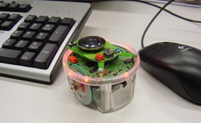

%end

E-puck was designed to fulfill the following requirements:

- *Elegant design*: the simple mechanical structure, electronics design and software of e-puck is an example of a clean and modern system.
- *Flexibility*: e-puck covers a wide range of educational activities, offering many possibilities with its sensors, processing power and extensions.
- *Simulation software*: e-puck is integrated with Webots simulation software for easy programming, simulation and remote control of the (physical) robot.
- *User friendly*: e-puck is small and easy to setup on a tabletop next to a computer.
It doesn't need any cables, providing optimal working comfort.
- *Robustness and maintenance*: e-puck is resilient under student use and is simple to repair.
- *Affordable*: the price tag of e-puck is friendly to university budgets.

E-puck is equipped with a large number of devices, as summarized in this table:

%figure "E-puck features"

| Feature        | Description                                                                                                                      |
| -------------- | -------------------------------------------------------------------------------------------------------------------------------- |
| Size           | 7.4 cm in diameter, 4.5 cm high                                                                                                  |
| Weight         | 150 g                                                                                                                            |
| Battery        | about 3 hours with the provided 5Wh LiION rechargeable battery                                                                   |
| Processor      | Microchip dsPIC 30F6014A @ 60MHz (about 15 MIPS)                                                                                 |
| Motors         | 2 stepper motors with 20 steps per revolution and a 50:1 reduction gear                                                          |
| IR sensors     | 8 infra-red sensors measuring ambient light and proximity of obstacles in a 4 cm range                                           |
| Camera         | color camera with a maximum resolution of 640x480 (typical use: 52x39 or 640x1)                                                  |
| Microphones    | 3 omni-directional microphones for sound localization                                                                            |
| Accelerometer  | 3D accelerometer along the X, Y and Z axes                                                                                       |
| Gyroscope      | 3D gyroscope along the X, Y and Z axes                                                                                           |
| LEDs           | 8 red LEDs on the ring and one green LED on the body                                                                             |
| Speaker        | on-board speaker capable of playing WAV or tone sounds                                                                           |
| Switch         | 16 position rotating switch                                                                                                      |
| Bluetooth      | Bluetooth for robot-computer and robot-robot wireless communication                                                              |
| Remote Control | infra-red LED for receiving standard remote control commands                                                                     |
| Expansion bus  | expansion bus to add new possibilities to your robot                                                                             |
| Programming    | C programming with the GNU GCC compiler system                                                                                   |
| Simulation     | Webots facilitates the programming of e-puck with a powerful simulation, remote control and cross-compilation system             |

%end

### E-puck Model

%figure "E-puck characteristics"

| Characteristics             | Values       |
| --------------------------- | ------------ |
| Diameter                    | 71 mm        |
| Height                      | 50 mm        |
| Wheel radius                | 20.5 mm      |
| Axle Length                 | 52 mm        |
| Weight                      | 0.16 kg      |
| Max. forward/backward speed | 0.25 m/s     |
| Max. rotation speed         | 6.28 rad/s   |

%end

The standard model of the e-puck is provided in the "E-puck.proto" PROTO file which is located in the "WEBOTS\_HOME/projects/robots/gctronic/e-puck/protos" directory of the Webots distribution (see also "E-puckDistanceSensor.proto" PROTO file and "E-puckGroundSensors.proto" PROTO file); you will find complete specifications in it.
The two PROTO fields `groundSensorSlot` and `turretSlot` have been included in the simulation model in order to support extension modules.
In particular, the ground sensors module extension of the real e-puck robot is modelled using the "E-puckGroundSensors.proto" PROTO in Webots to provide 3 optional infra-red sensors pointing to the ground in front of the robot.
The names of the simulated devices which are to be used as an argument of the `wb_robot_get_device` function (see the [Robot section](https://cyberbotics.com/doc/reference/robot)) are presented in the table below.

%figure "Devices names"

| Device                     | Name                                                             |
| -------------------------- | ---------------------------------------------------------------- |
| Motors                     | 'left wheel motor' and 'right wheel motor'                       |
| Position sensors           | 'left wheel sensor' and 'right wheel sensor'                     |
| Proximity sensors          | 'ps0' to 'ps7'                                                   |
| Light sensors              | 'ls0' to 'ls7'                                                   |
| LEDs                       | 'led0' to 'led7' (e-puck ring), 'led8' (body) and 'led9' (front) |
| Camera                     | 'camera'                                                         |
| Accelerometer              | 'accelerometer'                                                  |
| Gyro                       | 'gyro'                                                           |
| Ground sensors (extension) | 'gs0', 'gs1' and 'gs2'                                           |
| Speaker                    | 'speaker'                                                        |

%end

The `wb_motor_set_velocity` and `wb_position_sensor_get_value` functions allow you to set the speed of the robot and to use its encoders.

%figure "Devices orientations"

| Device | x (m)  | y (m)  | z (m)  | Orientation (rad) |
| ------ | ------ | -----  | ------ | ----------------- |
| ps0    | 0.030  | -0.010 | 0.033  | 1.27              |
| ps1    | 0.022  | -0.025 | 0.033  | 0.77              |
| ps2    | 0.00   | -0.031 | 0.033  | 0.00              |
| ps3    | -0.030 | -0.015 | 0.033  | 5.21              |
| ps4    | -0.030 | 0.015  | 0.033  | 4.21              |
| ps5    | 0.00   | 0.031  | 0.033  | 3.14159           |
| ps6    | 0.022  | 0.025  | 0.033  | 2.37              |
| ps7    | 0.030  | 0.010  | 0.033  | 1.87              |
| camera | 0.030  | 0.000  | 0.028  | 4.71239           |

%end

The forward direction of the e-puck is given by the positive x-axis of the world coordinates.
This is also the direction in which the camera eye and the direction vector of the camera are looking.
The axle's direction is given by the positive y-axis.
Proximity sensors, light sensors and [LEDs](https://cyberbotics.com/doc/reference/led) are numbered clockwise.
Their location and orientation are shown in [this figure](#sensors-leds-and-camera).
The last column of the latter lists the angles between the negative y-axis and the direction of the devices, the plane *xOy* being oriented counter-clockwise.
Note that the proximity sensors and the light sensors are actually the same devices of the real robot used in a different mode, so their direction coincides.
Proximity sensor responses are simulated in accordance to the lookup table in this figure; this table is the outcome of calibrations performed on the real robot.

%figure "Proximity sensor response against distance"

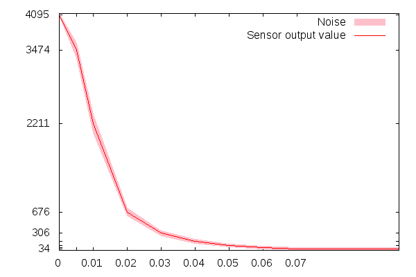

%end

The resolution of the camera was limited to 52x39 pixels, as this is the maximum rectangular image with a 4:3 ratio which can be obtained from the remote control interface with the real robot.

%figure "Sensors, LEDs and camera"

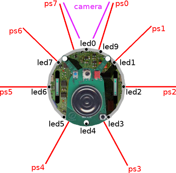

%end

### Movie Presentation


### e-puck2

%figure "e-puck2 model"

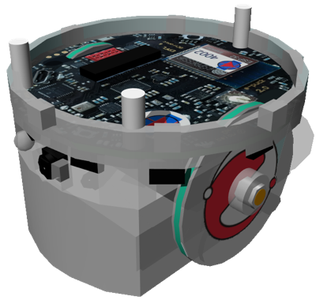

%end

The [e-puck2](http://www.gctronic.com/e-puck2.php) robot has been released in 2018.
Comparing to the original e-puck robot, the e-puck2 robot has a more powerful micro-controller, a Wi-Fi chipset, a few more sensors and a USB charging capability.
More information is available on [this wiki page](http://www.gctronic.com/doc/index.php/e-puck2).

The `version` field of the `E-puck` PROTO node selects the version of the e-puck model.
When set to "2", the e-puck model switches to the e-puck2, with the following differences:

- The graphical shape is changing: in particular, the top turret is removed and different chipset texture is set for the plate.
- The time-of-flight (ToF) long range distance sensor is added to the model (including support for Wi-Fi remote-control).
- The overall mass differs: 130 [grams] instead of 150 [grams].
- The max speed differs: 1200 [steps / second] instead of 1000 [steps / second].
- The e-puck2 robot windows offers Wi-Fi remote control instead of Bluetooth.
- The LEDs of the e-puck2 are slightly different from the ones of the e-puck (some are RGB LEDs).

> **Note**: Controller cross-compilation is currently not available for the e-puck2 robot. However, remote-controlling a real e-puck2 robot with Bluetooth is possible by using an e-puck 1 model in Webots (e.g., setting the `version` field of the `E-puck` PROTO to "1").

### E-puck PROTO

Derived from [Robot](https://cyberbotics.com/doc/reference/robot).

```
E-puck {
  SFVec3f    translation                  0 0 0
  SFRotation rotation                     0 0 1 0
  SFString   name                         "e-puck"
  SFString   controller                   "e-puck_avoid_obstacles"
  MFString   controllerArgs               []
  SFString   customData                   ""
  SFBool     supervisor                   FALSE
  SFBool     synchronization              TRUE
  SFString   version                      "1"
  SFFloat    camera_fieldOfView           0.84
  SFInt32    camera_width                 52
  SFInt32    camera_height                39
  SFBool     camera_antiAliasing          FALSE
  SFRotation camera_rotation              0 0 1 0
  SFFloat    camera_noise                 0.0
  SFFloat    camera_motionBlur            0.0
  SFInt32    distance_sensor_numberOfRays 1
  SFInt32    emitter_channel              1
  SFInt32    receiver_channel             1
  MFFloat    battery                      []
  SFString   window                       "e-puck"
  MFNode     turretSlot                   []
  MFNode     groundSensorsSlot            []
  SFBool     kinematic                    FALSE
}
```

#### E-puck Field Summary

- `version`: Defines the e-puck version; either "1" or "2".

- `camera_fieldOfView`: Defines the `fieldOfView` field of the [Camera](https://cyberbotics.com/doc/reference/camera).

- `camera_width`: Defines the `width` field of the [Camera](https://cyberbotics.com/doc/reference/camera).

- `camera_height`: Defines the `height` field of the [Camera](https://cyberbotics.com/doc/reference/camera).

- `camera_antiAliasing`: Defines the `antiAliasing` field of the [Camera](https://cyberbotics.com/doc/reference/camera).

- `camera_rotation`: Defines the `rotation` field of the [Camera](https://cyberbotics.com/doc/reference/camera).

- `camera_noise`: Defines the `noise` field of the [Camera](https://cyberbotics.com/doc/reference/camera).

- `camera_motionBlur`: Defines the `motionBlur` field of the [Camera](https://cyberbotics.com/doc/reference/camera).

- `distance_sensor_numberOfRays`: Defines the `numberOfRays` field of the [DistanceSensor](https://cyberbotics.com/doc/reference/distancesensor).

- `emitter_channel`: Defines the `channel` field of the [Emitter](https://cyberbotics.com/doc/reference/emitter).

- `receiver_channel`: Defines the `channel` field of the [Receiver](https://cyberbotics.com/doc/reference/receiver).

- `turretSlot`: Extends the robot with new nodes in the turret slot.

- `groundSensorsSlot`: Extends the robot with new nodes in the ground slot. Typically: `E-puckGroundSensors`.

- `kinematic`: Defines whether the robot motion and its sensors are computed according to a 2D kinematics algorithm.

### Control Interface

#### Robot Window

%figure "E-puck robot window"

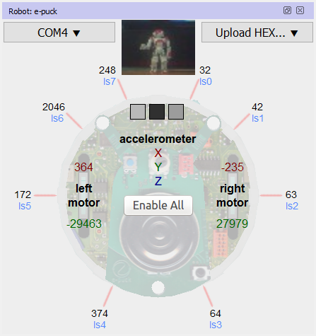

%end

When opening a world containing an e-puck robot, Webots may display the e-puck robot window.
If it is not displayed, you can open it by double-clicking on the e-puck robot.
This window is depicted in [this figure](#e-puck-robot-window).
It includes the visualization of the sensors of the robot.
The proximity measurements are displayed in black, outside the body of the robot.
The light measurements are displayed in blue, below the proximity measurements.
The motor speeds are displayed in red, and the motor positions are displayed in green.
The camera image is displayed at the top of the window and the XYZ accelerometer and gyroscope values are displayed on the robot.
If the e-puck robot is equipped with the ground sensors extension modeled in `E-puckGroundSensors`, then the ground sensors measurements are represented by the three grayscale boxes.

In addition to displaying the sensor information, the e-puck robot window also has a number of buttons.
The `Enable All` allows the user to enable all the sensors measurements on the robot, this cannot be undone and is meant for debugging purposes only.
The Simulation / COM ports drop down menu allows the user to switch between the simulation and the remote control of a real e-puck robot connected to a COM port of the computer.
In order to have the remote control working properly, the e-puck robot should run the Webots firmware (see below).
Finally, the `Upload HEX...` button allows the user to upload a cross-compilation HEX file on the robot to execute it on the micro-controller of the robot.
The Webots firmware can be uploaded this way on the e-puck robot.

This e-puck control window appears because the `window` field of the `E-puck` node in the world file was set to "e-puck".
Changing this `window` to an empty string will disable this control window.

#### BotStudio Overview

%figure "BotStudio window"

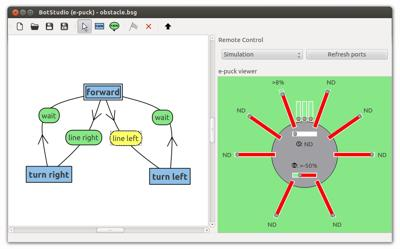

%end

BotStudio, depicted in [this figure](#botstudio-window), is a user interface to graphically program the e-puck thanks to a finite state automaton.
Behaviors such as wall follower, collision avoider or line follower can be implemented quickly thanks to this interface.
BotStudio is typically destined for the educational field, particularly for beginners in robotics.

An automaton state of BotStudio corresponds to a state of the e-puck actuators while a transition corresponds to a condition over its sensor values.
A transition is fired when all of its conditions are fulfilled (logical AND).
A logical OR can be performed by several transitions between two states.

The actuators available in BotStudio are the [LEDs](https://cyberbotics.com/doc/reference/led) and the motors.
Each automaton state have two sliders for setting the motor speed value.
Note that these values can be unset by clicking on the cursor of the slider.
Each state also have 10 square buttons to set the [LEDs](https://cyberbotics.com/doc/reference/led) states.
A red button means the LED is turned on, a black one means it is turned off and a gray one means there is no modification.

The sensor available in BotStudio are the distance sensors and the camera.
Moreover a timer can be used to temporize the conditions by dragging the corresponding slider.
Conditions over the IR sensors can be set by dragging the 8 red sliders.
A condition can be reversed by clicking on the gray part of the slider.
Finally, the camera is used to give a clue on the front environment of the e-puck.
An algorithm is applied on the last line of the camera and returns a integer between -10 and 10 indicating if a black line is perceived respectively at the left and at the right of the e-puck's field of view.
A condition can be set on this value to get a line follower behavior.

An example of BotStudio can be found by opening the "WEBOTS\_HOME/projects/robots/gctronic/e-puck/world/e-puck\_botstudio.wbt" world file (see below).
The BotStudio window can be opened by selecting the "Show Robot Window" item in the e-puck [context menu](https://cyberbotics.com/doc/guide/the-3d-window#context-menu) when the controller points on a *.bsg* file.

BotStudio needs some additional Qt libraries to run, so it is necessary to add a [`runtime.ini` file](https://cyberbotics.com/doc/guide/controller-programming#environment-variables) in the folder containing the BotStudio controller file.
A sample `runtime.ini` specifiying the required libraries could be found at "[WEBOTS\_HOME/projects/robots/gctronic/e-puck/controllers/obstacle/runtime.ini]({{ url.github_tree }}/projects/robots/gctronic/e-puck/controllers/obstacle/runtime.ini)".

#### Bluetooth Setup

The e-puck has a Bluetooth interface allowing it to communicate with Webots.
This feature is available under Windows, Linux and macOS.
The Bluetooth interface must be set up according to your operating system (OS).
Generally it is as simple as using the Bluetooth interface of your OS in order to discover and to pair the e-puck as a regular Bluetooth device.
The complete instructions about pairing can be found on the [GCTronic website](http://www.gctronic.com/doc/index.php/E-Puck#Getting_started).

On linux, the pairing has to be done manually (without using the Bluetooth interface of the OS).
This can be done by using the `rfcomm` command.
Once it has been generated, the rfcomm file has to be given to Webots through an environment variable.
It may also occur that the rfcomm file doesn't have the reading rights.
A typical pairing can be done using the following commands:

```sh
# Get the e-puck MAC adress
$ hcitool scan
Scanning ...
	10:00:E8:52:BF:32	e-puck_1368
# Bind the MAC adress of the e-puck with a non-existing rfcomm file
sudo rfcomm bind /dev/rfcomm1 10:00:E8:52:BF:32
# (Optional) Grant the read rights to the rfcomm file
sudo chmod 666 /dev/rfcomm1
# Export the WEBOTS_COM? environment variable (with ? between 1 and 9)
export WEBOTS_COM1=/dev/rfcomm1
# Launch Webots
webots
```

> **Note**: On recent Ubuntu releases, the Bluetooth connection may work slowly.
During a remote-control session, the real e-puck may have difficulties to run in real-time.
In this case, remove the `modemmanager` package (`sudo apt-get remove modemmanager`) as documented [here](http://www.gctronic.com/doc/index.php/E-Puck#Bluetooth_slowdown_in_Ubuntu).

#### Bluetooth Remote Control

Once properly set up, the Bluetooth connection to your e-puck should appear in the dropdown menus of the e-puck robot window.
If it doesn't appear there, it means that your computer was not properly configured to interface with your e-puck robot through Bluetooth.
Please refer to the instructions given in the previous section.

When selecting a specific Bluetooth connection from the popup menu of the control window, Webots will try to establish a connection with your e-puck robot.
Once connected, it will display the version of the e-puck serial communication software on the Webots console (e.g. `[e-puck] Running real e-puck (Version 1.5.2 April 2015 (Webots))`), and will switch the control to the real robot.
That is, it will send motor commands to the real robot and display sensor information (proximity, light, camera image, etc.) coming from the real robot.
This makes the transfer from the simulation to the real robot trivially simple.
Note that in the same popup menu, the `Refresh` menu item can be used to update the list of COM ports.

The remote control has two requirements: the Bluetooth must be correctly set up (computer side) and the e-puck must be programmed with the Webots latest firmware.
To set up Bluetooth, please refer to the official e-puck website.
To upload the last firmware on your robot, switch on your robot, press the `Upload HEX...` button on the e-puck robot window and select the COM port which corresponds to your robot.
Then choose the "WEBOTS\_HOME/projects/robots/gctronic/e-puck/transfer/firmware/firmware-x.x.x.hex" file located in your Webots directory (*x.x.x* has to be replaced by the current firmware's version).

>**Note**: On recent Windows versions of MATLAB, the remote control is not working because MATLAB is coming with a version of `libstdc++-6.dll` that is incompatible with the one coming with Webots.
A simple workaround to fix the issue is to replace the `MATLAB_HOME\MATLAB_VERSION\bin\win64\libstdc++-6.dll` file by the one from `WEBOTS_HOME\msys64\mingw64\bin\libstdc++-6.dll` (make sure to backup the original file before replacing it).

#### Cross-Compilation

An alternative to the remote-control session for running the real e-puck is to cross-compile your code and to upload it on the e-puck.

To use this feature, your code has to be written in C and use the C Webots API.
Moreover, you need to define a specific Makefile called "Makefile.e-puck" in the controller directory.
This Makefile must include the following file:

```makefile
include $(WEBOTS_HOME)/projects/robots/e-puck/transfer/libepuck/Makefile.include
```

Thanks to this, it is possible to cross-compile with Webots by using the `Build / Cross-compile` menu item of the text editor.
Note that the `Upload HEX...` button of the e-puck control window allows you to upload a file generated by the cross-compilation extended by ".hex" on the e-puck robot.

An example of cross-compilation is given in the "WEBOTS\_HOME/projects/robots/gctronic/e-puck/controllers/e-puck\_cross-compilation " subdirectory of your Webots directory.

#### Cross-Compilation Issues on Linux 64 Bit

When cross-compiling on Linux 64 bit, an error as such may occur:

```sh
/bin/sh: 1:
pic30-elf-gcc: not found
make: *** [e-puck_cross-compilation-pic30.o] Error 127
```

This error can be fixed simply by installing the following packets from a terminal:

```sh
sudo apt-get install gcc-4.6-base:i386 libgcc1:i386 libc6:i386
```

### Curriculum

The directory "WEBOTS\_HOME/projects/samples/curriculum" contains a rich collection of simulations involving the e-puck robot.
You will find inside it all the worlds and controllers corresponding to the exercices of Cyberbotics robotics [curriculum](http://www.cyberbotics.com/publications/RiE2011.pdf).
Written in collaboration with professors and master students of EPFL, Cyberbotics curriculum is an educational document intended for all level of learnings in robotics.
It addresses a dozen of topics ranging from finite state automata to particle swarm optimization, all illustrated through the real or the simulated e-puck robot; you can browse it [here](http://www.cyberbotics.com/curriculum) and [here](https://en.wikibooks.org/wiki/Cyberbotics'_Robot_Curriculum).
The e-puck models of Webots distribution are open source and you are welcome to modify them.
If you develop a useful modification and would like to share it, please let us know so that we can improve these models using your contribution.

### Samples

Several simulation examples are located in the "[WEBOTS\_HOME/projects/robots/gctronic/e-puck/worlds]({{ url.github_tree }}/projects/robots/gctronic/e-puck/worlds)" directory of the Webots distribution.

#### [e-puck.wbt]({{ url.github_tree }}/projects/robots/gctronic/e-puck/worlds/e-puck.wbt)

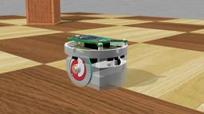 The "e-puck.wbt" is a simple example of collision avoidance behavior using a Braitenberg based controller.
This is done using the distance sensors of the e-puck.

#### [e-puck2.wbt]({{ url.github_tree }}/projects/robots/gctronic/e-puck/worlds/e-puck2.wbt)

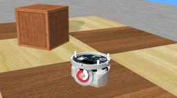 This is the same simulation as the above one, except that it uses an "e-puck2" model.

#### [e-puck2\_pi-puck.wbt]({{ url.github_tree }}/projects/robots/gctronic/e-puck/worlds/e-puck2\_pi-puck.wbt)

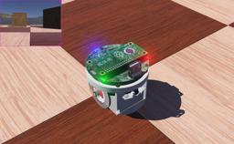 This is again the same simulation with the "e-puck2" model, but the robot is equipped with the `Pi-Puck` extension which gives it more sensors, [LEDs](https://cyberbotics.com/doc/reference/led) and computation power.

>**Note**: The model of the pi-puck extension was sponsored by the [ROSin european project](https://www.rosin-project.eu/ftp/ros2-for-the-e-puck2-robot).

#### [e-puck2\_server.wbt]({{ url.github_tree }}/projects/robots/gctronic/e-puck/worlds/e-puck2\_server.wbt)

 This is a simulation of an e-puck2 robot running a controller that implements a TCP/IP server emulating the e-puck2 Wi-Fi protocol.
The e-puck2 Wi-Fi protocol is available on the real e-puck2 when running the Wi-Fi enabled firmware.
As a consequence, it is possible to connect the Wi-Fi version of the GCTronic `EPuckMonitor` program to this controller (running on port 1000).
This allows users to test the behavior of the simulated e-puck2 robot with the TCP/IP Advance Sercom protocol commands.
The controller folder also contains an `e-puck2.vi` LabVIEW Virtual Instrument that controls the motors of the real or simulated e-puck2 using the Advanced Sercom protocol.

#### [e-puck\_line.wbt]({{ url.github_tree }}/projects/robots/gctronic/e-puck/worlds/e-puck\_line.wbt)

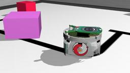 The "e-puck\_line.wbt" world especially examplifies the use of ground sensors.
Ground sensors can be added to a real e-puck robot by inserting a special extension card with three sensors just below the camera of the robot.
These sensors are actually simple infra-red sensors which allow the e-puck robot to see the color level of the ground at three locations in a line across its front.
The `groundSensorSlot` field of the standard E-puck PROTO is expressly provided to equip the simulated e-puck robot with the ground sensors extension modeled in the `E-puckGroundSensors` PROTO.
This is particularly useful for implementing line following behaviors.

#### [e-puck\_line\_demo.wbt]({{ url.github_tree }}/projects/robots/gctronic/e-puck/worlds/e-puck\_line\_demo.wbt)

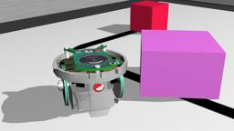 The "e-puck\_line" controller program contains the source code for a simple line following system which, as an exercise, can be improved to obtain the behavior demonstrated in the "e-puck\_line\_demo.wbt" demo, in which the e-puck robot is able to follow the line drawn on the floor, but also to avoid obstacles and return to the line following behavior afterwards.
This model was contributed by Jean-Christophe Zufferey from the EPFL, who sets up a series of exercises with Webots and extended e-puck robots.

#### [e-puck\_botstudio.wbt]({{ url.github_tree }}/projects/robots/gctronic/e-puck/worlds/e-puck\_botstudio.wbt)

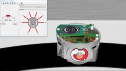 The "e-puck\_botstudio\_example.wbt" is an example of a controller using the BotStudio visual programming language.
The BotStudio window appears by selecting the "Show Robot Window" item in the e-puck [context menu](https://cyberbotics.com/doc/guide/the-3d-window#context-menu) allowing the user to see which command is executed.

#### [e-puck\_botstudio\_with\_floor\_sensors.wbt]({{ url.github_tree }}/projects/robots/gctronic/e-puck/worlds/e-puck\_botstudio\_with\_floor\_sensors.wbt)

 The "e-puck\_botstudio\_with\_floor\_sensors.wbt" is an example world similar to that of "e-puck\_botstudio\_example.wbt" but where the e-puck has a line following behavior based on its floor sensors.

#### [e-puck\_cross-compilation.wbt]({{ url.github_tree }}/projects/robots/gctronic/e-puck/worlds/e-puck\_cross-compilation.wbt)

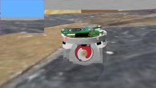 The "e-puck\_cross-compilation.wbt" is an example using a cross-compilation controller.

#### [e-puck\_kinematic.wbt]({{ url.github_tree }}/projects/robots/gctronic/e-puck/worlds/e-puck\_kinematic.wbt)

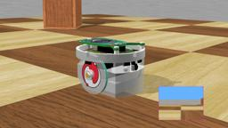 The "e-puck\_kinematic.wbt" is an example world similar to "e-puck.wbt" but where the kinematic field of the E-puck PROTO node is true.
This allows the robot's motion to be calculated according to 2D kinematics algorithms and the collision detection to be calculated with 3D algorithms.
