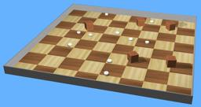

The [GCTronic Elisa 3](http://www.gctronic.com/doc/index.php/Elisa-3) is a small size two-wheeled robot able to move horizontally or vertically thanks to its magnetic wheels.
It has multiple sensors including IR distance sensors, accelerometer and an RF radio.

### Elisa3 PROTO

Derived from [Robot](https://cyberbotics.com/doc/reference/robot).

```
Elisa3 {
  SFVec3f    translation      0 0 0
  SFRotation rotation         0 0 1 0
  SFString   name             "Elisa-3"
  SFString   controller       "elisa3"
  MFString   controllerArgs   []
  SFString   customData       ""
  SFBool     supervisor       FALSE
  SFBool     synchronization  TRUE
  SFInt32    emitter_channel  1
  SFInt32    receiver_channel 1
  MFFloat    battery          []
  MFNode     extensionSlot    []
}
```

#### Elisa3 Field Summary

- `emitter_channel`: Defines the `channel` field of the [Emitter](https://cyberbotics.com/doc/reference/emitter).

- `receiver_channel`: Defines the `channel` field of the [Receiver](https://cyberbotics.com/doc/reference/receiver).

- `extensionSlot`: Extends the robot with new nodes in the extension slot.

### Samples

You will find the following sample in this folder: "[WEBOTS\_HOME/projects/robots/gctronic/elisa/worlds]({{ url.github_tree }}/projects/robots/gctronic/elisa/worlds)".

#### [elisa3.wbt]({{ url.github_tree }}/projects/robots/gctronic/elisa/worlds/elisa3.wbt)

 This simulation shows 10 Elisa robots moving randomly in a square arena with obstacles.
