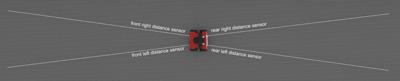
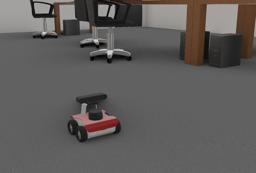

The ROSbot robot is a ROS powered four-wheeled base, used for research and prototyping applications involving mapping, navigation, monitoring, reconnaissance and other behaviors.
It is characterized by a set of features listed in the `rosbot-characteristics` figure.
This model includes 4x4 drive and 4 infra-red distance sensors (2 forward-facing, 2 rear-facing) for proximity measurements.
It is also equipped with a LIDAR, an RGB-D camera and an IMU.

More information on specifications is available on the following link: [ROSbot - Specifications](https://husarion.com/manuals/rosbot/#specification).

### Movie Presentation


### ROSbot

%figure "ROSbot characteristics"

| Characteristics             | Values       |
| --------------------------- | ------------ |
| Length                      | 200 mm       |
| Width                       | 235 mm       |
| Height                      | 220 mm       |
| Weight                      | 2.84 kg      |
| Max. forward/backward speed | 1 m/s        |

%end

The standard model of the ROSbot is provided in the "[rosbot.wbt]({{ url.github_tree }}/projects/robots/husarion/rosbot/worlds/rosbot.wbt)" file which is located in the "[$WEBOTS\_HOME/projects/robots/husarion/rosbot/worlds]({{ url.github_tree }}/projects/robots/husarion/rosbot/worlds)" directory of the Webots distribution.

The ROSbot motors are [RotationalMotor](https://cyberbotics.com/doc/reference/rotationalmotor) nodes, each associated with a [PositionSensor](https://cyberbotics.com/doc/reference/positionsensor).
They are named the following way:

%figure "ROSbot wheel names"

| Wheel                | Motor name                  | Position sensor name           |
| -------------------- | --------------------------- | ------------------------------ |
| Front right wheel    | front right wheel motor     | front right wheel motor sensor |
| Front left wheel     | front left wheel motor      | front left wheel motor sensor  |
| Rear left wheel      | rear left wheel motor       | rear left wheel motor sensor   |
| Rear right wheel     | rear right wheel motor      | rear right wheel motor sensor  |

%end

The `wb_set_motor_position` and `wb_set_motor_velocity` functions allow the user to control the rotation of the wheels.
`wb_position_sensor_get_value` allows the user to get the value of the position sensor.

The infra-red [DistanceSensor](https://cyberbotics.com/doc/reference/distancesensor) nodes are named according to the following figure:

%figure "Distance sensors positions and names (top view)"



%end

The angle between the two front sensor directions is 14.9 degrees.
The angle is the same for the two rear sensors.
The maximal range of the sensors is 2 meters.
They return the distance to the nearest obstacle in meters when using `wb_distance_sensor_get_value`.

The [MPU-9250](https://cyberbotics.com/doc/guide/imu-sensors#mpu-9250) IMU allows to get acceleration, angular rate and heading values.
The following table shows the names to access the different components of the IMU:

%figure "IMU components names"

| Device        | Name                        |
| ------------- | --------------------------- |
| Accelerometer | imu accelerometer           |
| Gyroscope     | imu gyro                    |
| Compass       | imu compass                 |

%end

The [Astra](https://cyberbotics.com/doc/guide/range-finder-sensors#orbbec-astra) RGB-D camera is composed of an RGB [Camera](https://cyberbotics.com/doc/reference/camera) and a [RangeFinder](https://cyberbotics.com/doc/reference/rangefinder).
They can be accessed respectively with the following names: "camera rgb" and "camera depth".
The camera can be removed to place another sensor.

The [RpLidar A2](https://cyberbotics.com/doc/guide/lidar-sensors#slamtec-rplidar-a2) rotational lidar is fixed on the ROSbot.
It is named "lidar".
It can be removed to place another sensor.

### Rosbot PROTO

Derived from [Robot](https://cyberbotics.com/doc/reference/robot).

```
Rosbot {
  SFVec3f    translation     0 0 0.043
  SFRotation rotation        0 0 1 0
  SFString   name            "Rosbot"
  SFString   controller      "rosbot"
  MFString   controllerArgs  []
  SFString   customData      ""
  SFBool     supervisor      FALSE
  SFBool     synchronization TRUE
  MFNode     cameraSlot      [ Astra { name "camera" translation -0.02 0 0.15 } ]
  MFNode     lidarSlot       [ RpLidarA2 { name "lidar" translation 0.02 0 0.088 } ]
}
```

#### Rosbot Field Summary

- `cameraSlot`: Extends the robot with an Astra RGBD camera.
- `lidarSlot`: Extends the robot with a RpLidar A2 lidar.

### Samples

You will find the following sample in the folder: "[$WEBOTS\_HOME/projects/robots/husarion/rosbot/worlds]({{ url.github_tree }}/projects/robots/husarion/rosbot/worlds)".

#### [rosbot.wbt]({{ url.github_tree }}/projects/robots/husarion/rosbot/worlds/rosbot.wbt)



The "[rosbot.wbt]({{ url.github_tree }}/projects/robots/husarion/rosbot/worlds/rosbot.wbt)" world file is a simulation example of a simple obstacle avoidance behavior based on the use of the two front [DistanceSensors](https://cyberbotics.com/doc/reference/distancesensor) (see "[rosbot.c]({{ url.github_tree }}/projects/robots/husarion/rosbot/controllers/rosbot/rosbot.c)" in the "[$WEBOTS\_HOME/projects/robots/husarion/rosbot/controllers/rosbot]({{ url.github_tree }}/projects/robots/husarion/rosbot/controllers/rosbot)" directory).
The [DistanceSensors](https://cyberbotics.com/doc/reference/distancesensor) outputs are used guide the robot with a simple Braitenberg algorithm.
The controller also shows how to enable all the sensors of the robot using their respective names.
