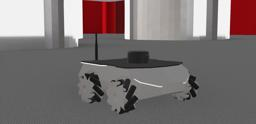

The ROSbot XL by [Husarion](https://husarion.com/) is a universal, ROS2-native autonomous mobile robot platform dedicated to R&D, rapid prototyping and custom robot development for indoor use cases.
It is equipped with a LIDAR and an IMU.

More information on specifications is available at the following link: [ROSbot XL - Specifications](https://husarion.com/manuals/rosbot-xl/#specification).

### ROSbot XL

%figure "ROSbot XL characteristics"

| Characteristics             | Values       |
| --------------------------- | ------------ |
| Length                      | 332 mm       |
| Width                       | 284 mm       |
| Height                      | 131 mm       |
| Max. forward/backward speed | 0.8 m/s      |

%end

The ROSbot XL motors are [RotationalMotor](https://cyberbotics.com/doc/reference/rotationalmotor) nodes, each motor is associated with a [PositionSensor](https://cyberbotics.com/doc/reference/positionsensor).
They are named the following way:

%figure "ROSbot XL wheel names"

| Wheel                | Motor name     | Position sensor name           |
| -------------------- | ---------------| ------------------------------ |
| Front right wheel    | fr\_wheel\_joint | front right wheel motor sensor |
| Front left wheel     | fl\_wheel\_joint | front left wheel motor sensor  |
| Rear left wheel      | rl\_wheel\_joint | rear left wheel motor sensor   |
| Rear right wheel     | rr\_wheel\_joint | rear right wheel motor sensor  |

%end

The `wb_set_motor_position` and `wb_set_motor_velocity` functions allow the user to control the rotation of the wheels.
`wb_position_sensor_get_value` allows the user to get the value of the position sensor.

The [MPU-9250](https://webots.cloud/run?url=https://github.com/cyberbotics/webots/blob/develop/projects/devices/tdk/protos/Mpu-9250.proto) IMU allows the user to get acceleration, angular rate and heading values.
The following table shows the names to access the different components of the IMU:

%figure "IMU components names"

| Device        | Name                        |
| ------------- | --------------------------- |
| Accelerometer | imu accelerometer           |
| Gyroscope     | imu gyro                    |
| Compass       | imu compass                 |

%end

The [RpLidar A2](https://webots.cloud/run?url=https://github.com/cyberbotics/webots/blob/develop/projects/devices/slamtec/protos/RpLidarA2.proto) rotational lidar is fixed on the ROSbot.
It is named "laser".
It can be removed to place another sensor.

### Rosbot XL PROTO

Derived from [Robot](https://cyberbotics.com/doc/reference/robot).

```
RosbotXl {
  SFVec3f    translation     0 0 0
  SFRotation rotation        0 0 1 0
  SFString   name            "rosbot_xl"
  SFString   controller      "<generic>"
  MFString   controllerArgs  []
  SFString   customData      ""
  SFBool     supervisor      FALSE
  SFBool     synchronization TRUE
  SFBool     selfCollision   FALSE
  MFNode     lidarSlot       [ RpLidarA2 { name "laser" } ]
}
```

#### Rosbot XL Field Summary

- `lidarSlot`: Extends the robot with a RpLidar A2 lidar.

### Samples

You will find the following sample in the folder: "[$WEBOTS\_HOME/projects/robots/husarion/rosbot\_xl/worlds]({{ url.github_tree }}/projects/robots/husarion/rosbot\_xl/worlds)".

#### [rosbot\_xl.wbt]({{ url.github_tree }}/projects/robots/husarion/rosbot\_xl/worlds/rosbot\_xl.wbt)



The "[rosbot\_xl.wbt]({{ url.github_tree }}/projects/robots/husarion/rosbot\_xl/worlds/rosbot\_xl.wbt)" shows the ROSbot XL in a simple environment.
The default controller is set to `<extern>` as this robot is meant to be controlled using ROS2.
