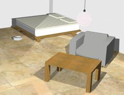

The [iRobot Create](http://www.irobot.com/About-iRobot/STEM/Create-2.aspx) robot is a customizable frame based on the famous Roomba vacuum cleaning platform, and is produced by iRobot.

### Movie Presentation


### Create PROTO

Derived from [Robot](https://cyberbotics.com/doc/reference/robot).

```
Create {
  SFVec3f    translation     0 0 0.044
  SFRotation rotation        0 0 1 0
  SFString   name            "Create"
  SFString   controller      "create_avoid_obstacles"
  MFString   controllerArgs  []
  SFString   customData      ""
  SFBool     supervisor      FALSE
  SFBool     synchronization TRUE
  MFNode     bodySlot        []
}
```

#### Create Field Summary

- `bodySlot`: Extends the robot with new nodes in the body slot.

### Samples

You will find the following sample in this folder: "[WEBOTS\_HOME/projects/robots/irobot/create/worlds]({{ url.github_tree }}/projects/robots/irobot/create/worlds)".

#### [create.wbt]({{ url.github_tree }}/projects/robots/irobot/create/worlds/create.wbt)

 This simulation shows the Create robot which cleans a small apartment.
The robot moves straight ahead.
When hitting an obstacle or detecting a virtual wall, the robot turns randomly.
The dust on the ground is a texture of a [Display](https://cyberbotics.com/doc/reference/displayd) device managed by a [Supervisor](https://cyberbotics.com/doc/reference/supervisor) controller.
The [Supervisor](https://cyberbotics.com/doc/reference/supervisor) draws transparent circles into this texture at the robot's location to simulate cleaning dust.
