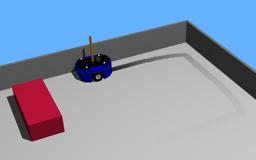

The "Hemisson" is a two-wheeled robot designed for education and teaching developped by [K-TEAM](https://www.k-team.com/mobile-robotics-products/old-products/hemisson).
Equipped with several sensors and a programmable 8bit MCU, the robot is able to avoid obstacles, detect ambient light intensity and follow a line on the floor.
Other equipments include programmable [LED](https://cyberbotics.com/doc/reference/led), buzzer and switches.

### Hemisson PROTO

Derived from [Robot](https://cyberbotics.com/doc/reference/robot).

```
Hemisson {
  SFVec3f    translation     0 0 0
  SFRotation rotation        0 0 1 0
  SFString   name            "Hemisson"
  SFString   controller      "hemisson"
  MFString   controllerArgs  []
  SFString   customData      ""
  SFBool     supervisor      FALSE
  SFBool     synchronization TRUE
  MFNode     extensionSlot   []
}
```

#### Hemisson Field Summary

- `extensionSlot`: Extends the robot with new nodes in the extension slot.

### Samples

You will find the following sample in this folder: "[WEBOTS\_HOME/projects/robots/k-team/hemisson/worlds]({{ url.github_tree }}/projects/robots/k-team/hemisson/worlds)".

#### [hemisson.wbt]({{ url.github_tree }}/projects/robots/k-team/hemisson/worlds/hemisson.wbt)

 This simulation shows an Hemisson robot which draws on the floor.
The robot is moving randomly while avoiding obstacles.
The ink evaporates continuously.
