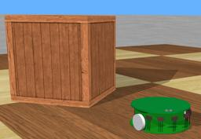
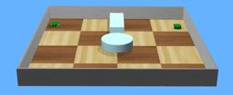
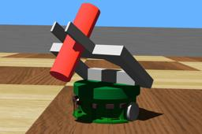
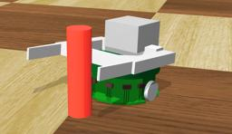
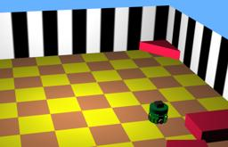
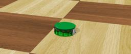
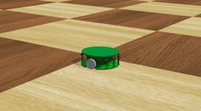

The "Khepera" robot is a two-wheeled robot produced by [K-Team](https://www.k-team.com/).
It is mounted by multiple sensors including 8 distance sensors.

### Khepera1 PROTO

Derived from [Robot](https://cyberbotics.com/doc/reference/robot).

```
Khepera1 {
  SFVec3f    translation     0 0 0
  SFRotation rotation        0 0 1 0
  SFString   name            "Khepera"
  SFString   controller      "braitenberg"
  MFString   controllerArgs  []
  SFString   customData      ""
  SFBool     supervisor      FALSE
  SFBool     synchronization TRUE
  MFNode     extensionSlot   []
  SFBool     kinematic       FALSE
}
```

#### Khepera1 Field Summary

- `extensionSlot`: Extends the robot with new nodes in the extension slot.

- `kinematic`: Defines whether the robot motion and its sensors are computed according to a 2D kinematics algorithm.

### Samples

You will find the following samples in this folder: "[WEBOTS\_HOME/projects/robots/k-team/khepera/worlds]({{ url.github_tree }}/projects/robots/k-team/khepera1/worlds)":

### [khepera.wbt]({{ url.github_tree }}/projects/robots/k-team/khepera1/worlds/khepera.wbt)

 In this example, you can see a Khepera robot moving inside an arena while avoiding the walls.
Like many other examples, this one uses the `braitenberg` controller.
The source code for this controller is located in the "WEBOTS\_HOME/projects/default/controllers/braitenberg" directory.

### [khepera\_kinematic.wbt]({{ url.github_tree }}/projects/robots/k-team/khepera1/worlds/khepera\_kinematic.wbt)

 In this example, you can see two Khepera robots moving inside an arena while avoiding each other and the walls.
It is a good example of how to use the kinematic mode of Webots.
Like many other examples, this one uses the `braitenberg` controller.
The source code for this controller is in the "WEBOTS\_HOME/projects/default/controllers/braitenberg" directory.

### [khepera\_gripper.wbt]({{ url.github_tree }}/projects/robots/k-team/khepera1/worlds/khepera\_gripper.wbt)

 In this example, you can see a Khepera robot equipped with a gripper.
The robot uses its gripper to grab a stick, move a bit with it and drop it on the ground.
This behavior is repeated endlessly.
The source code for this controller is in the "khepera\_gripper" directory.

### [khepera\_gripper\_camera.wbt]({{ url.github_tree }}/projects/robots/k-team/khepera1/worlds/khepera\_gripper\_camera.wbt)

 In this example, you can see a Khepera robot equipped with a gripper and a [Camera](https://cyberbotics.com/doc/reference/camera) device.
The robot uses its gripper to grab a stick, move a bit with it and drop it on the floor.
This behavior is repeated endlessly.
In this world, the robot does not analyse the images it takes with its camera.
The source code for this controller is in the "khepera\_gripper" directory.

### [khepera\_k213.wbt]({{ url.github_tree }}/projects/robots/k-team/khepera1/worlds/khepera\_k213.wbt)

 In this example, you can see a Khepera robot equipped with a K213 [Camera](https://cyberbotics.com/doc/reference/camera) device.
This camera is a linear vision turret with grayscale images.
Using this device, the robot is able to translate the information contained in the image into text and print this result in the Webots console.
When you load this world, the robot will not begin to move immediately.
It will give you enough time to read the explanations printed in the Webots console concerning this world.
The source code for this controller is in the "khepera\_k213" directory.

### [khepera\_pipe.wbt]({{ url.github_tree }}/projects/robots/k-team/khepera1/worlds/khepera\_pipe.wbt)

 In this example, you can see a Khepera robot inside an arena.
The controller for this robot opens a UNIX pipe in order to receive commands using the Khepera serial communication protocol.
This example is provided with a sample client program which interacts with the controller of the robot to make it move straight forward until it detects an obstacle.
This client program `client` must be launched separately from Webots.
The source code for this controller and for the client program are in the "pipe" directory.

> **Note**: As this example is based on standard UNIX pipes, it does not work under Windows.

### [khepera\_tcpip.wbt]({{ url.github_tree }}/projects/robots/k-team/khepera1/worlds/khepera\_tcpip.wbt)

 In this example, you can see a Khepera robot inside an arena.
The controller for this robot acts as a TCP/IP server, waiting for a connection.
Through this connection, the robot can receive commands using the Khepera serial communication protocol.
This example is provided with a sample client program which displays a command prompt, with which you can control the movements of the robot.
This client program `client` must be launched separately from Webots.
The source code for this controller and for the client program are in the "tcpip" directory.
