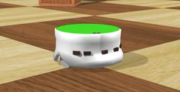

The "Khepera II" robot is a two-wheeled robot produced by [K-Team](https://www.k-team.com/mobile-robotics-products/old-products/khepera-ii).
It is mounted by multiple sensors including 8 distance sensors.

### Khepera2 PROTO

Derived from [Robot](https://cyberbotics.com/doc/reference/robot).

```
Khepera2 {
  SFVec3f    translation     0 0 0
  SFRotation rotation        0 0 1 0
  SFString   name            "Khepera II"
  SFString   controller      "braitenberg"
  MFString   controllerArgs  []
  SFString   customData      ""
  SFBool     supervisor      FALSE
  SFBool     synchronization TRUE
  MFNode     extensionSlot   []
}
```

#### Khepera2 Field Summary

- `extensionSlot`: Extends the robot with new nodes in the extension slot.

### Samples

You will find the following sample in this folder: "[WEBOTS\_HOME/projects/robots/k-team/khepera2/worlds]({{ url.github_tree }}/projects/robots/k-team/khepera2/worlds)":

#### [khepera2.wbt]({{ url.github_tree }}/projects/robots/k-team/khepera2/worlds/khepera2.wbt)

 In this example, you can see a Khepera II robot moving inside an arena while avoiding the walls.
