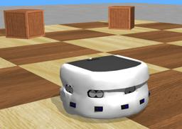
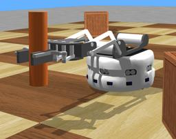

The "Khepera III" robot is a two-wheeled robot produced by [K-Team](https://www.k-team.com/mobile-robotics-products/old-products/khepera-iii).
It is mounted by multiple sensors including 8 distance sensors.

### Khepera3 PROTO

Derived from [Robot](https://cyberbotics.com/doc/reference/robot).

```
Khepera3 {
  SFVec3f    translation     0 0 0
  SFRotation rotation        0 0 1 0
  SFString   name            "Khepera III"
  SFString   controller      "braitenberg"
  MFString   controllerArgs  []
  SFString   customData      ""
  SFBool     supervisor      FALSE
  SFBool     synchronization TRUE
  SFString   wheelMaterial   "default"
  SFString   bodyMaterial    "default"
  MFNode     turretSlot      []
}
```

#### Khepera3 Field Summary

- `wheelMaterial`: Defines the `contactMaterial` field of the wheel [Solid](https://cyberbotics.com/doc/reference/solid) nodes.

- `bodyMaterial`: Defines the `contactMaterial` field of the body [Solid](https://cyberbotics.com/doc/reference/solid).

- `turretSlot`: Extends the robot with new nodes in the turret slot.

### Samples

You will find the following sample in this folder: "[WEBOTS\_HOME/projects/robots/k-team/khepera3/worlds]({{ url.github_tree }}/projects/robots/k-team/khepera3/worlds)":

#### [khepera3.wbt]({{ url.github_tree }}/projects/robots/k-team/khepera3/worlds/khepera3.wbt)

 In this example, you can see a Khepera III robot moving inside an arena while avoiding the walls.
It uses a Braitenberg's vehicle algorithm to avoid obstacles.

#### [khepera3\_gripper.wbt]({{ url.github_tree }}/projects/robots/k-team/khepera3/worlds/khepera3\_gripper.wbt)

 In this example, you can see a Khepera III robot mounted with a gripper.
It grabs an orange stick, moves and leaves the stick.
