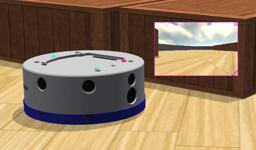

The "Khepera IV" robot is a two-wheeled robot produced by [K-Team](https://www.k-team.com/mobile-robotics-products/khepera-iv).
It is mounted by multiple sensors including 8 distance sensors.

### Movie Presentation


### Khepera4 PROTO

Derived from [Robot](https://cyberbotics.com/doc/reference/robot).

```
Khepera4 {
  SFVec3f    translation         0 0 0
  SFRotation rotation            0 0 1 0
  SFString   name                "Khepera IV"
  SFString   controller          "khepera4"
  MFString   controllerArgs      []
  SFString   customData          ""
  SFBool     supervisor          FALSE
  SFBool     synchronization     TRUE
  SFString   bodyMaterial        "default"
  SFString   wheelMaterial       "default"
  SFString   casterWheelMaterial "khepera4 caster wheel"
  SFInt32    emitterChannel      1
  SFInt32    receiverChannel     1
  MFNode     turretSlot          []
}
```

#### Khepera4 Field Summary

- `bodyMaterial`: Defines the `contactMaterial` field of the body [Solid](https://cyberbotics.com/doc/reference/solid).

- `wheelMaterial`: Defines the `contactMaterial` field of the wheel [Solid](https://cyberbotics.com/doc/reference/solid) nodes.

- `casterWheelMaterial`: Defines the `contactMaterial` field of the caster wheel [Solid](https://cyberbotics.com/doc/reference/solid).

- `emitterChannel`: Defines the `channel` field of the [Emitter](https://cyberbotics.com/doc/reference/emitter).

- `receiverChannel`: Defines the `channel` field of the [Receiver](https://cyberbotics.com/doc/reference/receiver).

- `turretSlot`: Extends the robot with new nodes in the turret slot.

### Samples

You will find the following sample in this folder: "[WEBOTS\_HOME/projects/robots/k-team/khepera4/worlds]({{ url.github_tree }}/projects/robots/k-team/khepera4/worlds)":

#### [khepera4.wbt]({{ url.github_tree }}/projects/robots/k-team/khepera4/worlds/khepera4.wbt)

 This simulation shows a Khepera IV moving in a square arena.
Its camera is enabled.
