Tinkerbots is a robotics kit consisting of a basic brick on which various sensors, actuators and structural blocks can be connected.
This kit is based on an Arduino system and can be programmed using the Arduino IDE.
It is also compatible with the Lego system.

In Webots, all the Tinkerbots bricks have been modeled.
It is possible to assemble them in the same way as in reality thanks to the powerful system of "slots".
These simulated models can be programmed with the standard Webots API.

### Presentation Movie


### Tinkerbots PROTO Nodes

#### TinkerbotsBase PROTO

Derived from [Robot](https://cyberbotics.com/doc/reference/robot).

%figure

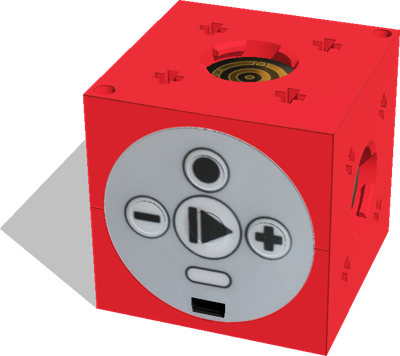

%end

```
TinkerbotsBase {
  field SFVec3f    translation                            0 0 0.02
  field SFRotation rotation                               0 0 1 0
  field SFString   name                                   "Tinkerbots"
  field SFString   controller                             "tinkerbots_demo"
  field MFString   controllerArgs                         []
  field SFString   customData                             ""
  field SFBool     supervisor                             FALSE
  field SFBool     synchronization                        TRUE
  field SFBool     selfCollision                          FALSE
  field SFNode     [up|down|left|right|back]Slot          NULL              # type: "tinkerbots-"
  field SFNode     [up|down|left|right|back][A|B|C|D]Slot NULL              # type: "lego cross-"
  field MFNode     extensionSlot                          []
}
```

> **License**: Copyright Cyberbotics Ltd. Licensed for use only with Webots.
[More information.](https://cyberbotics.com/webots_assets_license)

##### TinkerbotsBase Field Summary

- `[up|down|left|right|back]Slot`: Slots to plug other Tinkerbots bricks.
The TinkerBotsBase face with the buttons is the front face.

- `[up|down|left|right|back][A|B|C|D]Slot`: Slots to plug a Lego system cross axle.
The letters of the `[up|down|left|right|back][A|B|C|D]Slot` slots (i.e. `A`, `B`, `C` and `D`) are defined clockwise.

- `extensionSlot`: Extends the robot with new nodes.

#### TinkerbotsGrabber PROTO

Derived from [Slot](https://cyberbotics.com/doc/reference/slot) of the "tinkerbots+" type.

%figure

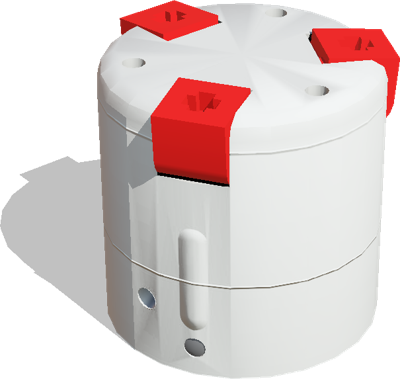

%end

```
TinkerbotsGrabber {
  field SFVec3f    translation 0 0 0
  field SFRotation rotation    0 0 1 0
  field SFString   name        "grabber"
  field SFNode     fingerASlot NULL      # type: "lego cross-"
  field SFNode     fingerBSlot NULL      # type: "lego cross-"
  field SFNode     fingerCSlot NULL      # type: "lego cross-"
}
```

> **License**: Copyright Cyberbotics Ltd. Licensed for use only with Webots.
[More information.](https://cyberbotics.com/webots_assets_license)

#### TinkerbotsMotor PROTO

Derived from [Slot](https://cyberbotics.com/doc/reference/slot) of the "tinkerbots+" type.

%figure

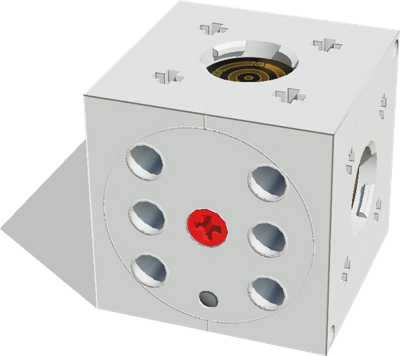

%end

```
TinkerbotsMotor {
  field SFVec3f    translation                  0 0 0
  field SFRotation rotation                     0 0 1 0
  field SFString   name                         "motor"
  field SFNode     [up|left|right]Slot          NULL    # type: "tinkerbots-"
  field SFNode     [up|left|right][A|B|C|D]Slot NULL    # type: "lego cross-"
  field SFNode     [front|back]Slot             NULL    # type: "lego cross-"
}
```

> **License**: Copyright Cyberbotics Ltd. Licensed for use only with Webots.
[More information.](https://cyberbotics.com/webots_assets_license)

##### TinkerbotsMotor Field Summary

- `[front|back]Slot`: define the motor axis slots.

#### TinkerbotsPivot PROTO

Derived from [Slot](https://cyberbotics.com/doc/reference/slot) of the "tinkerbots+" type.

%figure

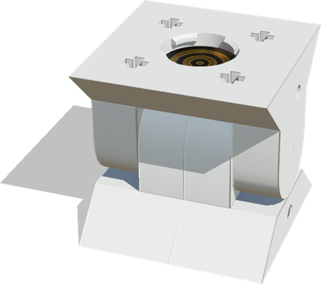

%end

```
TinkerbotsPivot {
  field SFVec3f    translation   0 0 0
  field SFRotation rotation      0 0 1 0
  field SFString   name          "pivot"
  field SFNode     slot          NULL  # type: "tinkerbots-"
  field SFNode     [A|B|C|D]Slot NULL  # type: "lego cross-"
}
```

> **License**: Copyright Cyberbotics Ltd. Licensed for use only with Webots.
[More information.](https://cyberbotics.com/webots_assets_license)

#### TinkerbotsTwister PROTO

Derived from [Slot](https://cyberbotics.com/doc/reference/slot) of the "tinkerbots+" type.

%figure

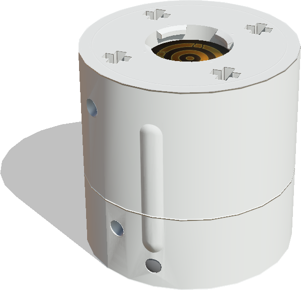

%end

```
TinkerbotsTwister {
  field SFVec3f    translation   0 0 0
  field SFRotation rotation      0 0 1 0
  field SFString   name          "twister"
  field SFNode     slot          NULL  # type: "tinkerbots-"
  field SFNode     [A|B|C|D]Slot NULL  # type: "lego cross-"
}
```

> **License**: Copyright Cyberbotics Ltd. Licensed for use only with Webots.
[More information.](https://cyberbotics.com/webots_assets_license)

#### TinkerbotsDistanceSensor PROTO

Derived from [Slot](https://cyberbotics.com/doc/reference/slot) of the "tinkerbots+" type.

%figure

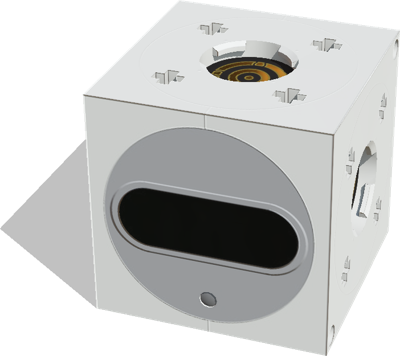

%end

```
TinkerbotsDistanceSensor {
  field SFVec3f    translation                       0 0 0
  field SFRotation rotation                          0 0 1 0
  field SFString   name                              "distance sensor"
  field SFNode     [up|left|right|back]Slot          NULL              # type: "tinkerbots-"
  field SFNode     [up|left|right|back][A|B|C|D]Slot NULL              # type: "lego cross-"
}
```

> **License**: Copyright Cyberbotics Ltd. Licensed for use only with Webots.
[More information.](https://cyberbotics.com/webots_assets_license)

#### TinkerbotsLightSensor PROTO

Derived from [Slot](https://cyberbotics.com/doc/reference/slot) of the "tinkerbots+" type.

%figure

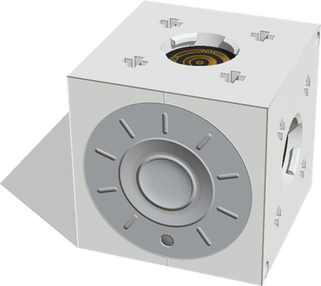

%end

```
TinkerbotsLightSensor {
  field SFVec3f    translation                       0 0 0
  field SFRotation rotation                          0 0 1 0
  field SFString   name                              "light sensor"
  field SFNode     [up|left|right|back]Slot          NULL           # type: "tinkerbots-"
  field SFNode     [up|left|right|back][A|B|C|D]Slot NULL           # type: "lego cross-"
}
```

> **License**: Copyright Cyberbotics Ltd. Licensed for use only with Webots.
[More information.](https://cyberbotics.com/webots_assets_license)

#### TinkerbotsCube PROTO

Derived from [Slot](https://cyberbotics.com/doc/reference/slot) of the "tinkerbots+" type.

%figure

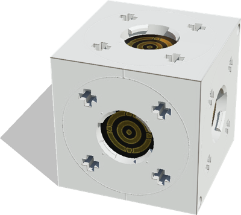

%end

```
TinkerbotsCube {
  field SFVec3f    translation                             0 0 0
  field SFRotation rotation                                0 0 1 0
  field SFString   name                                    "name"
  field SFNode     [up|left|right|front|back]Slot          NULL    # type: "tinkerbots-"
  field SFNode     [up|left|right|front|back][A|B|C|D]Slot NULL    # type: "lego cross-"
}
```

> **License**: Copyright Cyberbotics Ltd. Licensed for use only with Webots.
[More information.](https://cyberbotics.com/webots_assets_license)

#### TinkerbotsAxle PROTO

Derived from [Slot](https://cyberbotics.com/doc/reference/slot) of the "lego cross+" type.

%figure

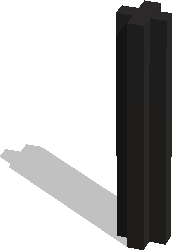

%end

```
TinkerbotsAxle {
  field SFVec3f                  translation 0 0 0
  field SFRotation               rotation    0 0 1 0
  field SFString                 name        "axle"
  field SFNode                   endSlot     NULL    # type: "lego cross+"
  field SFString{"2.2cm", "7cm"} length      "2.2cm"
}
```

> **License**: Copyright Cyberbotics Ltd. Licensed for use only with Webots.
[More information.](https://cyberbotics.com/webots_assets_license)

##### TinkerbotsAxle Field Summary

- `length`: Defines the length of the axle.
Either 2.2 centimeters or 7 centimeters.

#### TinkerbotsBrickAdapter PROTO

Derived from [Slot](https://cyberbotics.com/doc/reference/slot) of the "lego cross+" type.

%figure

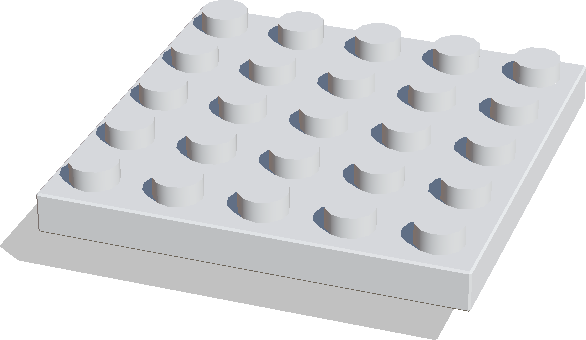

%end

```
TinkerbotsBrickAdapter {
  field SFVec3f    translation 0 0 0
  field SFRotation rotation    0 0 1 0
  field SFString   name        "brick adapter"
}
```

> **License**: Copyright Cyberbotics Ltd. Licensed for use only with Webots.
[More information.](https://cyberbotics.com/webots_assets_license)

#### TinkerbotsCubieBoxWithCrossSlots PROTO

Derived from [Slot](https://cyberbotics.com/doc/reference/slot) of the "lego cross+" type.

%figure

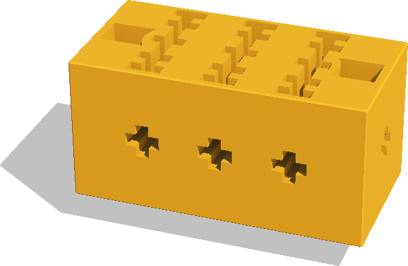

%end

```
TinkerbotsCubieBoxWithCrossSlots {
  field SFVec3f    translation                     0 0 0
  field SFRotation rotation                        0 0 1 0
  field SFString   name                            "box with cross slots cubie"
  field SFNode     [up|left|right|front|back]Slot  NULL                          # type: "lego cross-"
}
```

> **License**: Copyright Cyberbotics Ltd. Licensed for use only with Webots.
[More information.](https://cyberbotics.com/webots_assets_license)

#### TinkerbotsCubieBoxWithRoundSlots PROTO

Derived from [Slot](https://cyberbotics.com/doc/reference/slot) of the "lego cross+" type.

%figure


%end

```
TinkerbotsCubieBoxWithRoundSlots {
  field SFVec3f    translation          0 0 0
  field SFRotation rotation             0 0 1 0
  field SFString   name                 "box with round slots cubie"
  field SFNode     [up|left|right]Slot  NULL                          # type: "lego cross-"
  field SFNode     axisSlot             NULL                          # type: "lego cross-"
}
```

> **License**: Copyright Cyberbotics Ltd. Licensed for use only with Webots.
[More information.](https://cyberbotics.com/webots_assets_license)

##### TinkerbotsCubieBoxWithRoundSlots Field Summary

- `axisSlot`: Defines the slot passing through the center round hole.
This slot is mounted on a passive joint.

#### TinkerbotsCubieFemaleCube PROTO

Derived from [Slot](https://cyberbotics.com/doc/reference/slot) of the "lego cross+" type.

%figure

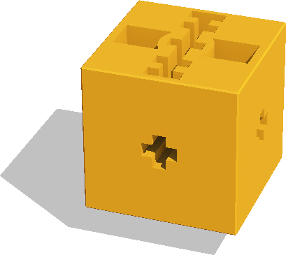

%end

```
TinkerbotsCubieFemaleCube {
  field SFVec3f    translation                     0 0 0
  field SFRotation rotation                        0 0 1 0
  field SFString   name                            "female cube cubie"
  field SFNode     [up|left|right|front|back]Slot  NULL                 # type: "lego cross-"
}
```

> **License**: Copyright Cyberbotics Ltd. Licensed for use only with Webots.
[More information.](https://cyberbotics.com/webots_assets_license)

#### TinkerbotsCubieMaleCube PROTO

Derived from [Slot](https://cyberbotics.com/doc/reference/slot) of the "lego cross+" type.

%figure

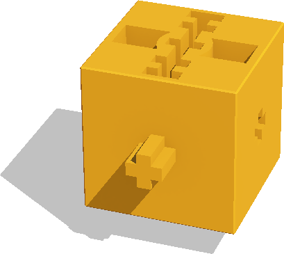

%end

```
TinkerbotsCubieMaleCube {
  field SFVec3f    translation               0 0 0
  field SFRotation rotation                  0 0 1 0
  field SFString   name                      "male cube cubie"
  field SFNode     [up|left|front|back]Slot  NULL              # type: "lego cross-"
  field SFNode     rightSlot                 NULL              # type: "lego cross+"
}
```

> **License**: Copyright Cyberbotics Ltd. Licensed for use only with Webots.
[More information.](https://cyberbotics.com/webots_assets_license)

#### TinkerbotsCubiePyramid PROTO

Derived from [Slot](https://cyberbotics.com/doc/reference/slot) of the "lego cross+" type.

%figure

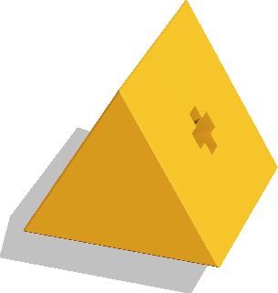

%end

```
TinkerbotsCubiePyramid {
  field SFVec3f                    translation      0 0 0
  field SFRotation                 rotation         0 0 1 0
  field SFString                   name             "pyramid cubie"
  field SFNode                     [front|back]Slot NULL            # type: "lego cross-"
  field SFString{"yellow", "blue"} color            "yellow"
}
```

> **License**: Copyright Cyberbotics Ltd. Licensed for use only with Webots.
[More information.](https://cyberbotics.com/webots_assets_license)

#### TinkerbotsCubieTriangle PROTO

Derived from [Slot](https://cyberbotics.com/doc/reference/slot) of the "lego cross+" type.

%figure

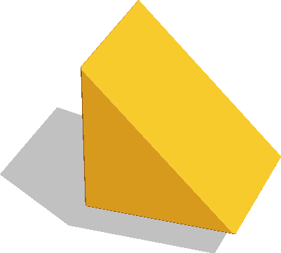

%end

```
TinkerbotsCubieTriangle {
  field SFVec3f                    translation 0 0 0
  field SFRotation                 rotation    0 0 1 0
  field SFString                   name        "pyramid cubie"
  field SFNode                     slot         NULL           # type: "lego cross-"
  field SFString{"yellow", "blue"} color        "yellow"
}
```

> **License**: Copyright Cyberbotics Ltd. Licensed for use only with Webots.
[More information.](https://cyberbotics.com/webots_assets_license)

#### TinkerbotsFinger PROTO

Derived from [Slot](https://cyberbotics.com/doc/reference/slot) of the "lego cross+" type.

%figure

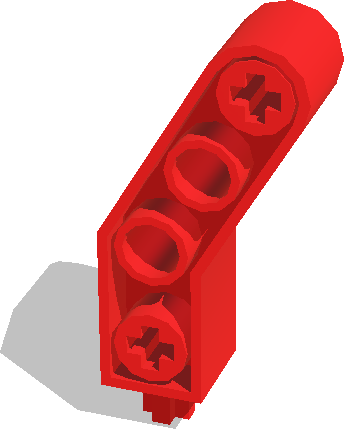

%end

```
TinkerbotsFinger {
  field SFVec3f    translation 0 0 0
  field SFRotation rotation    0 0 1 0
  field SFString   name        "finger"
}
```

> **License**: Copyright Cyberbotics Ltd. Licensed for use only with Webots.
[More information.](https://cyberbotics.com/webots_assets_license)

#### TinkerbotsWheel PROTO

Derived from [Slot](https://cyberbotics.com/doc/reference/slot) of the "lego cross-" type.

%figure

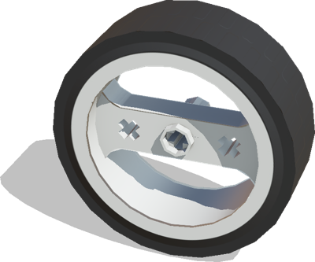

%end

```
TinkerbotsWheel {
  field SFVec3f    translation 0 0 0
  field SFRotation rotation    0 0 1 0
  field SFString   name        "wheel"
}
```

> **License**: Copyright Cyberbotics Ltd. Licensed for use only with Webots.
[More information.](https://cyberbotics.com/webots_assets_license)

### Samples

You will find the following examples in this folder: "[WEBOTS\_HOME/projects/robots/kinematics/tinkerbots/worlds]({{ url.github_tree }}/projects/robots/kinematics/tinkerbots/worlds)".

#### [tinkerbots\_demo.wbt]({{ url.github_tree }}/projects/robots/kinematics/tinkerbots/worlds/tinkerbots\_demo.wbt)

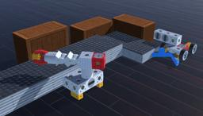 In this example, two robots work collaboratively in a fictitious factory.
A plastic object passes from one robot to the other with the help of two conveyor belts.
The robots detect the presence of the plastic objects using their distance sensors.

#### [android\_l30.wbt]({{ url.github_tree }}/projects/robots/kinematics/tinkerbots/worlds/android\_l30.wbt)

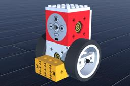 This example probably shows the simplest possible model.
Indeed, it has only one motor and two wheels plugged on it.
It is controlled by the random controller called "tinkerbots_demo".
This demo controller actuates the motors with random sinusoidal functions and chooses the color of the LEDs from a predefined color set.
This controller is used in most of the following examples.

#### [braitenberg.wbt]({{ url.github_tree }}/projects/robots/kinematics/tinkerbots/worlds/braitenberg.wbt)

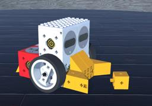 In this example, a robot with two motors and two distance sensors moves avoiding obstacles in a circular world.
In addition, it pushes a Tinkerbots cubie.
Note that the custom controller of this robot is written in Python.

#### [grabber\_base.wbt]({{ url.github_tree }}/projects/robots/kinematics/tinkerbots/worlds/grabber\_base.wbt)

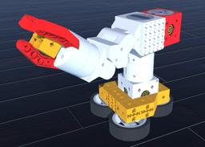 The crane in this example can be controlled by the computer keyboard following the instructions displayed in the Webots console.

#### [vision\_car.wbt]({{ url.github_tree }}/projects/robots/kinematics/tinkerbots/worlds/vision\_car.wbt)

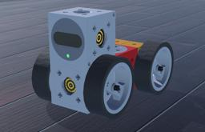 In this example, a robot moves forward until it detects an obstacle.

#### [roadster.wbt]({{ url.github_tree }}/projects/robots/kinematics/tinkerbots/worlds/roadster.wbt) and [racer.wbt]({{ url.github_tree }}/projects/robots/kinematics/tinkerbots/worlds/racer.wbt)

| | |
|:---:|:---:|
| 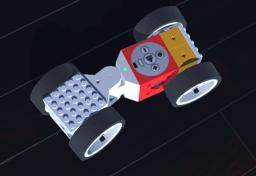 | 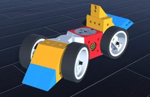 |

In these two examples, two car-looking robots move randomly using the "two_wheeled_vehicle" controller.

#### [donnergugi.wbt]({{ url.github_tree }}/projects/robots/kinematics/tinkerbots/worlds/donnergugi.wbt) and [top\_dog.wbt]({{ url.github_tree }}/projects/robots/kinematics/tinkerbots/worlds/top\_dog.wbt)

| | |
|:---:|:---:|
| 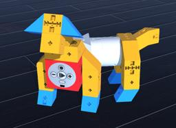 | 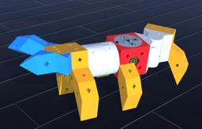 |

In these two examples, two animal-like robots move randomly using "tinkerbots_demo" controller.

#### [sensoric\_mega\_set.wbt]({{ url.github_tree }}/projects/robots/kinematics/tinkerbots/worlds/sensoric\_mega\_set.wbt)

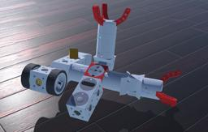 This example shows a robot made up of all Tinkerbots blocks that contain an Arduino component.
Here too, the robot moves randomly.
