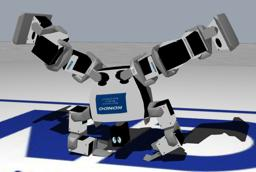

The "Kondo KHR-2HV" is an humanoid robot with 17 degrees of freedom.

### Movie Presentation


### Khr2hv PROTO

Derived from [Robot](https://cyberbotics.com/doc/reference/robot).

```
Khr2hv {
  SFVec3f    translation     0 0 0.215
  SFRotation rotation        0 0 1 0
  SFString   name            "KHR-2HV"
  SFString   controller      "khr-2hv_demo"
  MFString   controllerArgs  []
  SFString   contactMaterial "default"
  SFString   customData      ""
  SFBool     supervisor      FALSE
  SFBool     synchronization TRUE
  MFNode     bodySlot        []
}
```

#### Khr2hv Field Summary

- `bodySlot`: Extends the robot with new nodes in the body slot.

### Samples

You will find the following sample in this folder: "[WEBOTS\_HOME/projects/robots/kondo/khr-2hv/worlds]({{ url.github_tree }}/projects/robots/kondo/khr-2hv/worlds)".

#### [khr-2hv.wbt]({{ url.github_tree }}/projects/robots/kondo/khr-2hv/worlds/khr-2hv.wbt)

 In this simulation, the KHR-2HV robot plays several open-loop motions.
Once this automatic behavior is completed, you can move the robot using the computer keyboard (please refer to the instruction displayed in the Webots console).
