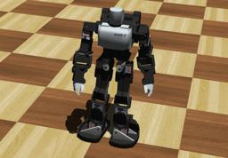

The "Kondo KHR-3HV" is an humanoid robot with 17 degrees of freedom.

### Movie Presentation


### Khr3hv PROTO

Derived from [Robot](https://cyberbotics.com/doc/reference/robot).

```
Khr3hv {
  SFVec3f    translation     0 0 0.68
  SFRotation rotation        0 0 1 0
  SFString   name            "KHR-3HV"
  SFString   controller      "<generic>"
  MFString   controllerArgs  []
  SFString   customData      ""
  SFBool     supervisor      FALSE
  SFBool     synchronization TRUE
  SFBool     selfCollision   FALSE
  MFNode     bodySlot        []
}
```

#### Khr3hv Field Summary

- `bodySlot`: Extends the robot with new nodes in the body slot.

### Samples

You will find the following sample in this folder: "[WEBOTS\_HOME/projects/robots/kondo/khr-3hv/worlds]({{ url.github_tree }}/projects/robots/kondo/khr-3hv/worlds)".

#### [khr-3hv.wbt]({{ url.github_tree }}/projects/robots/kondo/khr-3hv/worlds/khr-3hv.wbt)

 This simulation shows a KHR-3HV robot.
You can play with its motors using the generic robot window.
