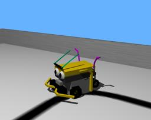

Robot models based on [Lego's Mindstorms](https://www.lego.com/en-us/mindstorms) can be created in Webots.

### MindstormsRover PROTO

Derived from [Robot](https://cyberbotics.com/doc/reference/robot).

```
MindstormsRover {
  SFVec3f    translation     0 0 0
  SFRotation rotation        0 0 1 0
  SFString   name            "MindstormsRover"
  SFString   controller      "Rover"
  MFString   controllerArgs  []
  SFString   customData      ""
  SFBool     supervisor      FALSE
  SFBool     synchronization TRUE
  MFNode     extensionSlot   []
}
```

#### MindstormsRover Field Summary

- `extensionSlot`: Extends the robot with new nodes in the extension slot.

### Samples

You will find the following sample in this folder: "[WEBOTS\_HOME/projects/robots/lego/mindstorms/worlds]({{ url.github_tree }}/projects/robots/lego/mindstorms/worlds)".

#### [rover.wbt]({{ url.github_tree }}/projects/robots/lego/mindstorms/worlds/rover.wbt)

 In this example you can see the Mindstorms Rover robot following a black line drawn on the ground.
In the middle of this line there is an obstacle which the robot navigates around after detecting a collision with it.
The robot will then recover its path.
As this robot is a *Mindstorms* robot, its world file and its controller are in the "mindstorms" directory.
This example is written both in Java and C, as a reference for translating Webots code from one language to another.
The source code for this controller is in the "Rover" directory.
