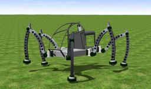

The [Mantis robot](http://www.mantisrobot.com/) is an hydraulic powered hexapod walking machine developed in 2009 by Matt Denton.
A human can drive this robot.

### Movie Presentation


### Mantis PROTO

Derived from [Robot](https://cyberbotics.com/doc/reference/robot).

```
Mantis {
  SFVec3f    translation     0 0 0.68
  SFRotation rotation        0 0 1 0
  SFString   name            "Mantis"
  SFString   controller      "mantis"
  MFString   controllerArgs  []
  SFString   customData      ""
  SFBool     supervisor      FALSE
  SFBool     synchronization TRUE
  MFNode     extensionSlot   []
}
```

#### Mantis Field Summary

- `extensionSlot`: Extends the robot with new nodes in the extension slot.

### Samples

You will find the following sample in this folder: "[WEBOTS\_HOME/projects/robots/micromagic/mantis/worlds]({{ url.github_tree }}/projects/robots/micromagic/mantis/worlds)".

#### [mantis.wbt]({{ url.github_tree }}/projects/robots/micromagic/mantis/worlds/mantis.wbt)

 The Mantis robot moves forwards on an uneven field.
Each Mantis motor is actuated by a simple sinusoidal function.
The parameters of these sinusoidal functions (amplitude, phase and offset) are unique for each motor and have been found empirically.
