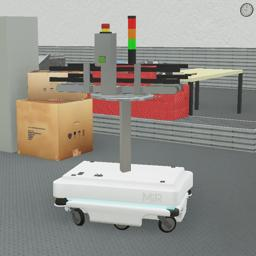

Designed by Mobile Industrial Robots, MiR100 is a six-wheeled robot: two of them, in the middle, are actuated, while the others are free caster wheels.
The model is a modular mobile platform used for logistics and indoor transport. It is well-suited for industries, as its design enables it to carry a payload of up to 100 kg.
It carries two [Lidars](https://cyberbotics.com/doc/reference/lidar) and four sonar [DistanceSensors](https://cyberbotics.com/doc/reference/distancesensor#sonar-sensors) designed for obstacle avoidance, as well as a [RangeFinder](https://cyberbotics.com/doc/reference/rangefinder) at the front for navigation.
More information on the MiR100 robot can be found on the [constructor website](https://www.mobile-industrial-robots.com/en/solutions/robots/mir100/).

### Mir100 PROTO

Derived from [Robot](https://cyberbotics.com/doc/reference/robot).

```
Mir100 {
  field  SFVec3f     translation      0 0 0
  field  SFRotation  rotation         0 0 1 0
  field  SFString    name             "Mir100"
  field  SFString    controller       "keyboard_control"
  field  MFString    controllerArgs   []
  field  SFString    customData       ""
  field  SFBool      supervisor       FALSE
  field  SFBool      synchronization  TRUE
  field  SFColor     color            0 0.9 1
  field  MFNode      frontLidarSlot   []
  field  MFNode      backLidarSlot    []
  field  MFNode      bodySlot         []
}
```

#### MiR100 Field Summary

- `color`: Middle section color of the robot.
- `frontLidarSlot`: Extends the robot with a lidar on the front (such as the `SickS300` for example).
- `backLidarSlot`: Extends the robot with a lidar on the back (such as the `SickS300` for example).
- `bodySlot` : Extends the robot with new nodes (such as the `Robotino3Platform` for example).


### Sample

You will find the following sample in this folder: "[WEBOTS\_HOME/projects/robots/mir/mir100/worlds]({{ url.github_tree }}/projects/robots/mir/mir100/worlds)".

#### [mir100.wbt]({{ url.github_tree }}/projects/robots/mir/mir100/worlds/mir100.wbt)

 This simulation shows a MiR100 mounted with a `ConveyorPlatform` that can be controlled to move in an industrial environment using the keyboard.
