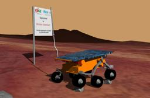

[Sojourner](https://en.wikipedia.org/wiki/Sojourner_(rover)) is the [NASA Pathfinder robotic rover](https://www.nasa.gov/mission_pages/mars-pathfinder) that landed on 1997 in the Ares Vallis region, and explored Mars for around three months.

### Movie Presentation


### Sojourner PROTO

Derived from [Robot](https://cyberbotics.com/doc/reference/robot).

```
Sojourner {
  SFVec3f    translation     0 0 0.237
  SFRotation rotation        0 0 1 0
  SFString   name            "Sojourner"
  SFString   controller      "sojourner"
  MFString   controllerArgs  []
  SFString   customData      ""
  SFBool     supervisor      FALSE
  SFBool     synchronization TRUE
  MFNode     extensionSlot   []
}
```

#### Sojourner Field Summary

- `extensionSlot`: Extends the robot with new nodes in the extension slot.

### Samples

You will find the following sample in this folder: "[WEBOTS\_HOME/projects/robots/nasa/worlds]({{ url.github_tree }}/projects/robots/nasa/worlds)".

#### [sojourner.wbt]({{ url.github_tree }}/projects/robots/nasa/worlds/sojourner.wbt)

 This simulation shows the Sojourner model in a Mars-like environment.
A large obstacle is placed in front of the robot so that it is possible to observe how the robot climbs over it.
The keyboard can be used to control the motion of the robot.
