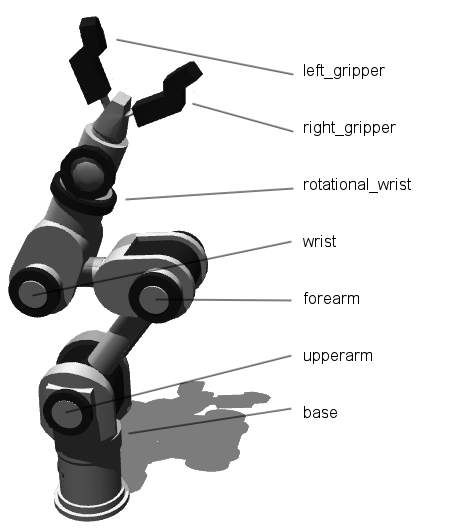
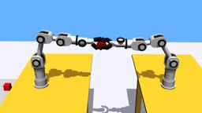
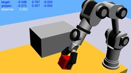
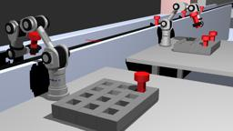
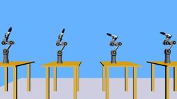

The IPR robot is a six degrees of freedom robotic arm equipped with a gripper composed of 2 rotational fingers.
It was developed by `Neuronics`.
Four models are supported in Webots: HD6M180, HD6Ms180, HD6M90 and HD6Ms90.

### Movie Presentation


### IprHd6 PROTO Nodes

There a four PROTO nodes for this robot, one per model:

- `IprHd6m90.proto`
- `IprHd6ms90.proto`
- `IprHd6m180.proto`
- `IprHd6ms180.proto`

Derived from [Robot](https://cyberbotics.com/doc/reference/robot).

```
IprHd6* {
  SFVec3f    translation      0 0 0
  SFRotation rotation         0 0 1 0
  SFString   name             "IPR"
  SFString   controller       "<generic>"
  MFString   controllerArgs   []
  SFString   customData       ""
  SFBool     supervisor       FALSE
  SFBool     synchronization  TRUE
  MFNode     sensorsSlot      []
  MFNode     tableSlot        []
  MFNode     wristSlot        []
  MFNode     leftGripperSlot  []
  MFNode     rightGripperSlot []
}
```

#### IprHd6 Field Summary

- `sensorsSlot`: Extends the robot with new nodes in the sensors slot.

- `tableSlot`: Extends the robot with new nodes in the table slot.

- `wristSlot`: Extends the robot with new nodes in the wrist slot.

- `leftGripperSlot`: Extends the robot with new nodes in the left gripper slot.

- `rightGripperSlot`: Extends the robot with new nodes in the right gripper slot.

### IPR Models

The different IPR models share the same device names.

%figure "IPR devices"

| Device | Support | Webots name |
| --- | --- | --- |
| Motors | Full support | base, upperarm, forearm, wrist, rotational\_wrist, left\_gripper and right\_gripper |
| Position sensors | Full support | base\_sensor, upperarm\_sensor, forearm\_sensor, wrist\_sensor, rotational\_wrist\_sensor, left\_gripper\_sensor and right\_gripper\_sensor |
| Touch sensors | Full support | ds[0-8] |
| Distance sensors | Full support | ts[0-3] |

%end

%figure "IPR motors"



%end

The difference between the `90` and `180` models is the orientation of the gripper.
The number matches with the orientation angle in degrees of the gripper.

The difference between the "regular" models and the `s` ones (`s` for "strong") are small.
It's mainly about dimensions and maximum torques.

The table is added as a `tableSlot` field of the robot, and is "fixed" in the dynamic environment.

### Samples

Here are listed the different example worlds based on the IPR.
The worlds and controllers can be accessed in the "[WEBOTS\_HOME/projects/robots/neuronics/ipr]({{ url.github_tree }}/projects/robots/neuronics/ipr)" directory.

#### [ipr\_collaboration.wbt]({{ url.github_tree }}/projects/robots/neuronics/ipr/worlds/ipr\_collaboration.wbt)

 In this example, two IPR robots work together to put three red cubes into a basket which is on the opposite side of the world.
All the IPR robots use the same controller, whose source code is in the "ipr/controllers" directory.
This particular example uses, in addition to this controller, a client program which coordinates the movements of the robots.
The source code for this client is in the "ipr/controllers/ipr\_collaboration.c" file.

#### [ipr\_cube.wbt]({{ url.github_tree }}/projects/robots/neuronics/ipr/worlds/ipr\_cube.wbt)

 In this example, an IPR robot moves a small red cube onto a bigger one.
This example also uses a client program which drives the movements of the robot.
The source code for this client is in the "ipr/controllers/ipr\_cube.c" file.

#### [ipr\_factory.wbt]({{ url.github_tree }}/projects/robots/neuronics/ipr/worlds/ipr\_factory.wbt)

 In this example, two IPR robots take industrial parts from a conveyor belt and place them into slots.
One of the robots detects the objects using an infrared sensor on the conveyor belt, while the other one waits.
This example also uses a client program which coordinates the movements of the robots.
The source code for this client is in the "ipr/controllers/ipr\_factory.c" file.

#### [ipr\_models.wbt]({{ url.github_tree }}/projects/robots/neuronics/ipr/worlds/ipr\_models.wbt)

 This example shows the different types of IPR model provided by Webots : HD6M180, HD6Ms180, HD6M90 and HD6Ms90.
The robots are not moving.
Open the generic robot window to actuate the motors.
