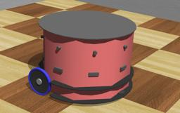

"Fire Bird VI" is a Robotic Research Platform designed by [NEX Robotics](http://www.nex-robotics.com/products/fire-bird-vi-robot/fire-bird-vi-robotic-research-platform.html).
It is a two-wheeled robot including 8 ultrasonic sensors and more.

### FireBird6 PROTO

Derived from [Robot](https://cyberbotics.com/doc/reference/robot).

```
FireBird6 {
  SFVec3f    translation     0 0 0.125           
  SFRotation rotation        0 0 1 0        
  SFString   name            "Fire Bird 6"  
  SFString   controller      "fire_bird_6_obstacle_avoidance"
  MFString   controllerArgs  []
  SFString   customData      ""
  SFBool     supervisor      FALSE
  SFBool     synchronization TRUE
  SFString   window          "<generic>"
  SFString   remoteControl   "<none>"
  MFNode     bodySlot        []
}
```

#### FireBird6 Field Summary

- `bodySlot`: Extends the robot with new nodes in the body slot.

### Samples

You will find the following sample in this folder: "[WEBOTS\_HOME/projects/robots/nex/worlds]({{ url.github_tree }}/projects/robots/nex/worlds)".

#### [fire\_bird\_6.wbt]({{ url.github_tree }}/projects/robots/nex/worlds/fire\_bird\_6.wbt)

 The FireBird 6 moves inside a squared arena and avoid obstacles.
