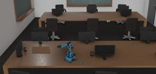

Ned is a 6-axis collaborative robot developed by [Niryo](https://niryo.com/). It is  based on open-source technologies designed for education, professional training and research.

### Movie Presentation


### Ned PROTO

Derived from [Robot](https://cyberbotics.com/doc/reference/robot).

```
PROTO Ned {
  field  SFVec3f     translation     0 0 0
  field  SFRotation  rotation        0 0 1 0
  field  SFString    name            "Ned"
  field  SFString    controller      "ned"
  field  MFString    controllerArgs  []
  field  SFString    customData      ""
  field  SFBool      supervisor      FALSE
  field  SFBool      synchronization TRUE
  field  SFBool      selfCollision   FALSE
}
```

### Samples

You will find the following sample in this folder: [WEBOTS\_HOME/projects/robots/niryo/ned/worlds](https://github.com/cyberbotics/webots/tree/released/projects/robots/niryo/ned/worlds).


#### [ned.wbt](https://github.com/cyberbotics/webots/tree/released/projects/robots/niryo/ned/worlds/ned.wbt)

 This simulation shows Ned in a working environment. You can control the robot with your keyboard, launch a demo and run a pick and place operation. You can start from this simulation to create your own world, prototype industrial processes and edit controllers with Ned.
