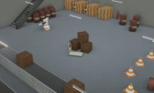

Designed by PAL Robotics, TIAGo is a two-wheeled human-like robot with a torso, a head and one articulated arm finished by a parallel gripper as end-effector.
It is completely ROS based, fully customizable and expandable with extra sensors and devices like other end-effector (Hey5 hand).

More information on the TIAGo robot can be found on their [website](http://pal-robotics.com/robots/tiago/) or in the [technical specifications datasheet](http://pal-robotics.com/wp-content/uploads/2019/06/TIAGo-Base_Datasheet.pdf).

### Tiago PROTO

Derived from [Robot](https://cyberbotics.com/doc/reference/robot).

```
Tiago {
  SFVec3f     translation      0 0 0.095
  SFRotation  rotation         0 0 1 0
  SFString    name             "TIAGo"
  SFString    controller       "tiago"
  MFString    controllerArgs   []
  SFString    window           "<generic>"
  SFString    customData       ""
  SFBool      supervisor       FALSE
  SFBool      synchronization  TRUE
  SFBool      selfCollision    FALSE
  SFNode      endEffectorSlot  TiagoGripper {}
  MFNode      cameraSlot       Astra { translation -0.028 -0.035 -0.009 rotation 1 0 0 -1.5708}
  MFNode      lidarSlot        HokuyoUrg04lxug01 {}
}
```

#### Tiago Field Summary

- `endEffectorSlot`:  Defines the robot end effector.
- `cameraSlot`:  Extends the robot with a camera at head level.
- `lidarSlot`: Extends the robot with a lidar.

### Sample

You will find the following samples in this folder: "[WEBOTS\_HOME/projects/robots/pal\_robotics/tiago/worlds]({{ url.github_tree }}/projects/robots/pal_robotics/tiago/worlds)".

#### [tiago.wbt]({{ url.github_tree }}/projects/robots/pal_robotics/tiago/worlds/tiago.wbt)

 This simulation shows a TIAGo making hello in an industrial environment.
It can also been controlled using the keyboard arrows.

#### [tiago\_hey5\_hand.wbt]({{ url.github_tree }}/projects/robots/pal_robotics/tiago/worlds/tiago\_hey5\_hand.wbt)

 This simulation shows a TIAGo with Hey5 hand making hello with the sign "Peace" with these fingers in an industrial environment.
It can also be controlled using the arrows on the keyboard.
