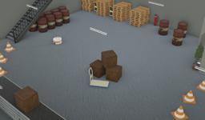

Designed by PAL Robotics, TIAGo Base is a two-wheeled robot.
The model is a modular mobile platform that automates deliveries in industrial environment. It is completely ROS based and customizable with accessories to adapt to any specific need.

More information on the TIAGo Base robot can be found on their [website](http://pal-robotics.com/robots/tiago-base/) or in the [technical specifications datasheet](http://pal-robotics.com/wp-content/uploads/2019/06/TIAGo-Base_Datasheet.pdf).

### TiagoBase PROTO

Derived from [Robot](https://cyberbotics.com/doc/reference/robot).

```
TiagoBase {
  SFVec3f      translation      0 0 0.095
  SFRotation   rotation         0 0 1 0
  SFString     name             "TIAGo Base"
  SFString     controller       "tiago_base"
  MFString     controllerArgs   []
  SFString     window          "<generic>"
  SFString     customData       ""
  SFBool       supervisor       FALSE
  SFBool       synchronization  TRUE
  SFBool       selfCollision    FALSE
  SFString     model            "PAL Robotics - TIAGo Base"
  MFNode       bodySlot         []
  MFNode       lidarSlot        []
}
```

#### TiagoBase Field Summary

- `bodySlot`:  Extends the robot with new nodes (such as the `TiagoBody` for example).
- `lidarSlot`: Extends the robot with a lidar.

### Sample

You will find the following sample in this folder: "[WEBOTS\_HOME/projects/robots/pal\_robotics/tiago\_base/worlds]({{ url.github_tree }}/projects/robots/pal_robotics/tiago_base/worlds)".

#### [tiago\_base.wbt]({{ url.github_tree }}/projects/robots/pal_robotics/tiago_base/worlds/tiago\_base.wbt)

 This simulation shows a TIAGo Base moving in an industrial environment using a Braitenberg algorithm using the information received by its lidar.
