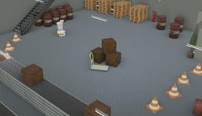

Designed by PAL Robotics, TIAGo LITE is a two-wheeled human-like robot with a torso and a head but no articulated arm.
The model is a modular mobile platform that allows human-robot interaction.
It is completely ROS based and customizable with accessories to adapt to any specific need.

More information on the TIAGo LITE robot can be found on their [website](http://pal-robotics.com/robots/tiago/) or in the [technical specifications datasheet](https://pal-robotics.com/wp-content/uploads/2022/04/Datasheet_TIAGo.pdf).

### TiagoLite PROTO

Derived from [Robot](https://cyberbotics.com/doc/reference/robot).

```
TiagoLite {
  SFVec3f     translation      0 0 0.095
  SFRotation  rotation         0 0 1 0
  SFString    name             "TIAGo LITE"
  SFString    controller       "tiago_lite"
  MFString    controllerArgs   []
  SFString    window           "<generic>"
  SFString    customData       ""
  SFBool      supervisor       FALSE
  SFBool      synchronization  TRUE
  SFBool      selfCollision    FALSE
  MFNode      cameraSlot       Astra { translation -0.028 -0.035 -0.009 rotation 1 0 0 -1.5708}
  MFNode      lidarSlot        HokuyoUrg04lxug01 {}   
}
```

#### TiagoLite Field Summary

- `cameraSlot`:  Extends the robot with a camera at head level.
- `lidarSlot`: Extends the robot with a lidar sensor (such as Sick TIM551 or Hokuyo URG 04LX_UG01 for example).


### Sample

You will find the following sample in this folder: "[WEBOTS\_HOME/projects/robots/pal\_robotics/tiago\_lite/worlds]({{ url.github_tree }}/projects/robots/pal_robotics/tiago_lite/worlds)".

#### [tiago\_lite.wbt]({{ url.github_tree }}/projects/robots/pal_robotics/tiago_lite/worlds/tiago\_lite.wbt)

 This simulation shows a TIAGo LITE moving in an industrial environment using a Braitenberg algorithm using the information received by its lidar.
