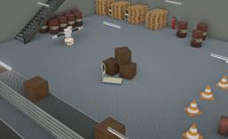

Designed by PAL Robotics, TIAGo++ is a two-wheeled human-like robot with two articulated arms finished by parallel grippers as end-effector.
The model includes two articulated arms with 7-DoF to perform coordinated dual-arm actions.
As the TIAGo model, this bi-manual version is completely ROS based, fully customizable and expandable with extra sensors and devices like end-effector (parallel gripper or Hey5 hand).

More information on the TIAGo++ robot can be found on their [website](http://blog.pal-robotics.com/tiago-bi-manual-robot-research/) or in the [technical specifications datasheet](https://pal-robotics.com/wp-content/uploads/2022/04/Datasheet_TIAGo.pdf).

### Movie Presentation


### Tiago++ PROTO

Derived from [Robot](https://cyberbotics.com/doc/reference/robot).
```
Tiago++ {
  SFVec3f     translation           0 0 0.095
  SFRotation  rotation              0 0 1 0
  SFString    name                  "TIAGo++"
  SFString    controller            "tiago++"
  MFString    controllerArgs        []
  SFString    window                "<generic>"
  SFString    customData            ""
  SFBool      supervisor            FALSE
  SFBool      synchronization       TRUE
  SFBool      selfCollision         FALSE
  MFNode      cameraSlot            Astra { translation -0.028 -0.035 -0.009 rotation 1 0 0 -1.5708}
  SFNode      endEffectorRightSlot  TiagoGripper { name "right" }
  SFNode      endEffectorLeftSlot   TiagoGripper { name "left" }
  MFNode      lidarSlot             HokuyoUrg04lxug01{}
}
```

#### Tiago++ Field Summary

- `cameraSlot`: Extends the robot with a camera at head level.
- `endEffectorRightSlot`: Extends the right arm with a new node (such as the `TiagoRightHey5` for example).
- `endEffectorLeftSlot`: Extends the left arm with a new node (such as the `TiagoLeftHey5` for example).
- `lidarSlot`: Extends the robot with a lidar sensor (such as Sick TIM551 or Hokuyo URG 04LX_UG01 for example).

### Sample

You will find the following sample in this folder: "[WEBOTS\_HOME/projects/robots/pal\_robotics/tiagopp/worlds]({{ url.github_tree }}/projects/robots/pal_robotics/tiagopp/worlds)".

#### [tiago++.wbt]({{ url.github_tree }}/projects/robots/pal_robotics/tiagopp/worlds/tiago++.wbt)

 This simulation shows a TIAGo++ making hello with both arms in an industrial environment.
It can also be controlled using the arrows on the keyboard.
