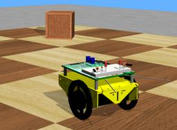

The "Boe-Bot" is a 3 wheeled robot (2 motorized wheels and a passive caster wheel) created by [Parallax Inc.](https://www.parallax.com/product/boe-bot-robot).
Its sensors and actuators can be extended.

### BoeBot PROTO

Derived from [Robot](https://cyberbotics.com/doc/reference/robot).

```
BoeBot {
  SFVec3f    translation     0 0 0.039
  SFRotation rotation        0 0 1 0
  SFString   name            "BoeBot"
  SFString   controller      "boebot"
  MFString   controllerArgs  []
  SFString   customData      ""
  SFBool     supervisor      FALSE
  SFBool     synchronization TRUE
  MFNode     extensionSlot   []
}
```

#### BoeBot Field Summary

- `extensionSlot`: Extends the robot with new nodes in the extension slot.

### Samples

You will find the following sample in this folder: "[WEBOTS\_HOME/projects/robots/parallax/boebot/worlds]({{ url.github_tree }}/projects/robots/parallax/boebot/worlds)".

#### [boebot.wbt]({{ url.github_tree }}/projects/robots/parallax/boebot/worlds/boebot.wbt)

 In this example, BoeBot moves inside an arena while avoiding the walls.
When the robot detects an obstacle with one of its [DistanceSensors](https://cyberbotics.com/doc/reference/distancesensor), it turns the corresponding [LED](https://cyberbotics.com/doc/reference/led) on.
