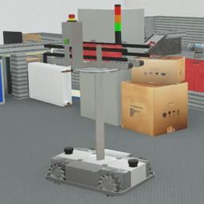

Designed by Robotics Equipment Corporation (REC), Fabtino is a four-wheeled (mecanum) robot.
The model is a modular mobile platform used for logistics and indoor transport.

### Fabtino PROTO

Derived from [Robot](https://cyberbotics.com/doc/reference/robot).

```
Fabtino {
  SFVec3f     translation     0 0 0.0613
  SFRotation  rotation        0 0 1 0
  SFString    name            "Fabtino"
  SFString    controller      "keyboard_control"
  MFString    controllerArgs  []
  SFString    customData      ""
  SFBool      supervisor      FALSE
  SFBool      synchronization TRUE
  MFNode      frontLidarSlot  []
  MFNode      backLidarSlot   []
  MFNode      bodySlot        []
}
```

#### Fabtino Field Summary

- `frontLidarSlot`: Extends the robot with a lidar on the front (such as the `SickS300` for example).
- `backLidarSlot`: Extends the robot with a lidar on the back (such as the `SickS300` for example).
- `bodySlot` : Extends the robot with new nodes (such as the `Robotino3Platform` for example).


### Sample

You will find the following sample in this folder: "[WEBOTS\_HOME/projects/robots/rec/fabtino/worlds]({{ url.github_tree }}/projects/robots/rec/fabtino/worlds)".

> **Note:** For the mecanum wheels to behave correctly, the following [ContactProperties](https://cyberbotics.com/doc/reference/contactproperties) should be added in the `contactProperties` field of the [WorldInfo](https://cyberbotics.com/doc/reference/worldinfo) node:
```
  contactProperties [
    ContactProperties {
      material1 "InteriorWheelMat"
      coulombFriction [
        0, 2, 0
      ]
      frictionRotation -0.785398 0
      bounce 0
      forceDependentSlip [
        10, 0
      ]
      softCFM 0.0001
    }
    ContactProperties {
      material1 "ExteriorWheelMat"
      coulombFriction [
        0, 2, 0
      ]
      frictionRotation 0.785398 0
      bounce 0
      forceDependentSlip [
        10, 0
      ]
      softCFM 0.0001
    }
  ]
```

#### [fabtino.wbt]({{ url.github_tree }}/projects/robots/rec/fabtino/worlds/fabtino.wbt)

 This simulation shows a Fabtino mounted with a `ConveyorPlatform` that can be controlled to move in an industrial environment using the keyboard.
