The ROBOTIS OP2 is an open source miniature humanoid robot platform with advanced computational power.
It is developed and manufactured by ROBOTIS (a Korean robot manufacturer) in collaboration with the University of Pennsylvania.

The previous model was named DARwIn-OP (for _**D**ynamic **A**nthropomorphic **R**obot **w**ith **In**telligence**-O**pen **P**latform_).
**This documentation is widely applicable for these two robots.**
For this reason and in order to remain concise, the "DARwIn-OP" term can be substituted to the "ROBOTIS OP2" term in this page.

The ROBOTIS OP2 is mainly used by universities and research centers for educational and research purposes.
It has a total of twenty degrees of freedom: two in the head, three in each arm and six in each leg.

This robot is available at a fairly low price and is based on open source components (both hardware and software).
It has been used in the RoboCup international competition with some success.

The ROBOTIS OP2 robot has been fully integrated into Webots in collaboration with ROBOTIS.
By using ROBOTIS OP2 in conjunction with Webots you will have following benefits compared to a direct use of ROBOTIS API on the robot:

- **Simulation**: You will be able to test your controller in simulation, without any risk of damaging the robot.
You will also be able to run automatically a lot of different simulations in a very small amount of time (to tune up parameters for example), which would be impossible to do with the real robot.
- **Remote compilation**: When your controller is doing fine in simulation, you will be able to send, compile and run it on the real robot, without changing anything to your code, just by pressing a button in the robot window.
- **Remote control**: To debug or understand your controller's behavior, you will be able to see in real time all sensor and actuator states on your computer screen.
This is available both in simulation and on the real robot.
Here again, this is done in just one click.
You will also be able to run your controller on the computer, but instead of sending commands to and reading sensor data from the simulated robot, it sends commands to and reads sensor data from the real robot.
- **Ease of use**: Webots greatly simplifies the programming of the robot.
Indeed, Webots API is simple to understand and to use thanks to examples and documentation.

### Presentation Movies


### RobotisOp2 PROTO

Derived from [Robot](https://cyberbotics.com/doc/reference/robot).

```
RobotisOp2 {
  SFVec3f    translation     0 0 0
  SFRotation rotation        0 0 1 0
  SFString   name            "ROBOTIS OP2"
  SFString   controller      "motion_player"
  MFString   controllerArgs  []
  SFString   customData      ""
  SFBool     supervisor      FALSE
  SFBool     synchronization TRUE
  SFBool     selfCollision   FALSE
  SFColor    plasticColor    0.8 0.8 0.8
  SFInt32    cameraWidth     160
  SFInt32    cameraHeight    120
  MFFloat    battery         []
  SFNode     jersey          NULL
  SFInt32    channel         0
  SFBool     backlash        FALSE
  MFNode     bodySlot        []
  MFNode     headSlot        []
  MFNode     leftFootSlot    []
  MFNode     rightFootSlot   []
  MFNode     leftHandSlot    []
  MFNode     rightHandSlot   []
}
```

#### RobotisOp2 Field Summary

- `plasticColor`: Defines the `diffuseColor` field of the main [Material](https://cyberbotics.com/doc/reference/material).

- `cameraWidth`: Defines the `width` field of the [Camera](https://cyberbotics.com/doc/reference/camera).

- `cameraHeight`: Defines the `height` field of the [Camera](https://cyberbotics.com/doc/reference/camera).

- `jersey`: Extends the robot with a jersey: typically RobotisJersey.proto.

- `channel`: Defines the `channel` field of the [Emitter](https://cyberbotics.com/doc/reference/emitter) and [Receiver](https://cyberbotics.com/doc/reference/receiver).

- `backlash`: Enables the modeling of backlash in all the joints of the robot.

- `bodySlot`: Extends the robot with new nodes in the body slot.

- `headSlot`: Extends the robot with new nodes in the head slot.

- `leftFootSlot`: Extends the robot with new nodes in the left foot slot.

- `rightFootSlot`: Extends the robot with new nodes in the right foot slot.

- `leftHandSlot`: Extends the robot with new nodes in the left hand slot.

- `rightHandSlot`: Extends the robot with new nodes in the right hand slot.

#### RobotisOp2Hinge2 Variant

A variant of this [PROTO](https://cyberbotics.com/doc/reference/proto) where the joints of the ankles, hips and neck have been modeled using [Hinge2Joint](https://cyberbotics.com/doc/reference/hinge2joint) instead of [HingeJoint](https://cyberbotics.com/doc/reference/hingejoint) nodes is also available. You can see it [here](https://webots.cloud/run?url=https://github.com/cyberbotics/webots/blob/released/projects/robots/robotis/darwin-op/protos/RobotisOp2Hinge2.proto).

This variant is more computationally efficient while still modeling the robot with great accuracy.

### Simulated Devices

The simulation model is mounted with the following sensors and actuators:

- 20 motors
- 20 position sensors
- 5 LEDs (including 2 RGB ones)
- A 3-axes accelerometer
- A 3-axes gyroscope
- A camera
- A speaker

#### Motors and Position Sensors

Motor positions and identifiers can be found in the following [figure](#position-of-the-motors).

%figure "Position of the Motors"
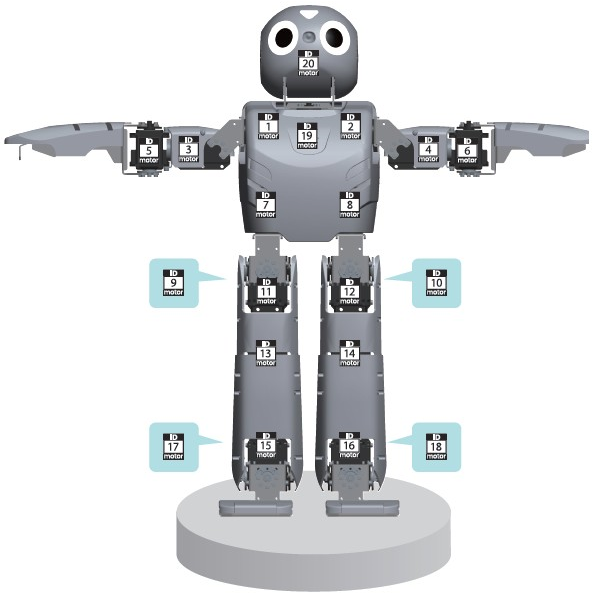
%end

Mapping between identifiers and names can be found in following table:

| ID | Name      | ID | Name      | ID | Name      | ID | Name      |
| -- | --------- | -- | --------- | -- | --------- | -- | --------- |
| 1  | ShoulderR | 2  | ShoulderL | 3  | ArmUpperR | 4  | ArmUpperL |
| 5  | ArmLowerR | 6  | ArmLowerL | 7  | PelvYR    | 8  | PelvYL    |
| 9  | PelvR     | 10 | PelvL     | 11 | LegUpperR | 12 | LegUpperL |
| 13 | LegLowerR | 14 | LegLowerL | 15 | AnkleR    | 16 | AnkleL    |
| 17 | FootR     | 18 | FootL     | 19 | Neck      | 20 | Head      |

Each of the 20 motors has the following configuration:

|                 |       |        |
| --------------- | ----- | ------ |
| maxForce        | 2.5   | N⋅m    |
| acceleration    | 55    | rad/s² |
| maxVelocity     | 12.26 | rad/s  |
| dampingConstant | 0.002 |        |
| staticFriction  | 0.025 | N⋅m    |

For the position sensors, the name is the same than the one of the motors, with a 'S' postfix:

| ID | Name       | ID | Name       | ID | Name       | ID | Name       |
| -- | ---------- | -- | ---------- | -- | ---------- | -- | ---------- |
| 1  | ShoulderRS | 2  | ShoulderLS | 3  | ArmUpperRS | 4  | ArmUpperLS |
| 5  | ArmLowerRS | 6  | ArmLowerLS | 7  | PelvYRS    | 8  | PelvYLS    |
| 9  | PelvRS     | 10 | PelvLS     | 11 | LegUpperRS | 12 | LegUpperLS |
| 13 | LegLowerRS | 14 | LegLowerLS | 15 | AnkleRS    | 16 | AnkleLS    |
| 17 | FootRS     | 18 | FootLS     | 19 | NeckS      | 20 | HeadS      |

#### LEDs

The two RGB [LEDs](https://cyberbotics.com/doc/reference/led) are placed on the robot head.
They are called `HeadLed` and `EyeLed`.
The two eyes will have same color.
Note that these [LEDs](https://cyberbotics.com/doc/reference/led) are replicated on the robot back panel.

The three other [LEDs](https://cyberbotics.com/doc/reference/led) are unicolor and placed on the robot back.
They are called `BackLedGreen`, `BackLedBlue` and `BackLedRed`.

#### Accelerometer

The accelerometer returns values between 0 and 1024 corresponding to values between -3 [g] to +3 [g] like on the real robot.
The Webots device simulating it is called [Accelerometer](https://cyberbotics.com/doc/reference/accelerometer).

#### Gyroscope

The gyroscope returns values between 0 and 1024, corresponding to values between -1600 [deg/sec] and +1600 [deg/sec], similarly to the values returned by the real robot.
The Webots device simulating it is called [Gyro](https://cyberbotics.com/doc/reference/gyro).

#### Camera

The camera is a RGBA camera.
It has a default resolution of 160x120 pixels, but it can be changed to any value.
The horizontal field of view is 1.0123 [rad].

#### Speaker

The Webots device simulating a speaker is named [Speaker](https://cyberbotics.com/doc/reference/speaker).
It can be used to play sound files or perform text-to-speech.

To be able to use text-to-speech feature, it is **required** to install the program `espeak` on the robot.

```sh
sudo apt-get install espeak
```

#### More Information

For more information on the use of all of these sensors/actuators refer to the [Reference Manual](http://www.cyberbotics.com/reference) of Webots.

#### Self Collision

The physical model is very realistic and self collision check is available.
To activate the self collision expand the ROBOTIS OP2 node in the scene tree and set `selfCollision` field to `true`.
Use the self collision check only if you need it, because it is an expensive computation feature and can therefore significantly slow down the simulation speed.

#### Backlash

It is possible to model the effect of backlash present in the motors by setting the `backlash` field to `true`.
Doing so will add a backlash of 0.01 [rad] to every joint in the robot.
The modeling of this effect is achieved by replacing the existing joints with [HingeJointWithBacklash](https://cyberbotics.com/doc/guide/hinge-joint-with-backlash) which effectively doubles their number.
Additionally, for the correct enforcing of this effect, the value of the `basicTimestep` in [WorldInfo](https://cyberbotics.com/doc/reference/worldinfo) should probably be set to a smaller value when enabling the backlash.
For these reasons, activating this option is computationally expensive and will significantly slow down the simulation speed.

### Non-Simulated Devices

The following sensors/actuators are not present on the simulation model:

- The three buttons on the back of the robot are not present because they have no interest in the simulation.
- The microphones are not present in simulation because sound is not yet supported in Webots.

### Managers

A library is provided in order to implement all the key functionalities of Robotis Framework in simulation.
This library is divided in three parts called managers.
Each manager implements a module of the Framework.
The first one called `Gait` manager allows you to use the walking algorithm of the Robotis Framework.
The second one called `Motion` manager allows you to play predefined motions stored in the "motion\_4096.bin" file.
The last one called `Vision` manager, contains some image processing tools, useful for example to find a colored ball in the camera image.

#### Gait Manager

The `RobotisOp2GaitManager` class allows you to use the walking algorithm of the Framework.

A lot of parameters are available in the Framework algorithm to tune the gait.
But in order to make this manager easy to use, only a subset of the parameters can be set.
The other parameters are set to default values that are known to works fine.
It is however possible to change them if needed, by changing the default values that are stored in a ".ini" configuration file.
In the [appendix](#walking-parameters), all the parameters of the gait are explained.

##### `RobotisOp2GaitManager(webots::Robot *robot, const std::string &iniFilename)`

```cpp
#include <RobotisOp2GaitManager.hpp>

RobotisOp2GaitManager(webots::Robot *robot, const std::string &iniFilename);
```

###### Description

*Gait Manager constructor*

The first parameter is the robot on which the algorithm applies and the second is the file name in which the default parameters are stored.

The following methods are available in order to modify the main parameters in your controller:

---

##### `void setXAmplitude(double x)`
##### `void setYAmplitude(double y)`
##### `void setAAmplitude(double a)`
##### `void setMoveAimOn(bool q)`
##### `void setBalanceEnable(bool q)`

```cpp
#include <RobotisOp2GaitManager.hpp>

void setXAmplitude(double x);
void setYAmplitude(double y);
void setAAmplitude(double a);
void setMoveAimOn(bool q);
void setBalanceEnable(bool q);
```

###### Description

*Change the gait parameters*

These are the open parameters, they have the following impact on the gait:

- X influences the length of the foot step forward, it can take any value between -1 and 1.
- Y influences the length of the foot step in the side direction, it can take any value between -1 and 1.
- A influences the angle of the gait and allows also the robot to rotate during the walk, it can take any value between 0 and 1.
- If MoveAimOn is set, it allows the robot to rotate around something by inversing the sense of rotation, it can be very useful to turn around a ball in order to kick it in the right direction for example.
- If BalanceEnable is set, the gyroscope is used in the control loop to make the walking gait more robust.

Finally the following methods can be used in order to run the algorithm:

---

##### `void start()`
##### `void step(int duration)`
##### `void stop()`

```cpp
#include <RobotisOp2GaitManager.hpp>

void start();
void step(int duration);
int  stop();
```

###### Description

*Start, stop and run the gait.*

The *start* and *stop* functions are used to start and stop the algorithm.
The *step* function is used to run the algorithm for a specified *duration*, expressed in milliseconds.

> **Note**: In order to run, the gait manager needs to know the position of each motor and the values of the gyroscope.
It is therefore essential to enable the [Gyro](https://cyberbotics.com/doc/reference/gyro) device and the [PositionSensor](https://cyberbotics.com/doc/reference/positionsensor) device of each motor before using it.
If it is not the case, a warning will appear and they will automatically be enabled.

#### Motion Manager

The `RobotisOp2MotionManager` class allows you to play a predefined motion stored in the "motion\_4096.bin" file.
The main motions and their corresponding ids are listed in [appendix](#motions-files).

It is also possible to add custom motions to this file by using the `Action Editor` tool.

> **Note**: The `Action Editor` tool is provided by ROBOTIS.
More information about are available on the [website](http://emanual.robotis.com/docs/en/platform/op/development/#action-editor).

##### `RobotisOp2MotionManager(webots::Robot *robot)`

```cpp
#include <RobotisOp2MotionManager.hpp>

RobotisOp2MotionManager(webots::Robot *robot);
```

###### Description

*Motion Manager constructor*

The first parameter is the robot on which the algorithm applies.

---

##### `void playPage(int id)`

```cpp
#include <RobotisOp2MotionManager.hpp>

void playPage(int id);
```

###### Description

*Plays a motion*

Plays the motion associated with page `id`.

##### Motion Manager in Step-by-Step

By default when starting a motion, the motion is run synchronously.
It means that the controller execution is stopped until the motion is finished.
But it is also possible to run a motion asynchronously, in that case, the motion is started but the execution flow of the controller is not stopped.
This can be done by calling the method `playPage` with the second parameter set to false:

##### `void playPage(int id, bool sync = true)`
##### `void step(int duration)`
##### `bool isMotionPlaying()`

```cpp
#include <RobotisOp2MotionManager.hpp>

void playPage(int id, bool sync);
void step(int duration);
bool isMotionPlaying();
```

###### Description

*Starts the motion in Step-by-Step mode.*

The *playPage* function initializes the motion, but does not run it.
The *step* method has to be called to run it (before calling the robot *step* function).
The *duration* argument is expressed in milliseconds.
The *isMotionPlaying* method determines if the motion is currently running.

Here is a typical use of the motion manager in step-by-step mode:

```cpp
mMotionManager->playPage(1, false);
while (mMotionManager->isMotionPlaying()) {
  mMotionManager->step(mTimeStep);
  // Do something,
  // like image processing for example
  myStep();
}
```

#### Vision Manager

The `RobotisOp2VisionManager` class allows you to use some image processing tools.

##### `RobotisOp2VisionManager(int width, int height, int hue, int hueTolerance, int minSaturation, int minValue, int minPercent, int maxPercent)`

```cpp
#include <RobotisOp2VisionManager.hpp>

RobotisOp2VisionManager(int width,
                        int height,
                        int hue,
                        int hueTolerance,
                        int minSaturation,
                        int minValue,
                        int minPercent,
                        int maxPercent);
```

###### Description

*Vision Manager constructor*

The Vision Manager constructor.
The arguments are the following:

- The width of the image.
- The height of the image.
- The color hue of the target object to find.
- The tolerance on the color hue of the target object to find.
- The minimum color saturation of the target object to find.
- The minimum color value of the target object to find.
- The minimum percentage of color value in the image to validate the result.
- The maximum percentage of color value in the image to validate the result.

To find the color hue of the target object and to understand the impact of the saturation and value you can refer to figure [HSV](#sv-colorspace), for more information you can also find a lot of great documentation on the Internet about HSV colorspace.

%figure "SV colorspace"

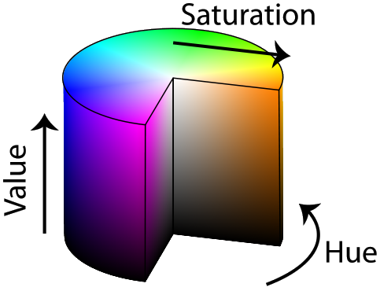
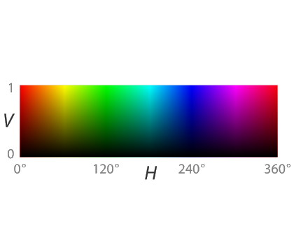

%end

---

##### `bool getBallCenter(double &x, double &y, const unsigned char \*image)`

```cpp
#include <RobotisOp2VisionManager.hpp>

void getBallCenter(double &x, double &y, const unsigned char *image);
```

###### Description

*Get the position of the target object*

Get the center of the target object.
This method returns true if the target was found, and false otherwise.
If found, the x and y variables are set.
The image pointer indicates the original image buffer.
In order to find the position of the target object.
This method proceeds with the following steps:

- Stores the BGRA version of the image in a buffer.
- Uses this buffer to convert the image to HSV format.
- Uses the `Finder` class of the Framework to find the target object.
- Extracts and saves the position of the target object.

---

##### `bool isDetected(int x, int y);`

```cpp
#include <RobotisOp2VisionManager.hpp>

void isDetected(int x, int y);
```

###### Description

*Determine if a pixel of the image is part of the target*

Once the method `getBallCenter` was called it is possible to know which pixels of the image are part of the target object by using the method `isDetected`.
This method returns true if the pixel (x,y) is part of the target object and false otherwise.

### Robot Window

The robot window can be opened by selecting the "Show Robot Window" option in the robot [context menu](https://cyberbotics.com/doc/guide/the-3d-window#context-menu).
This window has several tabs allowing you to perform different things.
First tabs concern the simulation and will be described here.
Last tab is used to interact with the real robot and will therefore be described in next sections.

#### Accelerometers Tab

This tab can be used to investigate the values of the accelerometer while the controller is running.
If the checkbox is checked, the values of the accelerometer are shown and plotted on the graph in real time.
Four different types of graph can be plotted.
The first three are one axis in function of an other, and the last one, plots the value of the three axes in function of the time.
The corresponding colors are the following:

- Red for axis X
- Green for axis Y
- Blue for axis Z

%figure "Accelerometer tab of the robot window"


%end

#### Gyro Tab

This tab is very similar to the accelerometer tab but addresses the gyroscope.
If the checkbox is checked, the values of the gyro are shown and plotted on the graph in real time.
Here again four different types of graph can be plotted.

%figure "Gyro tab of the robot window"

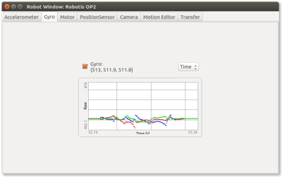

%end

#### Motors Tab

This tab can be used to see and influence the state of each motor.
The use of each motor in the robot window can separately be set by checking/unchecking the corresponding checkbox of the motor.
If the checkbox is checked, the value of the motor is shown and plotted in function of the time.
On the graph, two different colors are used to distinguish the target value (in red) and the real value (in black).
It is also possible to manually change the value of the motor by using the slider beside the graph.

%figure "Motor tab of the robot window"

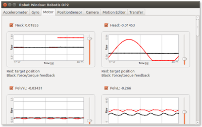

%end

#### Position Sensors Tab

This tab can be used to see the state of each position sensor.
The use of each sensor in the robot window can separately be set by checking/unchecking the corresponding checkbox.
If the checkbox is checked, the value of the sensor is shown and plotted in function of the time.

%figure "Position sensor tab of the robot window"

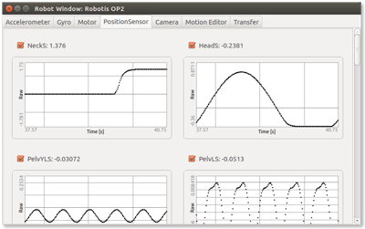

%end

#### Camera Tab

This tab is very simple, if the checkbox is checked, the picture of the camera is shown and updated in real time.

%figure "Camera tab of the robot window"

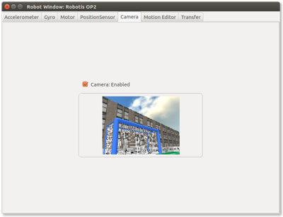

%end

#### Motion Editor

This tab allows you to create, edit or play a motion file.
It contains an animation which can be executed by the robot at any time.

%figure "Motion editor tab of the robot window"
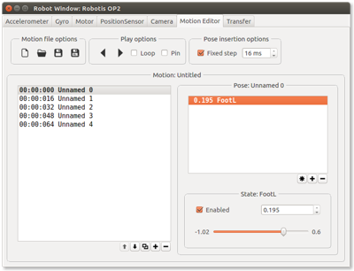
%end

The motion is composed of multiple poses (left pane).
A pose is an instant in the time the robot has to follow.
The robot will smoothly move from one pose to the next one.

A pose is composed of multiple states (right pane).
A state represents a position of one motor.
If the state is enabled, it means that the motor should have the set position at the pose instant time.

### Remote Control Tab

Remote control is much more simpler to use than remote compilation, you do not have to set the time step in any files, or to edit any specific Makefile, the exact same controller that in simulation can be used for remote control (without even having to recompile it).
Moreover, the remote control mode allows you to visualize the state of the sensors and actuators of the real robot in real time.

#### Settings

To send your controller to the real robot and make it run on it, go to the `Transfer` tab of the robot window (figure [Transfer tab](#transfer-tab-of-the-robot-window)).

%figure "Transfer tab of the robot window"

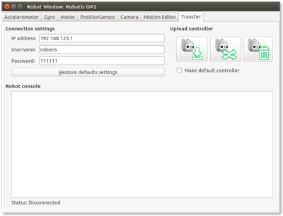

%end

The first thing to do is to set the connections settings.
The first setting is the IP address of the robot.
If you use an Ethernet cable to connect to the robot, the IP address is 192.168.123.1.
But if you use a wifi connection with the robot the address is not fixed, to know it, execute the `ifconfig` command on the robot, the IP address is the `inet addr` of wlan0 (warning, the address can sometimes change without any specific reason).

The second parameter is the username with which you log-on on the robot, if you do not have explicitly changed it, the username is `robotis`.

>**Note**: The default username of DARwIn-OP robot is `darwin`.

Finally the last parameter is the password corresponding to the username.
Here again, if you do not have explicitly changed it, the password is `111111`.
Each time you successfully connect, all settings are saved so that it is not necessary to set them each time you start the program.
If you want to restore the default parameters of the connection, just click on the `Restore default settings` button (Alt+r).

Before you can send your controller to the real robot you have to change the `Makefile.robotis-op2` file to suit to your project.
If you have added new files to the project, do not forget to add them to the `CXX_SOURCES` and if you have changed the project name, change also the `TARGET` value.

Before to send the controller you will also need to complete the `Robot Config` section of the `config.ini` file.
You have two parameters to fill in:

- `Time step` The time step in milliseconds must be specified in the field `time_step`, a minimal time step of 16ms is requested, if no time step (or a time step smaller than 16ms) is set, the default time step of 16ms is used.
Warning: Depending on the complexity of you controller, a time step of 16ms can not always be respected.
For example using the camera or the manager can slow done the speed, so enable them only if you really need them.
- `Camera resolution` The horizontal and vertical resolution of the camera must be set in the fields `camera_width` and `camera_height`.
Only the resolutions specified in the following table are supported, if another resolution is set, the default resolution of 320x240 will be used.

%figure "Camera resolutions supported by the camera of the ROBOTIS OP2"

| Width [pixel] | Height [pixel] | FPS  |
| ------------- | -------------- | ---- |
| 320           | 240            | 30   |
| 640           | 360            | 30   |
| 640           | 400            | 30   |
| 640           | 480            | 30   |
| 768           | 480            | 28   |
| 800           | 600            | 22.5 |

%end

#### Send a Controller to the Robot

To test your controller on the real robot press the following button:

%figure "Send icon"


%end

Webots will then connect to the robot, if any error appears during the connection, the reason will be shown.
If it is the first time you connect the robot with Webots, Webots will install all the files needed on the robot.
This can take some time and some step are longer than other, so be patient please, this happens only on the first connection, the next ones will be shorter.
You can also see in real time what is happening in the `Robot console`.
Webots will also stop the auto start of the demo program at the startup of the robot, but don't worry the program is not suppressed and the auto start can easily be reinstalled (explanation follows).

Then the controller code itself is sent to the robot.
The whole controller directory is sent to the robot, so please put all the files needed by your controller in the same directory.
The controller itself is then compiled for the robot and you can see the compilation in the `Robot console`.
If the compilation succeeds and the robot is close to the [start position](#start-position-of-the-robot-the-robot-is-sitting-down-same-start-position-as-in-simulation) the controller will be initialized (head and eyes [LED](https://cyberbotics.com/doc/reference/led) in red) and then started (head and eyes [LED](https://cyberbotics.com/doc/reference/led) in green).

%figure "Start position of the robot. The robot is sitting down (same start position as in simulation)"

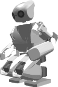

%end

It is recommended when testing a new controller whose behavior is not very certain to hold the robot by its handle.

To stop the controller press the [stop button](#stop-button).

This will stop the controller and clean all files previously sent to the robot.
You can also stop the controller by pressing the right button at the back of the robot.
This will not entirely stop the controller but will at least avoid the robot from moving.
It will also release the torque of all the servomotors.

#### Permanently Install a Controller to the Robot

If you want to install the controller on the real robot, check the checkbox `Make default controller`.
Then when you press the button to send the controller to the real robot, instead of running after the compilation, the controller is set to start automatically at the startup of the robot without any need of Webots or any computer.
Warning: the robot still need to be in the start position when starting but their wont be any verification on the position, it is your responsibility to make sure that you always start the robot in this position (starting from an unknown position is not safe).

#### Uninstall Webots Files from the Robot

If you don't need to use anymore Webots with your ROBOTIS OP2, you can uninstall all files installed on the robot by Webots by pressing this button:

%figure "Uninstall button"


%end

This will restore your robot like it was before installing the Webots files on it.
Even the demo program will again automatically start at the startup of the robot.
But if you send again a controller to the robot with Webots, all the files will again be installed.
You can also use this button to reinstall all Webots files to the robot if you think something went wrong during the installation.

If you install a new version of Webots on your computer the Webots files on the robot will automatically be updated at the sending of the first controller (don't worry if you use severals version of Webots, an older version can not erase files from a newer version).

#### Dynamixel MX28 Firmware

The remote compilation has been optimized for the latest firmware versions of the motors.
You need to have at least version 27 of the firmware installed on all the motors, if this is not the case (on old robot for example) you will be informed when you will try to send a controller to the real robot.
In order to update the firmware version please use the [Firmware Installer](http://emanual.robotis.com/docs/en/platform/op/development/#firmware-installer) from ROBOTIS.

#### Using Keyboard

The use of the keyboard is also available in remote compilation.
To use a keyboard you just have to connect an USB keyboard to the robot to one of the two USB ports available on the back of the robot (any wireless keyboard will also works).

Then when enabling the keyboard in your controller, a small window like the one depicted on this [figure](#small-window-used-to-capture-the-keyboard-inputs-in-cross-compilation) will show up on the real robot screen (if any connected).

%figure "Small window used to capture the keyboard inputs in cross-compilation"

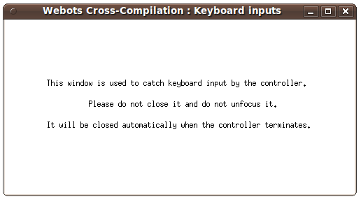

%end

This little window is used to capture the input of the keyboard.
Please do not close this window or unset the focus on it (by clicking outside this window) or you wont be able to read the keyboard input anymore.

### Remote Control

Remote control is much more simpler to use than remote compilation, you do not have to set the time step in any files, or to edit any specific Makefile, the exact same controller that in simulation can be used for remote control (without even having to recompile it).
Moreover, the remote control mode allows you to visualize the state of the sensors and actuators of the real robot in real time.

#### Using Remote Control from Robot Window

To use remote control, open the robot window, go to the `Transfer` tab, as for remote compilation you have to set the connection settings (see [previous chapter](#settings) for more information).
To start the remote control, stop and revert your simulation, put your robot in the [stable position](#start-position-of-the-robot-the-robot-is-sitting-down-same-start-position-as-in-simulation).
Then press the following button:

%figure "Remote control button"


%end

A small window (similar of the one from the [following picture](#this-small-window-asks-you-to-wait-until-remote-control-has-started)) will appear and ask you to wait until the remote control has been started.
When this window disappears and the eyes of the robot switch from red to green, the remote control has been sucessfully started.

%figure "This small window asks you to wait until remote-control has started"

%end

You can now easily start and pause your controller in remote control mode by using the run and pause buttons of Webots simulation (see chapter about [examples](#samples) for more details).
Warning: if you revert the simulation it will stop the remote control mode.
In order to stop the remote control (without reverting) simply press the following button:

%figure "Stop button"

%end

When the controller runs in remote control mode, you can see in the other tabs of the robot window the values of the sensors of the real robot in real-time.
You can also see the camera picture.

#### Camera Resolution

In remote control, supported camera resolutions are not the same as in remote compilation.
Indeed they are smaller in order to not slow down too much the communication speed between Webots and the robot.
All available resolutions are specified in the next table.
Unlike from remote compilation you do not have to specify the desired resolution in any file, the resolution is automatically sent to the robot from Webots.
So in order to adjust the resolution, just do the same way you would do it in the simulation (by editing `cameraWidth` and `cameraHeight` fields of the ROBOTIS OP2 in the scene tree window).

%figure "Camera resolutions supported in remote-control"

| Width [pixels] | Height [pixels] |
| ------------- | -------------- |
| 320           | 240            |
| 160           | 120            |
| 80            | 80             |
| 40            | 60             |
| 20            | 40             |

%end

> **Note**: You do not need to choose a width and a height from the same line, any combination of height and width is valid (for example, you can use a resolution of 320x30).

#### Controller Speed

Your controller is supposed to run at a speed of 1.0x whatever you chose to run the simulation at run in `real-time` or `as fast as possible` mode.
It can still happen sometimes that the speed can not achieve a speed of 1.0x, especialy when using the camera at high resolution, the mode `as fast as possible without graphics` should resolve this problem.

If despite this you can not achieve a speed of 1.0x, it means that your connection with the robot is to slow.
You should consider reducing camera resolution in order to increase the speed.

### Known Bugs

This chapter lists the bugs known by Cyberbotics.
They are not planned to be resolved on the short term but possible workarounds are explained.

#### Lateral Balance

In simulation, in the `RobotisOp2GaitManager`, the lateral balance does not work as expected.
It is recommended to set `balance_hip_roll_gain` and `balance_ankle_roll_gain` to 0.0, this must be done in the 'config.ini' file associated with the controller.

#### Controller P

In simulation the P gain of the motor affects the speed but on the real robot it affects the torque.
This can cause differences between simulation and reality in some specific cases.
Especially when P is small.

#### Text-To-Speech Warning Message

When using one of the two functions of text to speech from the [Speaker](https://cyberbotics.com/doc/reference/speaker) module in cross-compilation, you might see the following message:

```
bt_audio_service_open : connect() failed : Connection refused (111)
```

You can simply ignore this message.
This message is due to the fact that the robot is trying to communicate with a non-existent bluetooth device.
You can supress this message by executing the following command on the robot:

```sh
sudo apt-get purge bluez-alsa
```

### Samples

#### [soccer.wbt]({{ url.github_tree }}/projects/robots/robotis/darwin-op/worlds/soccer.wbt)

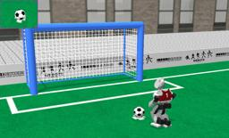 This is a very complete example which used the three managers and almost all of the sensors.
The controller is a very simple soccer player.
It relies on most of the tools used in previous examples.
We recommend you to study it by yourself and of course to improve it.

To extend this controller you can add new files to the project, but do not forget to also add them to the Makefile (add the cpp files to the `CXX_SOURCES` section).
This example is also a good starting point for developing a more complicated controller.

This example works in remote compilation.
But we recommend you to test it on a soft ground and away from any source of danger (stairs, hot surface, etc.), because the robot will move a lot and it is not excluded that it will fall down from time to time.

#### [symmetry.wbt]({{ url.github_tree }}/projects/robots/robotis/darwin-op/worlds/symmetry.wbt)

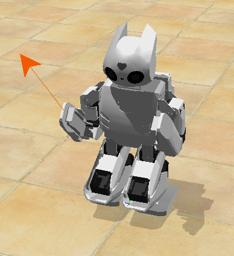 This example is very basic and explains the use of the motors.
It starts by setting the motor force of the three motors of the right arm to zero in order to completely release this arm.
Then, in an infinite loop, the position of the previous three motors is read and displayed.
Finally, still in the loop, the opposite position of each motor of the right arm is applied to the corresponding motor of the left arm in order to mimic the motion of the right arm.

You are now able to move the right arm which is free in simulation: select the robot, then press Ctrl+Alt and left click on the arm, then without releasing the left button move the mouse.
This will apply a force (symbolized by an arrow) which will make the arm move.
Note that it is very important to enable the position sensors in order to read motor positions.
In this example, this is done in the constructor.

You can also try to add an oscillation of the head, by adding this in your main loop:

```cpp
mMotors[18]->setPosition(sin(getTime()));
```

Then save the file, press the build button and finally revert the simulation to start the new controller.
This example is well suited for the remote compilation and we recommended that you start by testing the remote compilation tool by using this example.

>**Note**: This sample is also available using a MATLAB controller in the `symmetry_matlab.wbt` world.
On recent Windows versions of MATLAB, the remote control and robot window of the ROBOTIS OP2 are not working because MATLAB is coming with a version of `libstdc++-6.dll` that is incompatible with the one coming with Webots.
A simple workaround to fix the issue is to replace the `MATLAB_HOME\MATLAB_VERSION\bin\win64\libstdc++-6.dll` file by the one from `WEBOTS_HOME\msys64\mingw64\bin\libstdc++-6.dll` (make sure to backup the original file before replacing it).

#### [visual\_tracking.wbt]({{ url.github_tree }}/projects/robots/robotis/darwin-op/worlds/visual\_tracking.wbt)

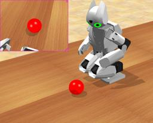 This example illustrates the use of the camera (including the [Vision Manager](#vision-manager)) and the use of the RGB [LEDs](https://cyberbotics.com/doc/reference/led).

In the infinite loop the [Vision Manager](#vision-manager) is used to find the red ball.
Then, if the ball has been found the head led is set to green and otherwise to red.
Then, again, if the ball has been found the position of the two motors of the head is corrected to watch in the direction of the ball.
To move the ball in simulation, press Ctrl+Shift and move the ball with the left button of the mouse pressed on it.

Try to change the color of the [LED](https://cyberbotics.com/doc/reference/led) by changing this line:

```cpp
mHeadLED->set(0xFF0000);
```

>**Note**: Here the color is set in hexadecimal.
The format is R8G8B8: The most significant 8 bits (left hand side) indicate the red level (between 0x00 and 0xFF).
Bits 8 to 15 indicate the green level and the least significant 8 bits (right hand side) indicate the blue level.
For example, 0xFF0000 is red, 0x00FF00 is green, 0x0000FF is blue, 0xFFFF00 is yellow, etc.

Try also to use the other RGB LED, this is done simply be exchanging `mHeadLED` by `mEyeLED`.

Here again this example is well suited for remote compilation.
You can adjust the color of the ball by changing the value in the constructor of `RobotisOp2VisionManager` if your ball has a different color.

This example can also be used as a tool to tune the parameters of the [Vision Manager](#vision-manager) in order to fit your application.

#### [walk.wbt]({{ url.github_tree }}/projects/robots/robotis/darwin-op/worlds/walk.wbt)

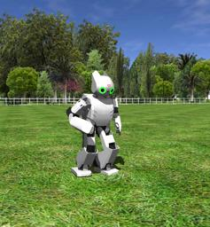 This example illustrates the use of the [Gait Manager](#gait-manager) and [Motion manager](#motion-manager), the use of the keyboard, and also the use of the accelerometer.

At the beginning of the controller, the [Motion manager](#motion-manager) is used to make the robot stand up, then the controller enters an infinite loop:
- The first thing done in the loop is to check if the robot has not fallen down, this is achieved by using the accelerometer.
- Then if the robot has fallen down, the [Motion manager](#motion-manager) is used to make the robot to stand up.
- Then, the keyboard is read, if the space bar is pressed the robot start/stop to walk.
- Then, the keys up/down/right/left are pressed to make the robot turn and move forward/backward, several keys can be pressed at the same time.

Try to add some more actions by using more keys.
You can for example use the `NUMPAD_RIGHT` and `NUMPAD_LEFT` keys to make a right/left shoot (page ids 12 and 13 in [Motion manager](#motion-manager)).
You can also use normal keys like 'A' instead if you prefer.

You can also use another key to make the robot walk quicker or slower.
Change the XAmplitude sent to the [Gait Manager](#gait-manager), values must be between -1 and 1.

This example works in remote compilation but you will need to connect a USB keyboard to the robot.
Otherwise, it is recommended to test this example with the remote control in order to use the computer's keyboard instead.

This example can also be used to explore and test all the parameters of the gait.

#### [darwin-op\_hinge\_vs\_hinge2.wbt]({{ url.github_tree }}/projects/robots/robotis/darwin-op/worlds/darwin-op\_hinge\_vs\_hinge2.wbt)

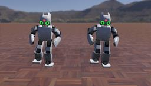 This example showcases the classic ROBOTIS OP2, which is modeled using [HingeJoint](https://cyberbotics.com/doc/reference/hingejoint) for all of its joints, side by side with the same robot where the ankles, hips and neck have been modeled using [Hinge2Joint](https://cyberbotics.com/doc/reference/hinge2joint) instead.

The advantage of this version is that it's more computationally efficient while retaining the same properties of the original.

This example can be used to compare the behavior of each variant.

### FAQ

#### An Error Occurs When Compiling the Plugins

If you are working on Linux and you installed Webots from the tarball package, it could be that some libraries are missing on your system.
Usually you should get error messages in the Webots console mentioning the missing dependencies.
Otherwise here are the instructions to install all the required ones:

```sh
sudo apt-get install libssh-dev libzip-dev libjpeg-dev
```

#### An Error Occurs When Compiling the Framework and/or Wrapper

Be sure to have the latest framework version installed on the robot.
If installation is done via the Webots robot window, then delete the file "/robotis/version.txt".

>**Note**: For DARwIn-OP, firmwares 1.5.0 or 1.5.1 are downloadable on [Sourceforge](http://sourceforge.net/projects/darwinop).
The file to delete is "/darwin/version.txt".

#### The Servomotors Have some Bad Behavior (Unstablilities, Oscillations, etc.)

This is due to wrong configuration of the servomotors (often due to one or several of the gains (P/I/D) wrong) or servomotors firmware not up to date.
Using [Robotis tool](http://emanual.robotis.com/docs/en/platform/op/development/#firmware-installer) in order to update the servomotors firmware should resolve the problem in both cases.

#### Keyboard Inputs Are Not Working in Remote Compilation and/or Result in a Segmentation Fault

Check that the keyboard window is open on the robot when enabling the keyboard and be sure this window do not lost keyboard focus on the robot.

If you are starting the controller 'manually' by SSH, use the -X option when starting SSH, and use the following command before to start the controller.

```sh
export DISPLAY=:0 ./my-controller
```

#### Activating the Backlash Flag Renders the Robot Unable to Stand

Due to the small amount of backlash present in the motors, for correct modeling of this effect it is required to lower the `basicTimestep` in [WorldInfo](https://cyberbotics.com/doc/reference/worldinfo). It was observed that setting the `basicTimeStep` to 8 ms gives good results.

### Appendix

#### Walking Parameters

This appendix explains all the parameters that can be set in the configuration file (.ini) to tune the gait:

| Name                       | Description                                                                                                                                                    | Figure                                                                                |
|----------------------------|----------------------------------------------------------------------------------------------------------------------------------------------------------------|:-------------------------------------------------------------------------------------:|
| `X offset`                 | Offset of the feet in the X direction in millimeter.                                                                                                           |                                |
| `Y offset`                 | Offset of the feet in the Y direction in millimeter.                                                                                                           | 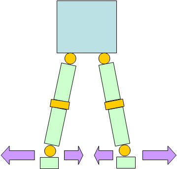                               |
| `Z offset`                 | Offset of the feet in the Z direction in millimeter.                                                                                                           | 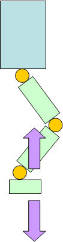                               |
| `Roll offset`              | Angle offset at the feet along x-axis in degree.                                                                                                               | 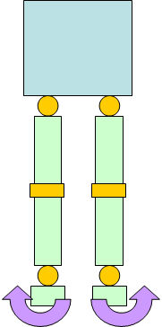                         |
| `Pitch offset`             | Angle offset at the feet along y-axis in degree.                                                                                                               | 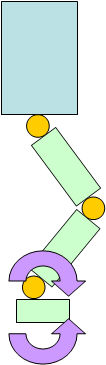                       |
| `Yaw offset`               | Angle offset of the leg along z-axis in degree.                                                                                                                | 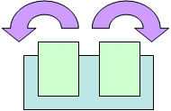                           |
| `Hip pitch offset`         | Tilt of the robot's body. It uses a special unit of the motor corresponding to 2.85 degree.                                                                    | 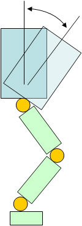               |
| `Period time`              | Time required for the robot to complete two full steps (left and right foot) in millisecond.                                                                   | 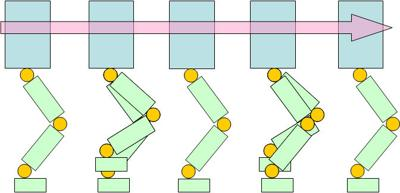                         |
| `DSP ratio`                | Ratio between the time when both feet are on the ground to only one foot (either left or right) is on the ground.                                              | 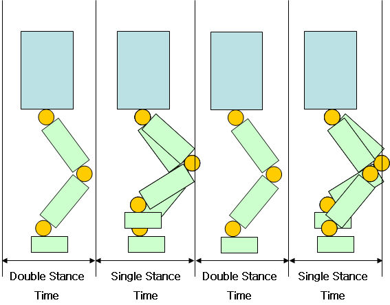                             |
| `Step forward back ratio`  | Differential distance according to X direction, between the left and right foot during walk in millimeter.                                                     | 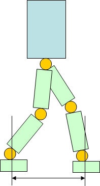 |
| `Foot height`              | Maximum height of the foot during the step in millimeter.                                                                                                      | 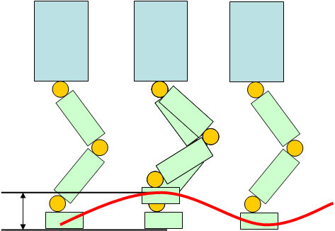                         |
| `Swing right left`         | Left and right swaying of the body during walking in millimeter.                                                                                               | 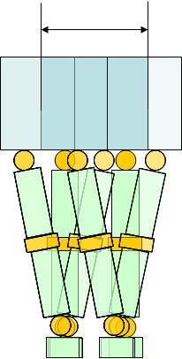               |
| `Swing top down`           | Up and down swaying of the body during walking.                                                                                                                | 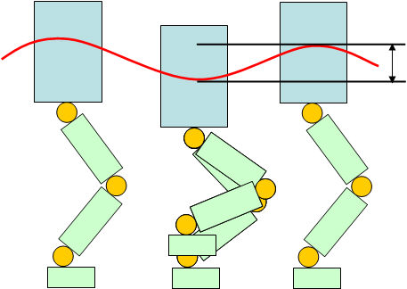                   |
| `Pelvis offset`            | Angle offset at the pelvis along x-axis. It uses a special unit of the motor correspondig to 2.85 degree.                                                      | 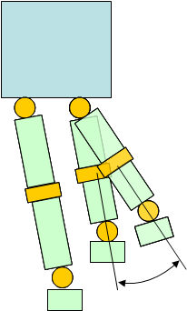                     |
| `Arm swing gain`           | Gain that influences the movement of the arm during walking.                                                                                                   | N/A                                                                                   |
| `Balance knee gain`        | Gain at the knee level for the front/back balance.                                                                                                             | N/A                                                                                   |
| `Balance ankle pitch gain` | Gain at the ankle level for the front/back balance.                                                                                                            | N/A                                                                                   |
| `Balance hip roll gain`    | Gain at the hip level for the lateral balance. Since the lateral balance does not work very well in simulation, we recommend you to set this parameter to 0.   | N/A                                                                                   |
| `Balance ankle roll gain`  | Gain at the ankle level for the lateral balance. Since the lateral balance does not work very well in simulation, we recommend you to set this parameter to 0. | N/A                                                                                   |

#### Motions Files

| ID  | Name      | Description                         | Recommended initial position  |
| --- | --------- | ----------------------------------- | ----------------------------- |
| 1   | ini       | Move to standing position           | Standing up                   |
| 2   | OK        | Nods head                           | Standing up                   |
| 3   | no        | Shakes head                         | Standing up                   |
| 4   | hi        | Tilts forward                       | Standing up                   |
| 6   | talk1     | Holds out his hand                  | Standing up                   |
| 9   | walkready | Prepares to walk                    | Standing up                   |
| 10  | f up      | Gets up                             | Lying face against the ground |
| 11  | b up      | Gets up                             | Lying back on the ground      |
| 12  | rk        | Right shoot                         | Standing up                   |
| 13  | lk        | Left shoot                          | Standing up                   |
| 15  | sit down  | Sits                                | Standing up                   |
| 16  | stand up  | Stands up                           | Seated                        |
| 17  | mul1      | Gets balanced on the head           | Standing up                   |
| 23  | d1        | Does yes with the arm               | Standing up                   |
| 24  | d2        | Applaud                             | Standing up                   |
| 27  | d3        | Does yes with the arm and head      | Standing up                   |
| 29  | talk2     | Holds out his hand                  | Standing up                   |
| 31  | d4        | Stretches in front and rear         | Standing up                   |
| 38  | d2        | Wave with the hand                  | Standing up                   |
| 41  | talk2     | Presents himself                    | Standing up                   |
| 54  | int       | Applaud louder                      | Standing up                   |
| 57  | int       | Applaud                             | Standing up                   |
| 70  | rPASS     | Performs a pass with the right foot | Standing up                   |
| 71  | lPASS     | Performs a pass with the left foot  | Standing up                   |
| 90  | lie down  | Lies on the front                   | Standing up                   |
| 91  | lie up    | Lies on the back                    | Standing up                   |
| 237 | sitdown   | Jumps up and down                   | Standing up                   |
| 239 | sitdown   | Jumps up and down quickly           | Standing up                   |

#### Audio Files

| File                                      | Length [sec] | Size [kB] |
| ----------------------------------------- | ------------ | --------- |
| Autonomous soccer mode.mp3                | 1            | 29        |
| Bye bye.mp3                               | 1            | 18.4      |
| Clap please.mp3                           | 1            | 20.4      |
| Demonstration ready mode.mp3              | 2            | 31.5      |
| Headstand.mp3                             | 1            | 19.2      |
| Interactive motion mode.mp3               | 1            | 29.8      |
| Introduction.mp3                          | 16           | 258.8     |
| Left kick.mp3                             | 1            | 17.2      |
| No.mp3                                    | 1            | 13.5      |
| Oops.mp3                                  | 1            | 14.7      |
| Right kick.mp3                            | 1            | 18.4      |
| Sensor calibration complete.mp3           | 2            | 36.4      |
| Sensor calibration fail.mp3               | 2            | 37.2      |
| Shoot.mp3                                 | 1            | 15.5      |
| Sit down.mp3                              | 1            | 20.4      |
| Stand up.mp3                              | 1            | 19.6      |
| Start motion demonstration.mp3            | 2            | 34.3      |
| Start soccer demonstration.mp3            | 2            | 34.3      |
| Start vision processing demonstration.mp3 | 2            | 42.9      |
| System shutdown.mp3                       | 1            | 26.2      |
| Thank you.mp3                             | 1            | 17.2      |
| Vision processing mode.mp3                | 1            | 28.2      |
| Wow.mp3                                   | 1            | 17.6      |
| Yes.mp3                                   | 1            | 16.8      |
| Yes go.mp3                                | 1            | 24.1      |

#### Available Voices

| Name | Voice     | Name  | Voice     | Name | Voice      |
| ---- | --------- | ----- | --------- | ---- | ---------- |
| af   | afrikaans | bs    | bosnian   | ca   | catalan    |
| cs   | czech     | cy    | welsh     | da   | danish     |
| de   | german    | el    | greek     | en   | english    |
| eo   | esperanto | fi    | finnish   | fr   | french     |
| grc  | greek     | hi    | hindi     | hr   | croatian   |
| hu   | hungarian | hy    | armenian  | id   | indonesian |
| is   | icelandic | it    | italian   | ku   | kurdish    |
| la   | latin     | lv    | latvian   | mk   | macedonian |
| nl   | dutch     | no    | norwegian | pl   | polish     |
| pt   | brazil    | pt-pt | portugal  | ro   | romanian   |
| ru   | russian   | sk    | slovak    | sq   | albanian   |
| sr   | serbian   | sv    | swedish   | sw   | swahihi    |
| ta   | tamil     | tr    | turkish   | vi   | vietnam    |
| zh   | Mandarin  |       |           |      |            |
