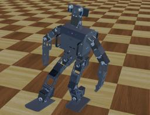

The ROBOTIS OP3 is an open source miniature humanoid robot platform with advanced computational power.
It is developed and manufactured by ROBOTIS (a Korean robot manufacturer) in collaboration with the University of Pennsylvania.

The ROBOTIS OP3 is mainly used by universities and research centers for educational and research purposes.
It has a total of twenty degrees of freedom: two in the head, three in each arm and six in each leg.

This robot is available at a fairly low price and is based on open source components (both hardware and software).
It has been used in the RoboCup international competition with some success.

The ROBOTIS OP3 Webots model will allow you to test your controller in simulation, without any risk of damaging the robot.
You will also be able to run automatically a lot of different simulations in a very small amount of time (to tune up parameters for example), which would be impossible to do with the real robot.

### Presentation Movie


### RobotisOp3 PROTO

Derived from [Robot](https://cyberbotics.com/doc/reference/robot).

```
RobotisOp3 {
  field SFVec3f    translation         0 0 0
  field SFRotation rotation            0 0 1 0
  field SFString   name                "ROBOTIS OP3"
  field SFString   controller          "<generic>"
  field MFString   controllerArgs      []
  field SFString   contactMaterial     "ROBOTIS OP3 default material"
  field SFString   footContactMaterial "ROBOTIS OP3 foot material"
  field SFString   handContactMaterial "ROBOTIS OP3 finger material"
  field SFString   customData          ""
  field SFBool     supervisor          FALSE
  field SFBool     synchronization     TRUE
  field SFBool     selfCollision       FALSE
  field SFInt32    cameraWidth         1920
  field SFInt32    cameraHeight        1080
  field MFNode     bodySlot            []
  field MFNode     headSlot            []
  field MFNode     leftFootSlot        []
  field MFNode     rightFootSlot       []
  field MFNode     leftHandSlot        []
  field MFNode     rightHandSlot       []
}
```

#### RobotisOp3 Field Summary

- `cameraWidth`: Defines the `width` field of the [Camera](https://cyberbotics.com/doc/reference/camera).

- `cameraHeight`: Defines the `height` field of the [Camera](https://cyberbotics.com/doc/reference/camera).

- `bodySlot`: Extends the robot with new nodes in the body slot.

- `headSlot`: Extends the robot with new nodes in the head slot.

- `leftFootSlot`: Extends the robot with new nodes in the left foot slot.

- `rightFootSlot`: Extends the robot with new nodes in the right foot slot.

- `leftHandSlot`: Extends the robot with new nodes in the left hand slot.

- `rightHandSlot`: Extends the robot with new nodes in the right hand slot.

### Simulated Devices

The simulation model is mounted with the following sensors and actuators:

- 20 motors
- 20 position sensors
- The blue LED on the head, and the RGB LED on the body
- A 3-axes accelerometer
- A 3-axes gyroscope
- A camera
- A speaker

#### Motion Manager

The ROBOTIS OP3 can use the MotionManager.
Please refer to [this documentation](https://webots.cloud/run?url=https://github.com/cyberbotics/webots/blob/released/projects/robots/robotis/darwin-op/protos/RobotisOp2.proto).

### Samples

#### [robotis\_op3.wbt]({{ url.github_tree }}/projects/robots/robotis/darwin-op/worlds/robotis\_op3.wbt)

 In this example, the ROBOTIS OP3 robot plays successively motions loaded from the ROBOTIS OP3 motion file of the real robot.
It demonstrates also the use of its loudspeaker.
