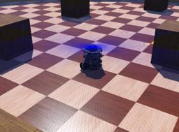

The [TurtleBot3 Burger](http://emanual.robotis.com/docs/en/platform/turtlebot3/specifications/) from [Robotis](http://www.robotis.us/) is a small, affordable, programmable, ROS-based mobile robot for use in education, research, hobby, and product prototyping.
The goal of TurtleBot3 is to dramatically reduce the size of the platform and lower the price without having to sacrifice its functionality and quality, while at the same time offering expandability.
The TurtleBot3 can be customized into various ways depending on how you reconstruct the mechanical parts and use optional parts such as the computer and sensor.
In addition, TurtleBot3 is evolved with cost-effective and small-sized SBC that is suitable for robust embedded system, 360 degree distance sensor and 3D printing technology.

This robot model and controller are sponsored by the [ROSin european project](http://rosin-project.eu/ftp/cross-platform-ros-simulation-for-mobile-manipulators).

### TurtleBot3Burger PROTO

Derived from [Robot](https://cyberbotics.com/doc/reference/robot).

```
TurtleBot3Burger {
  SFVec3f    translation     0 0 0
  SFRotation rotation        0 0 1 0
  SFString   name            "TurtleBot3Burger"
  SFString   controller      "<generic>"
  MFString   controllerArgs  []
  SFString   customData      ""
  SFBool     supervisor      FALSE
  SFBool     synchronization TRUE
  MFNode     extensionSlot   []
}
```

#### TurtleBot3Burger Field Summary

- `extensionSlot`: Extends the robot with new nodes.

### Samples

You will find the following sample in this folder: "[WEBOTS\_HOME/projects/robotis/turtlebot/worlds]({{ url.github_tree }}/projects/robots/robotis/turtlebot/worlds)".

#### [turtlebot3\_burger.wbt]({{ url.github_tree }}/projects/robots/robotis/turtlebot/worlds/turtlebot3\_burger.wbt)

 This simulation shows a TurtleBot3 Burger navigating in a circle arena avoiding obstacle using its `LDS-01` lidar sensor.
