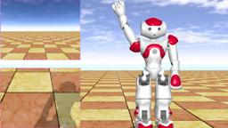
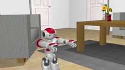
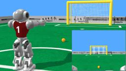
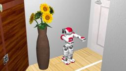
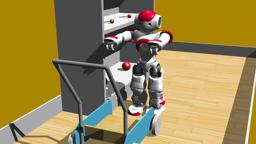
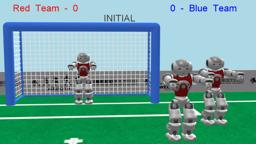

The Nao robot is a humanoid robot developed by [SoftBank Robotics](https://www.softbankrobotics.com/) (formerly known as Aldebaran Robotics).
This section explains how to use Nao robot simulated in Webots.
Currently, Webots supports the Nao V3.3, V4 and V5 versions, with and without their articulated fingers (respectively with 25 and 21 degrees of freedom) for the first two.

### NAOqi and Choregraphe

NAOqi and Choregraphe support is deprecated and not any more included in the standard Webots distribution.
However, it is still available at the [naoqisim github repository](https://github.com/cyberbotics/naoqisim) on a as-is basis.
It is not officially supported and is not maintained any more.
This is due to some bugs in the simulator SDK that are not being fixed by SoftBank Robotics and cannot be fixed by Cyberbotics.

### Movie Presentation


### Nao Models

You can switch between the Nao model thanks to the following Nao PROTO fields:

- The `version` field corresponds to the real Nao version.
The supported versions are "V3.3", "V4" and "V5".
The main difference between these models is the different calibration of the physics.
The field of view of the cameras is slightly different too.
Please refer directly to the "Nao.proto" PROTO file to see the complete difference.
Note that each version has a different weight repartition in their bodies, the best contact properties in the simulated world aren't always the same.
They are currently optimized for the version V5 of Nao in the default Nao worlds and may not perform as well with previous versions of Nao.
- The `degreeOfFreedom` field corresponds to the degree of freedom of the real Nao.
For versions V3.3 and V4 of Nao, the supported `degreeOfFreedom` values are 25 and 21.
This corresponds to a model respectively with and without articulated fingers.
We recommend to use articulated fingers only if necessary because of their big resource consumption.
Version 5.0 does not exist without articulated fingers, so the only possible value is 25 in this case.

### Nao PROTO

Derived from [Robot](https://cyberbotics.com/doc/reference/robot).

```
Nao {
  SFVec3f    translation           0 0 0.334
  SFRotation rotation              0 0 1 0
  SFString   name                  "NAO"
  SFString   version               "V5 (red)"
  SFInt32    degreeOfFreedom       25
  MFColor    customColor           []
  SFString   controller            "nao_demo"
  MFString   controllerArgs        []
  SFString   customData            ""
  SFBool     supervisor            FALSE
  SFBool     synchronization       TRUE
  SFBool     selfCollision         FALSE
  SFFloat    gpsAccuracy           0.0
  SFInt32    cameraWidth           160
  SFInt32    cameraHeight          120
  SFNode     jersey                NULL
  SFInt32    channel               0
  SFString   contactMaterial       "NAO material"
  SFString   footContactMaterial   "NAO foot material"
  SFString   fingerContactMaterial "NAO finger material"
  SFFloat    fingerRadius          0.0055
  SFFloat    fingerTorque          10.0
  MFNode     bodySlot              []
  MFNode     headSlot              []
  MFNode     leftFootSlot          []
  MFNode     rightFootSlot         []
  MFNode     leftHandSlot          []
  MFNode     rightHandSlot         []
}
```

#### Nao Field Summary

- `version`: Defines the Nao version; either "V3.3", "V4 (orange)", "V4 (blue)", "V5 (red)", "V5 (blue)" or "V5 (grey)".

- `degreeOfFreedom`: Defines the number of degrees of freedom; either "21" (fixed fingers) or "25" (articulated fingers).

- `customColor`: If a color is defined in this field, it overrides the default secondary color of the robot.
Either zero or one color is allowed in this field.

- `gpsAccuracy`: Defines the `accuracy` field of the [GPS](https://cyberbotics.com/doc/reference/gps).

- `cameraWidth`: Defines the `width` field of the [Camera](https://cyberbotics.com/doc/reference/camera).

- `cameraHeight`: Defines the `height` field of the [Camera](https://cyberbotics.com/doc/reference/camera).

- `jersey`: Extends the robot with a jersey: typically NaoJersey.proto.

- `channel`: Defines the `channel` field of the [Emitter](https://cyberbotics.com/doc/reference/emitter) and [Receiver](https://cyberbotics.com/doc/reference/receiver).

- `contactMaterial`: Defines the `contactMaterial` field of all the [Solid](https://cyberbotics.com/doc/reference/solid) nodes except the feet and the fingers ones.

- `footContactMaterial`: Defines the `contactMaterial` field of the foot [Solid](https://cyberbotics.com/doc/reference/solid) nodes.

- `fingerContactMaterial`: Defines the `contactMaterial` field of the finger [Solid](https://cyberbotics.com/doc/reference/solid) nodes.

- `fingerRadius`: Defines the radius of all the fingers.

- `fingerTorque`: Defines the torque applied on the finger motors.

- `bodySlot`: Extends the robot with new nodes in the body slot.

- `headSlot`: Extends the robot with new nodes in the head slot.

- `leftFootSlot`: Extends the robot with new nodes in the left foot slot.

- `rightFootSlot`: Extends the robot with new nodes in the right foot slot.

- `leftHandSlot`: Extends the robot with new nodes in the left hand slot.

- `rightHandSlot`: Extends the robot with new nodes in the righthand slot.

### Samples

The Webots installation includes several world files with Nao robots.
You will find some in this folder: "[WEBOTS\_HOME/projects/robots/softbank/nao/worlds]({{ url.github_tree }}/projects/robots/softbank/nao/worlds)".

#### [nao\_demo.wbt]({{ url.github_tree }}/projects/robots/softbank/nao/worlds/nao\_demo.wbt)

 The "nao\_demo.wbt" world is a demonstration of a very simple C controller that run motions on a Nao robot when keys are pressed on the keyboard.

#### [nao\_matlab.wbt]({{ url.github_tree }}/projects/robots/softbank/nao/worlds/nao\_matlab.wbt)

 The "nao\_matlab.wbt" world is an example of programming Webots using the MATLAB API.

#### [nao\_indoors.wbt]({{ url.github_tree }}/projects/robots/softbank/nao/worlds/nao\_indoors.wbt)

 The "nao\_indoors.wbt" world features a Nao robot in an apartment containing typical objects found in a living room.

#### [nao\_robocup.wbt]({{ url.github_tree }}/projects/robots/softbank/nao/worlds/nao\_robocup.wbt)

 The "nao\_robocup.wbt" world features a Nao robot on a soccer field ready to shoot the ball in the goal.

#### [challenge.wbt]({{ url.github_tree }}/projects/robots/softbank/nao/worlds/challenge.wbt)

 The "challenge.wbt" world contains the scenario of the Nao Challenge contest 2013-2014 edition by Aldebaran Robotics.
The robot has to grab a key in a door and drop it into a key pot.

#### [get\_the\_candies.wbt]({{ url.github_tree }}/projects/robots/softbank/nao/worlds/get\_the\_candies.wbt)

 The "get\_the\_candies.wbt" world contains one of the scenarios of the Nao Challenge contest 2014-2015 edition by Aldebaran Robotics.
The robot has to carry candies from a shelf to a cart.

#### [robotstadium\_nao\_vs\_robotis-op2.wbt]({{ url.github_tree }}/projects/robots/softbank/nao/worlds/robotstadium\_nao\_vs\_robotis-op2.wbt)

 The "robotstadium\_nao\_vs\_robotis-op2.wbt" world contains a robot soccer game scenario based on the Standard Platform League (SPL) rules of the RoboCup.
It opposes 5 Nao robots to 5 ROBOTIS OP2 robots.
